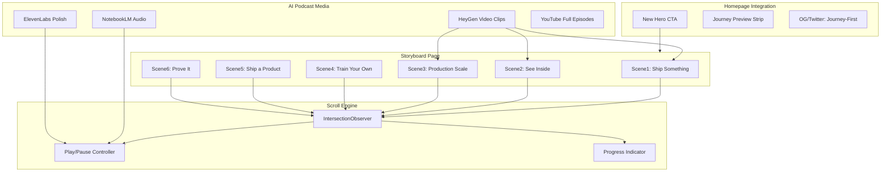

# AI-Driven Narrative Storyboard for First Break AI

## The Vision

First Break AI becomes the first adult AI learning cohort with a **narrative-driven, scroll-powered storyboard** where an AI podcast guides learners through each roadmap step like scenes in a story. No other platform combines scrollytelling + AI-generated podcast + curriculum structure for adult AI education. This becomes the site's hero feature.

## The Concept: "The Journey"

A dedicated storyboard page (`/journey/`) and a reworked homepage hero that positions First Break AI not as "another AI course" but as **an immersive, story-driven path to your first break in AI**.

The storyboard mirrors the 6 roadmap steps as **scenes**:

- **Scene 1: "Ship something real"** -- Quarto blog, GitHub, AI IDE. The first act of agency.
- **Scene 2: "See inside the machine"** -- Qwen3 in pure C. Tokens, attention, KV cache. The demystification moment.
- **Scene 3: "Think at production scale"** -- vLLM, batching, quantization, APIs. The systems mindset shift.
- **Scene 4: "Train your own"** -- PyTorch, LoRA, DDP, parallelism ladder. The builder threshold.
- **Scene 5: "Ship a product"** -- RAG, agents, deploy. The product lens.
- **Scene 6: "Prove it"** -- Capstone or OSS PR. The portfolio signal.

Each scene has:
- A **visual card** with illustration, key concept, and narrative text
- An **AI-generated podcast segment** (audio + video variant) that auto-plays as the user scrolls into the scene
- **Links** to the blog post, office hours notes, and project-watch articles for that step
- A **progress indicator** showing where you are in the journey

---

## Architecture (Buildable on Quarto)

### Page Structure

The storyboard page is a single `journey/index.qmd` with raw HTML blocks + inline JS:

- **Full-viewport scenes** using CSS `scroll-snap-type: y mandatory` or free-scroll with `IntersectionObserver` waypoints
- **Sticky audio/video player** that follows the user (small bottom bar, not intrusive)
- **Visual transitions** between scenes (parallax, fade, or slide)
- **"Tap to begin" gate** on mobile (required to unlock autoplay audio)
- **Progress bar** pinned to the side or top showing Scene 1-6 position

### Scroll-Driven Playback (the core JS)

~150 lines of inline JavaScript in `includes/journey-player.html`:

- `IntersectionObserver` watches each `.journey-scene` element
- When a scene enters 50%+ viewport, its `<audio>` or `<video>` element starts playing
- When it exits, playback pauses
- A sticky mini-player shows current scene title + play/pause toggle
- Progress bar updates based on which scene is active
- `?scene=3` URL parameter support for deep-linking to a specific scene

### Styling

New `styles/journey.css` for the storyboard page:

- Full-viewport scene containers with the warm paper aesthetic
- Scene number badges (like the existing `.blog-card-label` pattern)
- Parallax or gradient transitions between scenes
- Sticky player bar styling
- Progress indicator
- Mobile-responsive layout (stacked scenes, tap-to-play)

---

## AI Podcast Production Pipeline

### Phase 1 (MVP): NotebookLM

- Upload each roadmap step's content (blog post + office hours notes) as sources
- Generate a **Deep Dive** (6-15 min) per scene -- two AI hosts discussing the journey
- NotebookLM's **Interactive Mode** lets learners ask follow-up questions to the hosts
- Output: 6 audio files, one per scene
- **Effort: 1 day** (generation is 2-5 min per episode, plus curation)

### Phase 2: Polish with ElevenLabs

- Take NotebookLM scripts, refine for narrative flow
- Use ElevenLabs v3 with **Audio Tags** for emotion/pacing control
- Create a consistent narrator voice across all episodes
- **Effort: 1-2 days** per batch

### Phase 3: Video Variants with HeyGen

- Generate short (2-3 min) video clips per scene for the storyboard
- Full-length versions posted to YouTube
- **Effort: 1 day** for short clips, ongoing for full episodes

---

## Homepage Redesign

The homepage hero shifts from "Free, open cohort" (informational) to **"Start the journey"** (experiential):

**Current hero:** Static image + tagline + "Join Discord" CTA

**New hero:** Same warm aesthetic, but:
- Primary CTA: **"Start the Journey"** --> links to `/journey/`
- Secondary CTA: "Join Discord" (still prominent)
- A **visual preview strip** below the hero showing the 6 scenes as a horizontal scroll with scene thumbnails
- Tagline evolves from "Your first break in AI" to something like **"Your first break in AI -- a guided journey from first commit to capstone"**

### Metadata Update

- OG title: "First Break AI -- The Journey"
- OG description references the narrative storyboard experience
- OG image: A new visual showing the 6-scene journey (not just the fort illustration)
- JSON-LD schema updated to include `PodcastSeries` or `Course` with episode structure

---

## What This Does NOT Require

- **No React / Next.js** -- entirely buildable in Quarto with raw HTML + CSS + vanilla JS
- **No backend** -- all media files are static assets, search remains Quarto default
- **No database** -- progress tracking could be `localStorage` if added later
- **No complex build pipeline** -- audio/video files are pre-generated and committed or hosted externally (YouTube embeds, or a CDN)

---

## Phase Roadmap

### Phase 1: MVP Storyboard (3-4 days)

- `journey/index.qmd` with 6 scenes, scroll-driven layout
- `includes/journey-player.html` with IntersectionObserver playback
- `styles/journey.css` for scene styling
- NotebookLM-generated audio for scenes 1-3 (the steps that have content today)
- Scenes 4-6 as "coming soon" previews with roadmap teasers
- Homepage: add "Start the Journey" CTA below existing hero
- Navbar: add "Journey" link

### Phase 2: Polish and Full Audio (2-3 days)

- ElevenLabs-polished audio for all 6 scenes
- Visual illustrations per scene (AI-generated or hand-crafted)
- Parallax transitions between scenes
- Mobile-optimized experience with tap-to-play gate
- Deep-link support (`?scene=N`)
- Homepage hero redesign with journey preview strip

### Phase 3: Video + YouTube (2-3 days)

- HeyGen short video clips embedded in storyboard scenes
- Full-length episodes posted to YouTube
- YouTube playlist linked from the journey page
- OG metadata and JSON-LD updates

### Phase 4: AI Agent Layer (future, larger scope)

- Curriculum-aware chat agent embedded in the journey page
- Knows which scene/step the learner is on
- Scaffolds help based on what concepts have been introduced
- This is the bigger lift -- requires an API backend (OpenAI/Claude) and careful prompt engineering with the roadmap as context
- Could start simple: a chat widget that includes the current scene's content as system prompt context

---

## Why This Is Defensible

- **Content moat**: Every office hours session, every blog post, every project-watch article generates new storyboard material. The journey grows with the cohort.
- **Format moat**: Nobody else in adult AI education does scroll-driven narrative. Copying requires both the content depth AND the production quality.
- **Community moat**: The storyboard becomes the shared reference point for the cohort. "I'm on Scene 3" replaces "I'm on Step 3" -- it's more visceral.
- **AI-native moat**: The podcast episodes can be regenerated as the roadmap evolves, models improve, or new cohort discussions happen. The content is never stale.

---

## Key Files to Create/Modify

**New files:**
- `journey/index.qmd` -- the storyboard page
- `styles/journey.css` -- storyboard styling
- `includes/journey-player.html` -- scroll-driven playback JS
- `public/audio/` -- AI-generated podcast audio files
- `public/images/journey/` -- scene illustrations

**Modified files:**
- [index.qmd](index.qmd) -- add Journey CTA to hero, add preview strip
- [_quarto.yml](_quarto.yml) -- add Journey to navbar, update metadata
- [includes/schema.html](includes/schema.html) -- add PodcastSeries/Course schema
