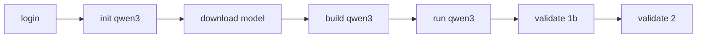

# CLI: Qwen3 lab pipeline + rubrics + login gate

## Summary

Ship a **deterministic, login-gated CLI** that takes a learner from zero to running Qwen3 with the sampling viz — matching Lesson 1b Part A and Step 2. All validation rules live in **YAML rubric files**. **Pi / OpenClaw is out of scope** for the critical path (optional tutor layer later).

**Primary command:** `firstbreakai` · **Alias:** `fba` (same binary, docs lead with `firstbreakai`)

---

## 1. Current gaps

| Area | Today | Target |
|------|-------|--------|
| Lesson 1b Part A | No `validate 1b`; Step 2 checks HF files in CWD | GGUF + Qwen3-RunLocally layout |
| Setup | Manual clone, LFS, 3 terminals | `init qwen3` → `download` → `build` → `run` |
| Rubrics | Hardcoded in [`validate.js`](cli/lib/validate.js) | [`cli/rubrics/*.yaml`](cli/rubrics/) |
| Login | Optional for most commands | Required for all cohort commands |
| Platform | Not detected | macOS / Linux / WSL ok; native Windows → WSL |
| Analytics | Best-effort server sync | Per-learner CLI activity counts |

---

## 2. Command reference

### Auth (gate everything else)

```bash
firstbreakai login          # required first (Discord)
firstbreakai whoami         # no login required
```

**Exempt from login:** `login`, `help`, `version`, `whoami`

### Qwen3 lab pipeline

```bash
firstbreakai init qwen3 [path]              # clone + submodules → ~/.firstbreakai.json qwen3.repoRoot
firstbreakai init qwen3 [path] --model      # clone + download GGUF (~3 GB)
firstbreakai download qwen3 [--status]      # download / re-download / show model status
firstbreakai build qwen3 [path|.c] [--target run|runviz]
firstbreakai run qwen3 [--plain] [-- -t 0.6 -p 0.95]
firstbreakai validate 1b [repo-path]        # Part A rubric → lessons.1b.partA.done
firstbreakai validate 2 [repo-path]         # full Step 2 → steps.2.done
```

**Routing:** `init` with no subcommand → Quarto blog (unchanged). `init qwen3` → Qwen3-RunLocally.

**Alias:** `fba login`, `fba build qwen3`, etc. — identical behavior.

### End-to-end learner flow

```bash
npm install -g @aiedx/firstbreakai
firstbreakai login
firstbreakai init qwen3 --model
firstbreakai build qwen3
firstbreakai run qwen3
firstbreakai validate 1b
# later
firstbreakai validate 2
```



---

## 3. Rubrics as data (single source of truth)

**All check definitions in versioned YAML.** Code provides a small **check type registry** only.

### Layout

```
cli/rubrics/
  step-0.yaml
  step-1.yaml
  step-2.yaml              # Qwen3-RunLocally + viz (replaces HF-in-CWD)
  lesson-1b-part-a.yaml    # subset of step-2 + platform
  doctor.yaml              # optional: tool checks
cli/lib/rubrics/
  load.js                  # parse YAML, resolve {qwen3Dir} placeholders
  engine.js                # run rubric checks, return results[]
  checks.js                # type → executor map
```

### Example rubric

[`cli/rubrics/lesson-1b-part-a.yaml`](cli/rubrics/lesson-1b-part-a.yaml):

```yaml
id: "1b"
part: a
title: "Qwen3 Fundamentals — Part A"
parent_step: 2
requires_login: true
on_pass: lessons.1b.partA.done
checks:
  - name: Platform supported
    check: platform.supported
    hint: "Native Windows needs WSL — see Lesson 1b Part A"
  - name: Qwen3 repo found
    check: qwen3.repo_exists
    hint: "Run: firstbreakai init qwen3"
  - name: run.c exists
    check: file.exists
    params: { path: "{qwen3Dir}/run.c" }
  - name: GGUF model present
    check: qwen3.gguf_exists
    params: { min_bytes: 2000000000 }
    hint: "Run: firstbreakai download qwen3"
  - name: Binary built and executable
    check: qwen3.binary_executable
    params: { binary: run }
  - name: Tokenizer files present
    check: file.all_exist
    params: { paths: ["{qwen3Dir}/vocab.txt", "{qwen3Dir}/merges.txt"] }
```

### Check type registry (stable, tested in code)

| Type | Purpose |
|------|---------|
| `file.exists` / `file.all_exist` | Path checks |
| `file.regex` | e.g. `_quarto.yml` has `type: website` |
| `command.ok` | `git --version`, `make --version` |
| `auth.logged_in` / `auth.in_guild` | Step 0 |
| `git.remote_github` / `git.has_commit` | Step 1 |
| `platform.supported` | mac / linux / wsl |
| `qwen3.repo_exists` | Qwen3-RunLocally layout |
| `qwen3.gguf_exists` | size ≥ min_bytes |
| `qwen3.binary_executable` | run / run_viz |
| `qwen3.viz_deps` | tools + sampling-viz node_modules |
| `qwen3.smoke_run` | `./run gguf -n 1` with timeout (Step 2 only) |
| `legacy.hf_cwd` | transition: old HF-in-CWD Step 2 layout |

**Consumers:** `validate.js`, `cohort_validate` MCP tool, future cohort checklist page, future MCP worker parity.

[`validate.js`](cli/lib/validate.js) becomes thin: load rubric → `engine.run(ctx)` → print ✓/✗ → mark done → submit server.

---

## 4. Login gate + CLI activity

### Auth guard — [`lib/auth-guard.js`](cli/lib/auth-guard.js)

Invoked from [`bin/firstbreakai.js`](cli/bin/firstbreakai.js) before every protected handler.

- Missing token → exit 1, `Run: firstbreakai login`
- Optional `GET /auth/me` (cache 5 min); 401 → clear token, re-login

### Progress schema v2 — `~/.firstbreakai.json`

```json
{
  "version": 2,
  "learner_id": "abc123",
  "access_token": "...",
  "cli": {
    "login_count": 3,
    "last_login_at": "...",
    "command_count": 47,
    "last_command": "build qwen3",
    "commands": { "validate": 5, "run": 8 }
  },
  "steps": {},
  "lessons": { "1b": { "partA": { "done": true, "at": "..." } } },
  "qwen3": {
    "repoRoot": "...",
    "qwen3Dir": "...",
    "binary": ".../run_viz",
    "builtAt": "..."
  }
}
```

### Server analytics (CLI ships first; worker follow-up)

```
POST /auth/cli-activity
{ command, args, cli_version, platform, learner_id }
```

Extend `GET /auth/me` → `cli_stats` for [`status.js`](cli/lib/status.js) / [`whoami.js`](cli/lib/whoami.js).

---

## 5. Qwen3 commands (detail)

### `init qwen3 [path]`

| | |
|---|---|
| Default path | `./Qwen3-RunLocally` |
| Clone | `git clone --recurse-submodules` thefirehacker/Qwen3-RunLocally |
| Submodule fix | `git submodule update --init repos/qwen3.c repos/qwen3.cu` if model gitlink fails |
| Idempotent | Existing repo → skip clone, hint `git pull` |

### `download qwen3` / `init qwen3 --model`

| | |
|---|---|
| Primary | `huggingface-cli download huggit0000/Qwen3-0.6B-GGUF-FP32 Qwen3-0.6B-FP32.gguf --local-dir {qwen3Dir}` |
| Fallback | git clone HF repo + `git lfs pull` + mv (per upstream README) |
| Verify | file ≥ 2 GB (catch LFS pointer stubs) |
| Progress | TTY inherit + phase labels via [`lib/qwen3/status.js`](cli/lib/qwen3/status.js) |

### `build qwen3 [path|.c] [--target run|runviz]`

| | |
|---|---|
| Default | `make runviz` in qwen3Dir + `npm install` in `tools/` and `apps/sampling-viz/` |
| Custom `.c` | `gcc -O3 -o <basename> <file> -lm` |
| State | Save `qwen3.binary`, `builtAt` to progress file |

### `run qwen3`

| | |
|---|---|
| Default | Background `npm run dev` (sampling-viz) + foreground `node tools/sampling-bridge.mjs {binary} {gguf} -v 1 …` + open http://localhost:3000 |
| `--plain` | `./run model.gguf` only (no viz) |
| Cleanup | SIGINT kills viz + bridge PIDs |
| Model | Auto-detect `Qwen3-0.6B-FP32.gguf` in qwen3Dir |

### Platform — [`lib/qwen3/platform.js`](cli/lib/qwen3/platform.js)

| OS | Action |
|----|--------|
| macOS | ✓ check Xcode CLI tools |
| Linux | ✓ hint build-essential |
| WSL | ✓ show distro |
| Windows native | ✗ block with `wsl --install` instructions |
| MSYS2 (v1 optional) | warn + allow |

---

## 6. Validation levels

| Command | Marks | Checks |
|---------|-------|--------|
| `validate 1b` | `lessons.1b.partA` only | Platform, repo, run.c, GGUF, binary, vocab/merges; optional hint if no run_viz |
| `validate 2` | `steps.2` | All of 1b + run_viz, viz deps, smoke run; **or** legacy HF-in-CWD during transition |

---

## 7. Files to create / change

| File | Change |
|------|--------|
| [`cli/rubrics/*.yaml`](cli/rubrics/) | **New** — all rubric definitions |
| [`cli/lib/rubrics/load.js`](cli/lib/rubrics/load.js) | **New** |
| [`cli/lib/rubrics/engine.js`](cli/lib/rubrics/engine.js) | **New** |
| [`cli/lib/rubrics/checks.js`](cli/lib/rubrics/checks.js) | **New** |
| [`cli/lib/auth-guard.js`](cli/lib/auth-guard.js) | **New** |
| [`cli/lib/qwen3/platform.js`](cli/lib/qwen3/platform.js) | **New** |
| [`cli/lib/qwen3/paths.js`](cli/lib/qwen3/paths.js) | **New** |
| [`cli/lib/qwen3/init.js`](cli/lib/qwen3/init.js) | **New** |
| [`cli/lib/qwen3/download.js`](cli/lib/qwen3/download.js) | **New** |
| [`cli/lib/qwen3/build.js`](cli/lib/qwen3/build.js) | **New** |
| [`cli/lib/qwen3/run.js`](cli/lib/qwen3/run.js) | **New** |
| [`cli/lib/qwen3/status.js`](cli/lib/qwen3/status.js) | **New** — phased setup display |
| [`cli/bin/firstbreakai.js`](cli/bin/firstbreakai.js) | Auth gate; subcommands init/build/run/download/validate |
| [`cli/package.json`](cli/package.json) | `"fba"` bin alias; optional `yaml` dep; bump version |
| [`cli/lib/validate.js`](cli/lib/validate.js) | Thin wrapper over rubric engine |
| [`cli/lib/login.js`](cli/lib/login.js) | login_count |
| [`cli/lib/status.js`](cli/lib/status.js) | CLI stats + lesson 1b Part A |
| [`cli/lib/whoami.js`](cli/lib/whoami.js) | CLI stats from server |
| [`cli/lib/doctor.js`](cli/lib/doctor.js) | Git LFS; platform line |
| [`cli/lib/mcp-server.js`](cli/lib/mcp-server.js) | Auth gate; cohort_build/run/validate 1b |
| [`cli/lib/config.js`](cli/lib/config.js) | Lesson rubric ids |
| [`cli/README.md`](cli/README.md) | Full command docs |

---

## 8. Implementation order

1. **Rubrics refactor** — YAML for Steps 0–2 (parity with today) + engine; no behavior change yet
2. **Auth guard** + progress schema v2 + `fba` alias
3. **`qwen3/paths.js` + `platform.js`**
4. **`init qwen3` + `download qwen3`**
5. **`build qwen3` + `run qwen3`**
6. **Rubrics** — `lesson-1b-part-a.yaml`, refreshed `step-2.yaml`
7. **MCP tools + status/whoami + README/docs**

Worker `POST /auth/cli-activity` can land in parallel or after CLI v0.4.0.

---

## 9. Explicit non-goals (v1)

- **Pi / OpenClaw** on critical path — deterministic CLI only; Pi optional as future `firstbreakai tutor`
- **Auto-download WSL / Xcode** — detect + link only
- **Rename npm package** to `@aiedx/fba` — keep `@aiedx/firstbreakai`
- **Remote worker rubric sync** — YAML in CLI package first
- **`firstbreakai up qwen3`** — optional v1.1 convenience alias

---

## 10. Risks / mitigations

| Risk | Mitigation |
|------|------------|
| Step 2 rubric breaks HF-in-CWD learners | `legacy.hf_cwd` check type during transition |
| Orphan Node after `run qwen3` | Track PIDs; kill on SIGINT |
| 3 GB download fails / stub file | Size verify; `download qwen3` retry |
| Login friction before `doctor` | Docs: login first; only help/version/whoami exempt |
| YAML typo breaks validate | JSON Schema or startup validation in `load.js` |
| Native Windows | Platform gate before clone |
| Expired token | Auth guard 401 → re-login |
| Offline after login | Local commands + local activity counts |

---

## 11. Version bump

Ship as **`@aiedx/firstbreakai@0.4.0`** (minor feature release: qwen3 pipeline, rubrics, login gate, fba alias).
