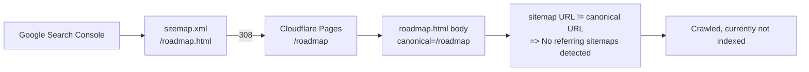

## Diagnosis

The bridge (Part A + Part B in [.cursor/plans/oldgithubPagemigration.md](.cursor/plans/oldgithubPagemigration.md)) is correct. The remaining blocker is a **sitemap ↔ canonical mismatch**, plus a **secondary crawl-noise issue** that explains the weird "Referring page: /public/audio" line in your screenshot.

### Issue 1 (the actual indexing blocker) — sitemap URLs don't match canonicals

Live state on `cohort.bubblnet.com`:

- Sitemap entries (from [docs/sitemap.xml](docs/sitemap.xml), all 20 URLs end in `.html`):

```
<loc>https://cohort.bubblnet.com/index.html</loc>
<loc>https://cohort.bubblnet.com/roadmap.html</loc>
<loc>https://cohort.bubblnet.com/blog/index.html</loc>
...
```

- Cloudflare's serving form: `/roadmap.html` → `HTTP/2 308 Location: /roadmap` (verified live).
- Canonical tag on every page (from [canonical.lua](canonical.lua)) strips `.html`:

```6:16:canonical.lua
local SITE_URL = 'https://cohort.bubblnet.com'

function Pandoc(doc)
  local out = quarto.doc.output_file or ''
  local rel = out:gsub('^.*/docs/', ''):gsub('^docs/', '')
  if rel == '' or rel == out then return nil end

  local url_path = '/' .. rel
  url_path = url_path:gsub('/index%.html$', '/')
  url_path = url_path:gsub('%.html$', '')
```

So Google's flow: read `…/roadmap.html` from sitemap → 308 → `…/roadmap` → canonical says `…/roadmap`. The sitemap URL ≠ the canonical URL, so Google does **not** record the sitemap as the discovery source for `https://cohort.bubblnet.com/`. That's the exact "**No referring sitemaps detected**" message you see in URL Inspection, and the reason "Crawled – currently not indexed" is sticky on a brand-new low-authority domain.

This is a Quarto default — its sitemap generator concatenates `site-url` + raw output path; it does not know about the canonical filter or Cloudflare's clean-URL serving.

### Issue 2 (crawl noise, not a blocker) — `/public/audio/*` 404s

[journey/index.qmd](journey/index.qmd) emits `<source>` tags whose static `src` is a relative path to mp3s that aren't deployed (gitignored):

```110:115:journey/index.qmd
      <source data-r2="scene-1.mp3" src="../public/audio/scene-1.mp3" type="audio/mpeg">
```

In the browser, the JS in [includes/journey-player.html](includes/journey-player.html) swaps `src` to `https://firstbreakai.bubblnet.com/scene-1.mp3` using `AUDIO_BASE`. But Google's crawler reads the static markup, follows `…/public/audio/scene-N.mp3` → all 404 (verified live). That's where the bizarre "Referring page: https://cohort.bubblnet.com/public/audio" line in your URL Inspection screenshot is coming from — Google catalogued those broken links while crawling the journey page.

This adds crawl noise but is not what's blocking indexing.

### Discovery flow (current, broken)



After the fix, sitemap entries will match canonicals 1:1 with no redirect hop.

---

## Fixes (in order of impact)

### Fix 1 — rewrite sitemap to clean URLs via Quarto `post-render` hook  *(critical)*

Quarto runs `project.post-render` scripts after `sitemap.xml` is written. Add a tiny rewriter and wire it in [_quarto.yml](_quarto.yml).

Create `scripts/rewrite-sitemap.mjs`:

```javascript
import fs from 'node:fs';
const f = 'docs/sitemap.xml';
let s = fs.readFileSync(f, 'utf8');
s = s
  .replace(/<loc>([^<]+)\/index\.html<\/loc>/g, '<loc>$1/</loc>')
  .replace(/<loc>([^<]+)\.html<\/loc>/g, '<loc>$1</loc>');
fs.writeFileSync(f, s);
console.log('[sitemap] rewrote .html -> clean URLs');
```

Edit [_quarto.yml](_quarto.yml) `project:` block to add:

```yaml
project:
  type: website
  output-dir: docs
  post-render:
    - scripts/rewrite-sitemap.mjs
  resources:
    ...
```

After deploy, [docs/sitemap.xml](docs/sitemap.xml) entries will become `https://cohort.bubblnet.com/`, `https://cohort.bubblnet.com/roadmap`, `https://cohort.bubblnet.com/blog/`, etc — exact matches for every canonical and Cloudflare's serving URL. No 308, no canonical mismatch.

### Fix 2 — keep crawler out of the empty `/public/audio/` tree  *(small, prevents future GSC noise)*

The mp3s are gitignored and journey-player swaps to R2 at runtime — those `/public/audio/*` paths never need to be crawled or indexed. Update [robots.txt](robots.txt) to disallow that prefix and let the JS fallback continue working:

```
User-agent: *
Allow: /
Disallow: /public/audio/
Sitemap: https://cohort.bubblnet.com/sitemap.xml
```

(We are NOT touching the `<source>` tag — keeping the local-fallback behaviour documented in [README.md](README.md). Robots-disallow is enough to stop Google from following them.)

### Fix 3 — clean up the stale `docs/robots.txt` artefact  *(housekeeping)*

The local [docs/robots.txt](docs/robots.txt) currently has an extra `User-agent: GPTBot / Disallow: /` block that does NOT match the source [robots.txt](robots.txt) and does NOT match what's live (verified). It's a stale local edit that will be overwritten by the next `quarto render` (because `robots.txt` is a Quarto project resource). No code change needed — just commit a fresh `docs/` after rebuilding so the repo is consistent.

### Fix 4 — manual GSC actions after the new build deploys

These are user actions in Google Search Console (cannot be done from code):

1. **Sitemaps tab** on `https://cohort.bubblnet.com/` property → resubmit `sitemap.xml` (delete the old submission first, then re-add). This forces Google to refetch and re-process all 20 entries with the new clean URLs.
2. **URL Inspection** → for each of these 5 priority URLs, "Test live URL" → confirm canonical matches → "Request indexing":
   - `https://cohort.bubblnet.com/`
   - `https://cohort.bubblnet.com/roadmap`
   - `https://cohort.bubblnet.com/checklist`
   - `https://cohort.bubblnet.com/blog/`
   - `https://cohort.bubblnet.com/lessons/lesson-0-welcome`
3. Wait 7–14 days. "No referring sitemaps detected" should flip to "Sitemaps: …/sitemap.xml" once Google reprocesses, and the "Crawled – currently not indexed" status should start clearing for the priority URLs first.

---

## Why this should unstick indexing

- The new domain is 2 days old with low backlinks — Google's crawl-budget allocation is conservative. The sitemap is the strongest signal you control to say "these N URLs are the canonical pages, please prioritise them." Right now that signal is being thrown away because the sitemap URL ≠ canonical URL. After Fix 1, every sitemap entry will be a 200 OK with a self-canonical match. That's the cleanest possible state and is what GSC needs to flip "No referring sitemaps detected" off.
- Fix 2 stops Google wasting crawl budget on 8 known broken `/public/audio/scene-*.mp3` URLs, which currently generate the noisy "Referring page: /public/audio" line in your URL Inspection report.
- Bridge (Part B in the existing plan) and self-canonical (Part A) are already correct — those don't need to change.

## Files touched

- [_quarto.yml](_quarto.yml) — add `project.post-render` entry
- `scripts/rewrite-sitemap.mjs` — new file (~6 lines)
- [robots.txt](robots.txt) — add one `Disallow: /public/audio/` line
- [docs/](docs) — regenerated by `quarto render` (sitemap, robots.txt updated automatically by the new pipeline)