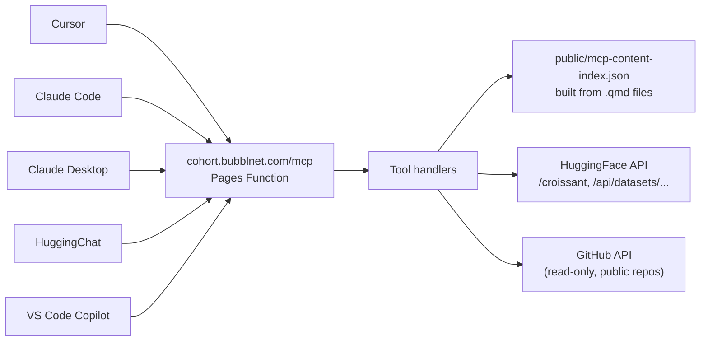

# First Break AI MCP Server — Plan

## Why this approach

The repo is already a Cloudflare Pages site with one Pages Function ([functions/_middleware.ts](functions/_middleware.ts)). Adding an MCP server is **one new file** in `functions/`, plus a small content index built at render time. No Python, no Gradio, no separate hosting account, no new domain.

Cloudflare's Agents SDK now ships `createMcpHandler` — a stateless Streamable-HTTP MCP server (the current MCP spec since March 2025) that runs natively in Pages Functions / Workers. It is the correct primitive for this.

## Architecture



## Client compatibility (one URL, all clients)

- **Cursor:** add server URL in MCP settings → done
- **Claude Code:** add to `.claude/settings.json` with `"url": "https://cohort.bubblnet.com/mcp"`
- **Claude Desktop:** custom MCP server via settings UI
- **HuggingChat:** "Add MCP server" dialog (the one in your screenshot) — paste URL
- **VS Code / GitHub Copilot:** `.vscode/mcp.json` with `"type": "http"`
- **ChatGPT:** not supported (different protocol — OpenAPI Actions, not MCP). Out of scope.

## Phase 1 tools (read-only, no auth)

All tools wrap **public** data, so no auth is needed. Per earlier discussion, defer auth until Phase 2 when write/private tools are added.

- `search_lesson(query: string)` — semantic-ish keyword search across all `.qmd` files in [lessons/](lessons/), [blog/](blog/), [office-hours/](office-hours/). Returns matching paragraphs with source path + URL.
- `get_lesson(slug: string)` — fetch full markdown of a lesson by slug (e.g. `lesson-1-huggingface-beyond-upload`).
- `inspect_dataset_schema(hf_dataset_id: string)` — hits `https://huggingface.co/api/datasets/<id>/croissant`, parses Croissant JSON-LD, returns clean column-name → type table. The exact thing demonstrated in Lesson 1.
- `inspect_binary_dataset(hf_dataset_id: string)` — for repos like `kjj0/fineweb10B-gpt2` where Croissant is empty, lists `.bin` files and points at the linked source code repo for binary format. Implements the "follow the trail" pattern from Lesson 1.
- `get_homework(lesson_number: number)` — extracts the `## Homework` section from a lesson `.qmd`. Useful for "what is the homework for lesson 1?".

## Files to add / change

### New files

- [functions/mcp/[[path]].ts](functions/mcp/%5B%5Bpath%5D%5D.ts) — Pages Function catch-all that mounts `createMcpHandler`. Defines the 5 tools above using `zod` schemas.
- [scripts/build-content-index.mjs](scripts/build-content-index.mjs) — runs at render time, walks `lessons/`, `blog/`, `office-hours/`, parses each `.qmd` (frontmatter + section headings + paragraphs), writes `public/mcp-content-index.json`. The MCP function imports this JSON at request time (Pages Functions can fetch static assets via `env.ASSETS.fetch`).
- [tsconfig.json](tsconfig.json) — minimal config for `functions/*.ts` (Pages Functions can compile TS without one, but having it helps editor and prevents drift).
- [wrangler.jsonc](wrangler.jsonc) — Pages compatibility date + flags (so `nodejs_compat` is on if needed for any deps).

### Modified files

- [package.json](package.json) — add three deps:
  - `agents` (Cloudflare Agents SDK — provides `createMcpHandler`)
  - `@modelcontextprotocol/sdk`
  - `zod`
- [_quarto.yml](_quarto.yml) — append `scripts/build-content-index.mjs` to `project.post-render` so the content index is rebuilt every render.
- [functions/_middleware.ts](functions/_middleware.ts) — verify Fetchlens (`observeOnly: true`) does not interfere with `/mcp` POST requests. If it adds latency to streaming, scope middleware to non-`/mcp` paths via an early return.
- [.github/workflows/publish.yml](.github/workflows/publish.yml) — confirm `functions/` is included in the deploy artifact (currently `_cf_deploy` is just `docs/`; `functions/` lives at the project root and Wrangler picks it up automatically — verify on first deploy).

## Skeleton for the main handler

Conceptual shape, not final code:

```typescript
// functions/mcp/[[path]].ts
import { createMcpHandler } from "agents/mcp";
import { z } from "zod";

const handler = createMcpHandler((server) => {
  server.tool(
    "search_lesson",
    "Search across First Break AI lessons, blog posts, and office hours.",
    { query: z.string() },
    async ({ query }) => {
      const idx = await env.ASSETS.fetch("/mcp-content-index.json").then(r => r.json());
      // simple ranked keyword search
      return { content: [{ type: "text", text: formatHits(idx, query) }] };
    }
  );

  server.tool(
    "inspect_dataset_schema",
    "Returns column names and types for any HuggingFace dataset by parsing its Croissant manifest.",
    { hf_dataset_id: z.string() },
    async ({ hf_dataset_id }) => {
      const r = await fetch(`https://huggingface.co/api/datasets/${hf_dataset_id}/croissant`);
      // walk JSON for extract.column entries (same logic from lesson 1)
      return { content: [{ type: "text", text: schemaTable(await r.json()) }] };
    }
  );

  // ... 3 more tools
});

export const onRequest = handler;
```

## Auth posture

**Phase 1: no auth.** All Phase 1 tools call public endpoints. Friction-free onboarding for cohort students.

**Phase 2 (deferred):** Add HuggingFace token passthrough — students send `Authorization: Bearer <hf-token>` in the MCP "HTTP Headers" field; server validates by calling `huggingface.co/api/whoami`. Then we can add tools like `get_my_uploaded_models()`, `submit_homework_link(...)` that touch private/user-specific data.

## Setup snippets students will paste

Once deployed, the cohort gets one URL and these snippets:

**Cursor / Claude Desktop / HuggingChat:** paste `https://cohort.bubblnet.com/mcp` in the "Add MCP Server" dialog.

**Claude Code** — `.claude/settings.json`:
```json
{
  "mcpServers": {
    "firstbreakai": { "url": "https://cohort.bubblnet.com/mcp" }
  }
}
```

**VS Code / GitHub Copilot** — `.vscode/mcp.json`:
```json
{
  "servers": {
    "firstbreakai": { "type": "http", "url": "https://cohort.bubblnet.com/mcp" }
  }
}
```

## Risks / open items

- **Middleware compatibility:** [functions/_middleware.ts](functions/_middleware.ts) wraps every request with Fetchlens analytics. Need to verify it does not break MCP streaming responses. Mitigation: add path-based early return for `/mcp` if it does.
- **`docs/` vs `functions/` deploy:** the deploy artifact is currently `_cf_deploy` (= `docs/`). Cloudflare Pages picks up `functions/` separately from the project root — the [.github/workflows/publish.yml](.github/workflows/publish.yml) checks the repo out in the deploy job, so this should work. Verify on first deploy with a smoke test endpoint.
- **MCP spec drift:** Streamable HTTP became the spec March 2025, SSE deprecated. Cloudflare's `createMcpHandler` uses Streamable HTTP by default but supports SSE fallback for older clients. No action needed — just be aware.
- **GitHub-hosted MCP:** GitHub itself runs an official MCP server, but for *consuming* MCP, students use VS Code Copilot config (covered above). There is no separate "GitHub" install path for our server.

## What this delivers

A working MCP server at `cohort.bubblnet.com/mcp` that any student in any AI-coding tool can add with one URL and start asking questions like "search the lessons for Croissant" or "show me the schema for FineWeb" — answered using the same code paths the lesson teaches them. The server itself becomes a Phase-2 cohort project (students can submit tools as PRs).