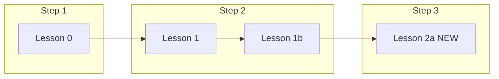

# Lesson 2a (Step 3) + Lessons index redesign

## What we're building

A new **Lesson 2a** — *Run a Coding AI on Your Laptop* — as the first published Step 3 lesson. It bridges Step 2 (you ran a model in pure C) to Step 3 (inference servers): **llama.cpp server** serving a **Qwen2.5 Coder Q4_KM** GGUF model via an **OpenAI-compatible API**, wired to **Cline** in VS Code/Cursor.

Video: [https://youtu.be/S-XveF9GDDc](https://youtu.be/S-XveF9GDDc) (`S-XveF9GDDc`, ~8:18)

Transcript source: provided SRT at  
`/Users/booimac/AIEDX/Bubblspace_Work/Alpha4_TimeCapsule_Skills_SubAgents/FirstBreakAI/Recording/PostProcessing/06-Run a Coding AI Agent locally on your laptop /Run model locallyRun a Coding AI on Your Laptop — 100_ Free, Fully Private, No API Key.srt`



---

## 1. Transcript JSON from SRT

**New file:** [`public/transcripts/lesson-2a-run-coding-ai-locally.json`](public/transcripts/lesson-2a-run-coding-ai-locally.json)

Convert the SRT to the live transcript schema used by [`public/transcripts/lesson-1-huggingface-beyond-upload.json`](public/transcripts/lesson-1-huggingface-beyond-upload.json):

```json
{
  "video_id": "S-XveF9GDDc",
  "title": "Lesson 2a: Run a Coding AI on Your Laptop",
  "duration": 498,
  "chapters": [ { "t": 0, "title": "..." }, ... ],
  "segments": [ { "start_time": 0, "end_time": 8, "text": "..." }, ... ]
}
```

**Chapters** (derived from SRT narrative beats):

| Time | Chapter |
|------|---------|
| 0 | Intro — three things you'll have working |
| 56 | Why local? Privacy, cost, demystify the stack |
| 105 | The stack: llama.cpp server + OpenAI API + Cline |
| 174 | Install llama.cpp (brew / Windows) |
| 210 | Start the model server (Qwen2.5 Coder Q4_KM) |
| 350 | Configure Cline in VS Code / Cursor |
| 490 | Live demo — local coding agent in action |
| 530 | Wrap-up |

Implementation: a one-off Python script in the repo (or inline during implementation) to parse SRT timestamps → `start_time`/`end_time` seconds and merge multi-line cues into segment text.

---

## 2. New lesson page (full text, llama.cpp focus)

**New file:** [`lessons/lesson-2a-run-coding-ai-locally.qmd`](lessons/lesson-2a-run-coding-ai-locally.qmd)

Follow the established pattern from [`lessons/lesson-1-huggingface-beyond-upload.qmd`](lessons/lesson-1-huggingface-beyond-upload.qmd):

- Frontmatter: title, subtitle, description, `title-block-style: none`, `page-layout: full`, `journey.css` + `lessons.css`
- **Hero** with `[● Published]{.lesson-hero-status .lesson-hero-status-published}` (requirement #3)
- Eyebrow: `Lesson 2a · Step 3`
- Chips: `~8 min video`, `Cohort 01`, link to Step 3 roadmap

**Written content structure** (full lesson, llama.cpp + model emphasis, Step 3 context at end):

1. **Opening** — the promise from the video (free, private, no API key)
2. **Why this matters for Step 3** — you already ran inference in C (Step 2); now you use an **inference server** (`llama-server`) that speaks the same protocol production tools use
3. **The three-piece stack** — diagram: GGUF weights → llama.cpp server (`localhost:8080`) → Cline (OpenAI-compatible client)
4. **llama.cpp deep dive** (primary focus)
   - What `llama.cpp` is and why the cohort uses it for local serving
   - Install: `brew install llama.cpp` (Mac) + Windows path from video
   - Verify install command from SRT
   - `llama-server` — the OpenAI-compatible endpoint; contrast with Step 2's single-process `run.c`
5. **The model: Qwen2.5 Coder Q4_KM** (primary focus)
   - Why a 4-bit quantized coding model (Q4_KM) for laptop inference
   - GGUF format connection back to Lesson 1b
   - Server command from video (with extended context window note from SRT)
   - First-run HuggingFace download behavior
6. **Wire Cline to your local server**
   - VS Code / Cursor extension setup
   - Base URL `http://127.0.0.1:8080/v1`, model name, auto-compact setting
   - What "OpenAI-compatible" means and why every inference engine (vLLM, TGI, **llama.cpp server**) exposes this shape
7. **Demo walkthrough** — plan → approve → edit files locally (from SRT)
8. **Step 3 context — what comes next**
   - Table: this lesson (single model, local, llama.cpp) vs full Step 3 (vLLM, TGI, batching, continuous batching, speculative decoding)
   - Explicitly list **llama.cpp server** alongside vLLM and TGI as Step 3 inference engines (requirement #2)
   - Link to [`roadmap.qmd#step-3`](roadmap.qmd) and relevant office hours

**Video block** (same HTML shell as Lesson 1):

```html
<div id="ytPlayer"
     data-video-id="S-XveF9GDDc"
     data-transcript="lesson-2a-run-coding-ai-locally.json"></div>
```

**Navigate by roadmap table:**

| Step | Topic | This lesson |
|------|-------|-------------|
| Lesson 0 / 1 / 1b | Steps 1–2 | Prerequisites |
| **Lesson 2a** | **Run a coding AI locally** | **You are here** |
| Step 3 | Inference deep dive | This lesson is the first Step 3 video |

---

## 3. Wire into roadmap (Step 3 + llama.cpp)

**Edit:** [`roadmap.qmd`](roadmap.qmd) in **three places**:

**A. Timeline Step 3 `<details>`** (currently lines 136–164) — add a **Lessons** block after "You will learn":

```html
<p><strong>Lessons:</strong></p>
<ul>
<li><a href="lessons/lesson-2a-run-coding-ai-locally.qmd">Lesson 2a — Run a Coding AI on Your Laptop</a>: serve Qwen2.5 Coder with llama.cpp server and wire Cline to a local OpenAI-compatible endpoint.</li>
</ul>
```

Keep existing bullet: *Inference engines and runtimes (vLLM, TGI, llama.cpp server)* — lesson 2a is the hands-on llama.cpp entry point.

**B. Normal view Step 3** (lines 347–359) — add matching **Lessons:** section (Step 2 already has this pattern at lines 307–310).

**C. `LESSON_MAP` JS** (lines 437–441) — add:

```js
'lesson-2a-run-coding-ai-locally': '2a'
```

So logged-in users can mark Lesson 2a complete via MCP checkboxes.

---

## 4. CLI config sync

**Edit:** [`cli/lib/config.js`](cli/lib/config.js)

- Change Step 3 title from `'Inference deep dive (coming soon)'` → `'Inference deep dive — llama.cpp server, vLLM, serving'`
- Populate `lessons` array:

```js
{ id: '2a', title: 'Run a Coding AI on Your Laptop', url: `${COHORT_URL}/lessons/lesson-2a-run-coding-ai-locally` }
```

---

## 5. Lessons index — step-grouped, prettier cards

**Edit:** [`lessons/index.qmd`](lessons/index.qmd)

Replace the flat `[Cohort 01]` section with **step-grouped sections** mirroring [`blog/index.qmd`](blog/index.qmd):

```
## [Step 1]{.section-tag .step-1} First use of AI for coding
  → Lesson 0 card (.blog-card-step-1)

## [Step 2]{.section-tag .step-2} Run a model locally
  → Lesson 1 + Lesson 1b cards (.blog-card-step-2)

## [Step 3]{.section-tag .step-3} Inference deep dive
  → Lesson 2a card (.blog-card-step-3)
```

**Label normalization** (requirement #4):

| Lesson | Old label | New label |
|--------|-----------|-----------|
| 0 | `Lesson 0 · Cohort intro` | `Lesson 0 · Step 1` |
| 1 | `Lesson 1 · Step 2` | `Lesson 1 · Step 2` (unchanged) |
| 1b | `Lesson 1b · Step 2` | `Lesson 1b · Step 2` (unchanged) |
| 2a | — | `Lesson 2a · Step 3` |

**Card CSS enhancements** in [`styles/blog.css`](styles/blog.css):

Add `.blog-card-lesson` variant (inspired by existing `.blog-card-oh-cohort` LIVE badge pattern at lines 104–122):

- Subtle step-tinted gradient background per step class
- Top-right **step pill** via `::before` (e.g. `STEP 3`) using the step color already defined for `.blog-card-step-*`
- Slightly stronger hover shadow for lesson cards vs generic cards
- Optional: `.lesson-cards-row` grid modifier so Step 2's two cards sit side-by-side cleanly

This gives visual "clubbing" by step without new React components — pure Quarto markup + CSS.

**Lesson 2a card copy** (index):

- Title: **Run a Coding AI on Your Laptop**
- Description: Serve **Qwen2.5 Coder** with **llama.cpp server**, connect **Cline** via OpenAI-compatible API — free, private, no API key. First Step 3 lesson.

---

## 6. Minor cross-links (optional but low-cost)

- [`blog/index.qmd`](blog/index.qmd) — replace Step 3 placeholder card with a link to Lesson 2a (or add it alongside the placeholder)
- [`docs.qmd`](docs.qmd) line 105 — update `Step 3: Inference deep dive (coming soon)` → note Lesson 2a is live

---

## Files touched (summary)

| Action | File |
|--------|------|
| **Create** | `lessons/lesson-2a-run-coding-ai-locally.qmd` |
| **Create** | `public/transcripts/lesson-2a-run-coding-ai-locally.json` |
| **Edit** | `lessons/index.qmd` — step sections + new card + labels |
| **Edit** | `roadmap.qmd` — Step 3 lesson links + LESSON_MAP |
| **Edit** | `cli/lib/config.js` — Step 3 lesson entry |
| **Edit** | `styles/blog.css` — `.blog-card-lesson` enhancements |
| **Edit** | `blog/index.qmd`, `docs.qmd` — cross-links (minor) |

No `_quarto.yml` changes needed — `lessons/*.qmd` and `public/transcripts/**` are already in the render pipeline.

---

## Verification

1. `quarto preview` — open `/lessons/` and confirm step-grouped cards with Step 1/2/3 visual grouping
2. Open `/lessons/lesson-2a-run-coding-ai-locally.html` — video plays, transcript loads, chapters seek correctly, **Published** pill visible
3. Open `/roadmap.html` — Step 3 shows Lesson 2a link in both timeline and normal views; llama.cpp listed with vLLM/TGI
4. Confirm `LESSON_MAP` checkbox appears on Lesson 2a roadmap link when logged in
