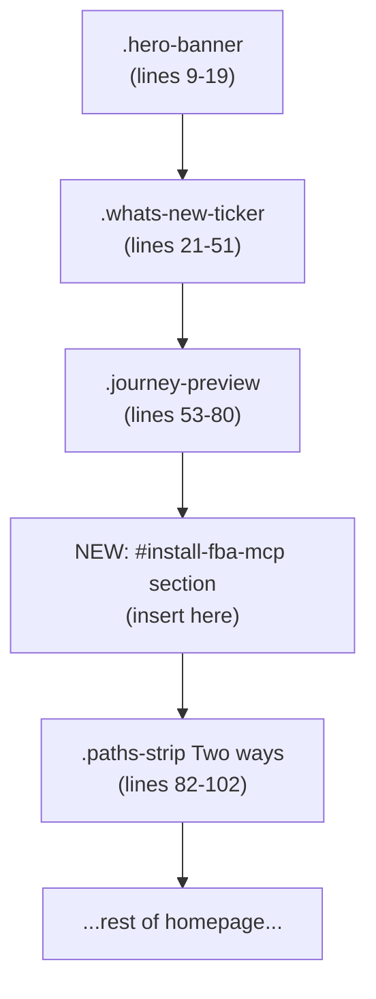

## Plan: Wire Fetchlens MCP widget + install section into cohort site

The Fetchlens team built an MCP server at `https://fba-mcp.throbbing-thunder-4d33.workers.dev/mcp` and shipped two snippets to embed. This plan adds them to the cohort Quarto site with minimal interpretation.

## Files to change

### 1. New: `includes/fba-mcp-widget.html`

Single file containing only the widget script tag the user provided. Site-wide injection happens via Quarto's `include-in-header`.

```html
<script
  src="https://fba-mcp.throbbing-thunder-4d33.workers.dev/widget.js"
  data-endpoint="https://fba-mcp.throbbing-thunder-4d33.workers.dev/widget/mcp"
  data-button-label="Open Cohort Lens"
  async
  defer
></script>
```

### 2. Modify: [_quarto.yml](_quarto.yml)

Currently line 81 has a single-string include. Convert to a list and add the new include:

```yaml
    include-in-header:
      - includes/schema.html
      - includes/fba-mcp-widget.html
```

This makes the widget pill appear on every page (homepage, lessons, blog, journey, office hours, etc.) — which matches the snippet author's "every page" intent.

### 3. Modify: [index.qmd](index.qmd)

Insert the "Install First Break AI into your AI" section into the existing top `{=html}` block, **right before** the `<section class="paths-strip">` opening tag at line 82.

That places the install section between the 6-scene preview (`.journey-preview`, lines 53-80) and the "Two ways into First Break AI" cards (`.paths-strip`, lines 82-102). The narrative flow becomes: hero -> news ticker -> 6-scene preview -> install-FBA-into-your-AI -> two ways in.

Paste verbatim — the `<script>window.FBA_MCP_URL = ...</script>`, the `<section id="install-fba-mcp">...</section>`, and the closing `<script>` with the copy/click handlers — all three blocks in one insertion.

## Placement diagram



## Risks and follow-ups (not blockers)

- **Dev subdomain.** `throbbing-thunder-4d33.workers.dev` is a Cloudflare workers.dev URL, not a production domain. When Fetchlens MCP gets a permanent home (likely `mcp.fetchlens.ai`), three places need updating: `includes/fba-mcp-widget.html` (two URLs in the script tag's `src` and `data-endpoint`) and `index.qmd` (the `window.FBA_MCP_URL` literal). Acceptable for launch; flag for a follow-up to centralize.
- **Inline styles do not match the cohort palette.** The install section uses neutral white cards (`#fff`, `#e4e4e7`, `#555`) and a blue link colour (`#5865f2`). The cohort site uses warm amber. The section will visibly look like a Fetchlens-branded card embedded in a cohort page. Acceptable for the v1 ship; polish item: move to `styles/home.css` and reskin to match.
- **Floating pill collision.** The widget injects a fixed bottom-right pill. Quarto's scroll-to-top and the existing `mermaid-zoom.html`/`lesson-player.html`/`journey-player.html` includes may also occupy that corner. We will check on first deploy and adjust `z-index` if needed.
- **`mcp-remote` shim in Claude config.** The Claude Desktop snippet uses `npx -y mcp-remote <url>` because Claude Desktop does not yet support HTTP MCP servers natively. If Anthropic ships native HTTP support, the copy-config handler in the snippet needs updating.

## Verification after deploy

- Floating "Open Cohort Lens" pill appears bottom-right on every page (homepage, any lesson, any blog post).
- Homepage shows the new install section between scene previews and "Two ways" cards.
- Clicking "Copy install URL" on the HuggingChat or Cursor card copies `https://fba-mcp.throbbing-thunder-4d33.workers.dev/mcp` to the clipboard.
- Clicking "Copy config snippet" on the Claude card copies the JSON block with `mcp-remote` and the workers.dev URL.
- Clicking "open the Lens widget here" in the section footer triggers the floating widget pill.

## What this does NOT do

- Does not touch the existing Fetchlens **analytics** middleware in [functions/_middleware.ts](functions/_middleware.ts) (separate Fetchlens product, separate site tag `fl_pub_6f78bbfb4264f7b4b76c3b86272e1b49`).
- Does not implement the previously discussed cohort-local Phase 1 MCP at `cohort.bubblnet.com/mcp`. That decision is now moot for this iteration: Fetchlens is hosting the MCP server externally, so the cohort site only consumes it via the widget + install card.
- Does not add any new dependencies to `package.json`. The widget loads at runtime from the Fetchlens worker.