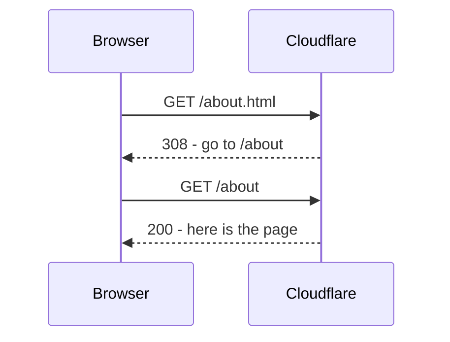
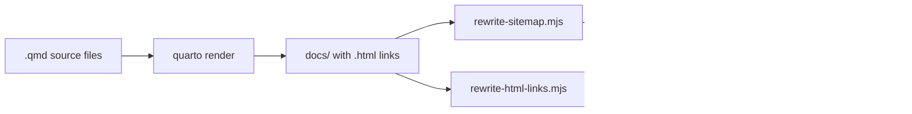
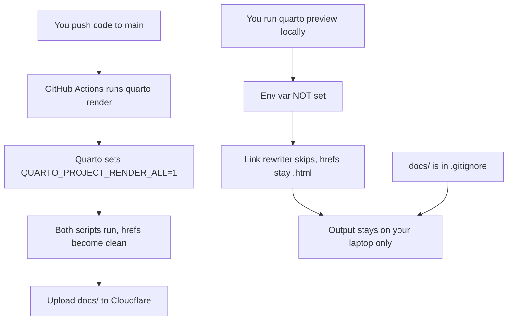

# SEO Explained: Clean URLs, Hrefs, and the Two Post-Render Scripts

A plain-English walkthrough of how `cohort.bubblnet.com` keeps its URLs SEO-friendly, why local preview behaves differently from production, and why none of it can break the live site.

## 1. What is an `href`?

When you click a link on a webpage, the browser is following an `href` attribute in HTML:

```html
<a href="/about.html">About us</a>
```

That `href` tells the browser "go to this address." Easy.

## 2. The two flavors of URLs

Same page, two ways to write the address:

| URL style | Example | Looks like |
| --- | --- | --- |
| Ugly URL | `/about.html` | A file on disk |
| Clean URL | `/about` | A modern website |

Modern hosts (like Cloudflare Pages) prefer **clean URLs**. They look professional and Google likes them.

## 3. What Cloudflare does automatically

When someone visits `cohort.bubblnet.com/about.html`, Cloudflare says:

> "Nope, the real address is `/about`. Go there instead."

That "go there instead" message is called a **redirect** (specifically a 308). The browser then makes a second trip to `/about` and finally gets the page.



Two trips instead of one. Annoying but harmless for one human visitor.

## 4. Why this matters for Google (the SEO problem)

Google's crawler ("Googlebot") visits your site like a robot, following every link. Google gives each site a **crawl budget** — basically, "I'll spend X minutes per day on your site, no more."

Now imagine your site has 470 internal links and **every single one** ends in `.html`. Every link Googlebot clicks costs **two trips** instead of one. You just burned half your crawl budget on redirects instead of letting Google read actual pages.

Worse: Google sees inconsistency.

- Your `<link rel="canonical">` says: "the real URL is `/about`"
- Your `sitemap.xml` says: "the real URL is `/about`"
- But your `<a href>` says: "the real URL is `/about.html`"

Google gets confused signals → indexing slows down → "Crawled - currently not indexed" appears in Search Console. Which is exactly what we were stuck on for weeks.

## 5. Why Quarto creates the problem

Quarto is the static site generator that builds the site. By default, when you write a link in a `.qmd` file, Quarto outputs `.html` in the `href`:

```html
<a href="/about.html">About</a>
```

Quarto doesn't know that Cloudflare strips `.html`. It just produces files. So out of the box, every internal link on the site ends in `.html` → every click is a redirect → Googlebot is unhappy.

## 6. The fix: two post-render scripts

After Quarto finishes building the site into the `docs/` folder, two scripts run and clean up the mess:



**Script 1 — [`scripts/rewrite-sitemap.mjs`](scripts/rewrite-sitemap.mjs)**

Edits `sitemap.xml`. Changes every `<loc>https://cohort.bubblnet.com/about.html</loc>` to `<loc>https://cohort.bubblnet.com/about</loc>`. Now the sitemap and canonical tags agree.

**Script 2 — [`scripts/rewrite-html-links.mjs`](scripts/rewrite-html-links.mjs)**

Opens every `.html` file in `docs/`. Finds every `href="…/about.html"` and rewrites it to `href="…/about"`. Now Googlebot crawls links that go straight to the page — no redirect, no wasted trips.

**Before (raw Quarto output):**

```html
<a href="/about.html">About</a>
<a href="/journey/index.html">Journey</a>
```

**After (post-render scripts run):**

```html
<a href="/about">About</a>
<a href="/journey/">Journey</a>
```

Both scripts are wired into [`_quarto.yml`](_quarto.yml) under `post-render:`.

## 7. The new problem: local preview broke

When you run `quarto preview` on your laptop, Quarto starts a tiny local web server. **That local server does NOT auto-redirect `.html` to clean URLs the way Cloudflare does.**

So if `rewrite-html-links.mjs` runs locally and strips `.html` from all your hrefs, then you click "About" in your browser → 404. The local server is looking for a file literally named `/about` and there isn't one (the file is `/about.html`).

That's why the office-hours pages broke last session.

## 8. The guard (the recent change)

The fix: tell the script "only run during a real deploy, never during local preview."

```js
if (process.env.QUARTO_PROJECT_RENDER_ALL !== '1') {
  process.exit(0);  // skip — local preview
}
```

Quarto sets that environment variable to `1` only when you do a **full project render** (`quarto render` with no arguments — which is what GitHub Actions runs in CI). When you just preview locally, the variable isn't set, so the script exits without touching anything. Local hrefs keep `.html` → local navigation works.

## 9. Why this can't break production SEO

Three independent safeguards:



1. **`docs/` is gitignored** — your local build output never gets committed, never reaches Cloudflare. Only CI's build does.
2. **CI does a full render** — `quarto render` (no arguments) → env var is set → scripts run → clean URLs.
3. **The script itself is the fail-safe** — even if you accidentally ran it locally, it would just exit politely.

So locally everything has `.html` and works in your browser. In production everything is clean and Google is happy. The two worlds never collide.

## TL;DR

- **`.html` in links = bad for Google** (each click is a redirect, wastes crawl budget).
- **Cloudflare prefers clean URLs** (`/about` not `/about.html`).
- **Two scripts strip `.html`** from the sitemap and from every internal link.
- **Local preview needs `.html`** to work (Quarto's preview server is dumb), so we skip the link rewriter locally.
- **CI always does a full render**, which triggers the rewriter, so production stays clean.
- **Your laptop's output never reaches production** because `docs/` is gitignored.

Net result: Googlebot crawls a perfectly consistent site, and you can still preview locally without 404s.

## One gotcha

If you ever change the CI workflow ([`.github/workflows/publish.yml`](.github/workflows/publish.yml)) to render a single file (e.g. `quarto render some-page.qmd`) instead of the whole project, the env var won't be set, and that page would ship with `.html` `href`s. Keep the workflow on a bare `quarto render`.

## Files involved

| File | Role |
| --- | --- |
| [`_quarto.yml`](_quarto.yml) | Wires the two post-render scripts |
| [`scripts/rewrite-sitemap.mjs`](scripts/rewrite-sitemap.mjs) | Cleans `sitemap.xml` (runs every render) |
| [`scripts/rewrite-html-links.mjs`](scripts/rewrite-html-links.mjs) | Cleans `<a href>` in every HTML file (CI only) |
| [`.github/workflows/publish.yml`](.github/workflows/publish.yml) | Runs `quarto render` in CI, triggers the rewriter |
| [`.gitignore`](.gitignore) | Excludes `docs/` so local builds never leak to production |
| [`robots.txt`](robots.txt) | Tells crawlers what to skip (e.g. `Disallow: /public/audio/`) |
| [`canonical.lua`](canonical.lua) | Quarto filter that injects `<link rel="canonical">` tags |
