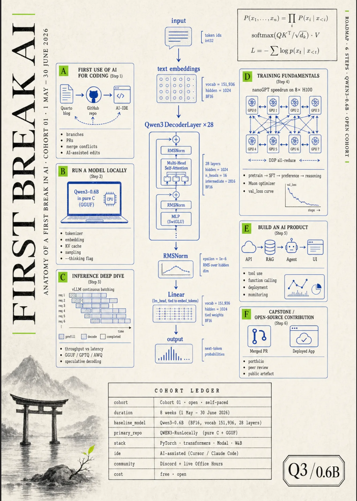

```{=html}
<div class="hero-banner">
  
  <div class="hero-overlay">
    <div class="hero-text">
      <h1 class="hero-title">First Break AI</h1>
      <p class="hero-tagline">The first fully agentic AI cohort — AI agents guide your journey from first commit to capstone</p>
      <p class="hero-sub">Community cohort for training, inference, and agentic AI — now evolving to <a href="https://bubblnet.com/" target="_blank" rel="noopener" style="color:#f0ebe1;text-decoration:underline">FBA Lab</a>. Powered by AI agents built on <a href="https://fetchlens.ai" target="_blank" rel="noopener" style="color:#f0ebe1;text-decoration:underline">FetchLens.ai</a></p>
      <a href="https://bubblnet.com/" class="hero-journey-btn" target="_blank" rel="noopener noreferrer">Start the Journey &#9654;</a>
    </div>
  </div>
</div>

<div class="whats-new-ticker" aria-label="What's new at First Break AI">
  <span class="ticker-label">What's New</span>
  <div class="ticker-viewport">
    <div class="ticker-track">
      <div class="ticker-group">
        <a class="ticker-item" href="https://bubblnet.com/" target="_blank" rel="noopener">
          <span class="ticker-pill new">New · FBA Lab</span>
          <span class="ticker-text">First Break AI is evolving — FBA Lab is the new hands-on front door. Real model code, diagrams, terminal logs. No GPU, no setup.</span>
        </a>
        <span class="ticker-sep" aria-hidden="true">●</span>
        <a class="ticker-item" href="lessons/lesson-1b-qwen3-fundamentals.qmd">
          <span class="ticker-pill new">New · Lesson 1b</span>
          <span class="ticker-text">Qwen3 Fundamentals — how a language model lives on disk and loads into memory, byte by byte.</span>
        </a>
        <span class="ticker-sep" aria-hidden="true">●</span>
        <a class="ticker-item" href="lessons/lesson-1-huggingface-beyond-upload.qmd">
          <span class="ticker-pill">Lesson 1</span>
          <span class="ticker-text">HuggingFace Beyond Upload — why an open model is not a file, it's a supply chain you can inspect.</span>
        </a>
        <span class="ticker-sep" aria-hidden="true">●</span>
      </div>
      <div class="ticker-group" aria-hidden="true">
        <a class="ticker-item" href="https://bubblnet.com/" target="_blank" rel="noopener" tabindex="-1">
          <span class="ticker-pill new">New · FBA Lab</span>
          <span class="ticker-text">First Break AI is evolving — FBA Lab is the new hands-on front door. Real model code, diagrams, terminal logs. No GPU, no setup.</span>
        </a>
        <span class="ticker-sep">●</span>
        <a class="ticker-item" href="lessons/lesson-1b-qwen3-fundamentals.qmd" tabindex="-1">
          <span class="ticker-pill new">New · Lesson 1b</span>
          <span class="ticker-text">Qwen3 Fundamentals — how a language model lives on disk and loads into memory, byte by byte.</span>
        </a>
        <span class="ticker-sep">●</span>
        <a class="ticker-item" href="lessons/lesson-1-huggingface-beyond-upload.qmd" tabindex="-1">
          <span class="ticker-pill">Lesson 1</span>
          <span class="ticker-text">HuggingFace Beyond Upload — why an open model is not a file, it's a supply chain you can inspect.</span>
        </a>
        <span class="ticker-sep">●</span>
      </div>
    </div>
  </div>
</div>

<div class="journey-preview">
  <div class="journey-preview-track">
    <a href="roadmap.qmd" class="journey-preview-card">
      <span class="journey-preview-num">1</span>
      <span class="journey-preview-label">Ship something real</span>
    </a>
    <a href="roadmap.qmd" class="journey-preview-card">
      <span class="journey-preview-num">2</span>
      <span class="journey-preview-label">See inside the machine</span>
    </a>
    <a href="roadmap.qmd" class="journey-preview-card">
      <span class="journey-preview-num">3</span>
      <span class="journey-preview-label">Think at production scale</span>
    </a>
    <a href="roadmap.qmd" class="journey-preview-card">
      <span class="journey-preview-num">4</span>
      <span class="journey-preview-label">Train your own</span>
    </a>
    <a href="roadmap.qmd" class="journey-preview-card">
      <span class="journey-preview-num">5</span>
      <span class="journey-preview-label">Ship a product</span>
    </a>
    <a href="roadmap.qmd" class="journey-preview-card">
      <span class="journey-preview-num">6</span>
      <span class="journey-preview-label">Prove it</span>
    </a>
  </div>
</div>

<script>
  window.FBA_MCP_URL = 'https://fba-mcp.throbbing-thunder-4d33.workers.dev/mcp';
</script>
<details id="install-fba-mcp" class="install-fba" aria-labelledby="install-fba-mcp-title">
  <summary>
    <span class="install-fba-eyebrow">For builders — fully agentic</span>
    <span class="install-fba-headline" id="install-fba-mcp-title">Install the First Break AI MCP server &amp; CLI — AI agents built in</span>
    <span class="install-fba-hint">Model Context Protocol · AI Agents · Agentic AI · HuggingChat · Claude · Cursor · Codex · npm CLI · <a href="docs.html">Docs</a></span>
  </summary>
  <div class="install-fba-body">
    <p class="install-fba-intro">
      First Break AI is <strong>completely agentic</strong> — every part of the cohort is powered by AI agents. The live <strong>MCP server</strong> (Model Context Protocol) lets AI assistants call cohort tools over HTTP: answer questions, validate homework, track progress, and guide you through the roadmap.
      Add it once in HuggingChat, Claude Desktop, Claude Code, Cursor, or OpenAI Codex, and your AI agent can use cohort tools (<code>ask</code>, <code>find</code>, <code>validate</code>, and more) without leaving the chat.
    </p>
    <div class="install-fba-endpoint">
      <label class="install-fba-endpoint-label" for="fba-mcp-url-display">MCP endpoint</label>
      <div class="install-fba-endpoint-row">
        <input
          type="text"
          class="install-fba-endpoint-input"
          id="fba-mcp-url-display"
          value="https://fba-mcp.throbbing-thunder-4d33.workers.dev/mcp"
          readonly
          spellcheck="false"
          aria-label="First Break AI MCP server URL"
        />
        <button type="button" class="install-fba-btn install-fba-endpoint-copy" data-mcp-copy-url data-target="MCP server">Copy URL</button>
      </div>
      <p class="install-fba-endpoint-hint">Same URL on every client card below — or copy the config snippet that matches your tool.</p>
    </div>
    <div class="install-fba-grid">
      <article class="install-fba-card">
        <div class="install-fba-card-head">
          
          <span>HuggingChat</span>
        </div>
        <p class="install-fba-card-desc">Open HuggingChat → MCP Servers panel → Custom Servers → "Add Your First Server."</p>
        <div class="install-fba-card-actions">
          <button type="button" class="install-fba-btn" data-mcp-copy-url data-target="HuggingChat">Copy install URL</button>
          <a class="install-fba-link" href="https://huggingface.co/chat/" target="_blank" rel="noopener">Open HuggingChat ↗</a>
        </div>
      </article>
      <article class="install-fba-card">
        <div class="install-fba-card-head">
          
          <span>Claude Desktop</span>
        </div>
        <p class="install-fba-card-desc">Settings → Developer → Edit Config → paste under <code>mcpServers</code> (uses <code>mcp-remote</code> shim). Restart Claude Desktop after saving.</p>
        <div class="install-fba-card-actions">
          <button type="button" class="install-fba-btn" data-mcp-claude-desktop-config data-target="Claude Desktop">Copy config snippet</button>
          <a class="install-fba-link" href="https://support.anthropic.com/en/articles/10949351-getting-started-with-local-mcp-servers-on-claude-desktop" target="_blank" rel="noopener noreferrer">Setup guide ↗</a>
        </div>
      </article>
      <article class="install-fba-card">
        <div class="install-fba-card-head">
          
          <span>Claude Code</span>
        </div>
        <p class="install-fba-card-desc">Terminal: <code>claude mcp add --transport http fba-cohort &lt;url&gt;</code> — or add to <code>~/.claude.json</code> / project <code>.mcp.json</code>. Run <code>/mcp</code> in a session to verify.</p>
        <div class="install-fba-card-actions">
          <button type="button" class="install-fba-btn" data-mcp-copy-url data-target="Claude Code">Copy install URL</button>
          <button type="button" class="install-fba-btn" data-mcp-claude-code-config data-target="Claude Code">Copy JSON snippet</button>
          <a class="install-fba-link" href="https://docs.anthropic.com/en/docs/claude-code/mcp" target="_blank" rel="noopener noreferrer">Setup guide ↗</a>
        </div>
      </article>
      <article class="install-fba-card">
        <div class="install-fba-card-head">
          
          <span>Cursor</span>
        </div>
        <p class="install-fba-card-desc">Settings → Features → Model Context Protocol → add server, or edit <code>~/.cursor/mcp.json</code> / <code>.cursor/mcp.json</code> with a remote <code>url</code> entry.</p>
        <div class="install-fba-card-actions">
          <button type="button" class="install-fba-btn" data-mcp-copy-url data-target="Cursor">Copy install URL</button>
          <button type="button" class="install-fba-btn" data-mcp-cursor-config data-target="Cursor">Copy JSON snippet</button>
          <a class="install-fba-link" href="https://cursor.com/docs/mcp" target="_blank" rel="noopener noreferrer">Setup guide ↗</a>
        </div>
      </article>
      <article class="install-fba-card">
        <div class="install-fba-card-head">
          
          <span>Codex</span>
        </div>
        <p class="install-fba-card-desc">Add to <code>~/.codex/config.toml</code> under <code>[mcp_servers.fba-cohort]</code> — or run <code>codex mcp</code> in the CLI. Then <code>/mcp</code> in a session to verify.</p>
        <div class="install-fba-card-actions">
          <button type="button" class="install-fba-btn" data-mcp-copy-url data-target="Codex">Copy install URL</button>
          <button type="button" class="install-fba-btn" data-mcp-codex-toml data-target="Codex">Copy TOML snippet</button>
          <a class="install-fba-link" href="https://developers.openai.com/codex/mcp" target="_blank" rel="noopener">Setup guide ↗</a>
        </div>
      </article>
    </div>
    <details class="install-fba-tools">
      <summary>What can my AI actually do with FBA installed?</summary>
      <ul>
        <li><code>ask</code> — answer any cohort question using the FBA roadmap, lessons, FAQ.</li>
        <li><code>do</code> — enroll you, send the Discord invite + welcome email.</li>
        <li><code>find</code> — locate specific lessons, steps, or office-hours topics.</li>
        <li><code>validate</code> — judge your submitted work against the rubric and unlock the next step.</li>
        <li><code>next</code> — tell your AI what to ask you next so you keep moving.</li>
      </ul>
    </details>
    <details class="install-fba-tools">
      <summary>Want a local CLI too? Install the npm package</summary>
      <div class="install-fba-cli-detail">
        <p>The <a href="https://www.npmjs.com/package/@aiedx/firstbreakai" target="_blank" rel="noopener"><code>@aiedx/firstbreakai</code></a> npm package gives you a terminal CLI <em>and</em> a local MCP server in one install:</p>
        <pre><code>npm install -g @aiedx/firstbreakai</code></pre>
        <ul>
          <li><code>firstbreakai doctor</code> — check your dev environment (Git, Python, Quarto, HF CLI)</li>
          <li><code>firstbreakai init</code> — scaffold a Quarto blog for Step 1</li>
          <li><code>firstbreakai validate 1</code> — run local checks on your work</li>
          <li><code>firstbreakai status</code> / <code>done</code> / <code>next</code> — track and navigate your progress</li>
          <li><code>firstbreakai ask "..."</code> — query the FBA assistant from your terminal</li>
          <li><code>firstbreakai mcp</code> — start a local MCP server for Cursor, Claude Desktop, etc.</li>
        </ul>
        <p><a href="docs.html"><strong>Full CLI &amp; MCP docs →</strong></a></p>
      </div>
    </details>
    <p class="install-fba-fallback">
      Or, if you'd rather stay on this page,
      <button type="button" id="fba-open-widget">ask anything here</button>.
    </p>
  </div>
</details>
<script src="public/scripts/install-fba-mcp.js?v=5" defer></script>

<section class="paths-strip" aria-labelledby="paths-headline">
  <div class="paths-strip-head">
    <span class="paths-eyebrow">Start here</span>
    <h2 class="paths-headline" id="paths-headline">Two ways into First Break AI</h2>
    <p class="paths-sub">Pick a path — they're built to work together. Most learners ping-pong between the map and the lessons.</p>
  </div>
  <div class="paths-grid">
    <a href="roadmap.html" class="path-card path-card-roadmap">
      <span class="path-card-step">01 · The map</span>
      <span class="path-card-title">Roadmap</span>
      <span class="path-card-desc">Six steps from first commit to capstone. Know where you're going before you start running.</span>
      <span class="path-card-cta">Open the roadmap <span class="path-card-arrow" aria-hidden="true">→</span></span>
    </a>
    <a href="lessons/" class="path-card path-card-lessons">
      <span class="path-card-step">02 · The build</span>
      <span class="path-card-title">Lessons</span>
      <span class="path-card-desc">Hands-on deep dives — HuggingFace, training, inference, and shipping AI-powered products.</span>
      <span class="path-card-cta">Start with Lesson 1 <span class="path-card-arrow" aria-hidden="true">→</span></span>
    </a>
  </div>
</section>
```

::: {.content-section}

**Cohort: 1 May 2026 — 30 June 2026** [<span class="cohort-live-badge cohort-archived-badge"><span class="cohort-live-dot" aria-hidden="true"></span>Archived</span>]{.cohort-live-wrap}

First Break AI is evolving. Cohort 01 started as a live + async cohort — and the first cohort that is **completely agentic**. But the clearest signal is that serious learners do not need more passive sessions — they need a better way to touch real AI systems directly.

So the focus is moving to **[FBA Lab](https://bubblnet.com/)**. FBA Lab is the new hands-on front door: real model code, synced architecture diagrams, terminal logs, and explanations that move together. No GPU, no setup, no account required to start.

Because of this, weekly office hours will pause. The cohort will stay open and async. Focused sessions will run only when there is real work to review: demos, project submissions, debugging, training runs, or walkthrough requests.

This keeps the community focused on builders, not passive attendance. AI agents are woven into every layer of the cohort: an agentic MCP server answers your questions, AI agents validate your code against rubrics, track your progress across devices, and guide you through the roadmap step by step. The agentic backbone is built on [FetchLens.ai](https://fetchlens.ai). The goal is simple: **upskill, build, showcase** — and get that first role or first break in AI.

## Who it's for

You don't need a specific degree. You need a starting point. This cohort is for anyone — students, professionals, career switchers, the simply curious — who wants their first real break in AI. No applications, no prerequisites. Follow the roadmap, build in the open, and let your work speak for itself.

**Cohort lead:** [FireHacker](https://thefirehacker.github.io/) (blog, TIL) · [GitHub @thefirehacker](https://github.com/thefirehacker) · [About](about.qmd)

**For teams:** [First Break AI for Teams](teams.qmd) — instructor-led, with team dashboards, custom projects, and enterprise billing.
**For compute providers:** [Partner with us](sponsors.qmd) — your platform becomes the curriculum, not just a coupon.

## How AI agents enhance cohort learning

Traditional online courses give you videos and quizzes. First Break AI gives you **AI agents that learn alongside you**. Every part of this cohort is powered by agentic AI — real AI agents that answer your questions, validate your code, track your progress, and guide you through the roadmap in real time.

Here's what makes an **agentic AI cohort** different from a course PDF:

- **AI agents answer questions in context.** The on-site AI assistant and CLI agent know the syllabus, the lessons, and your current step. Ask "What is GGUF?" and the AI agent answers from the cohort's own knowledge base — not a generic web search.
- **AI agents validate your work.** When you finish a step, run `firstbreakai validate` in your terminal. An AI agent checks your code, your repo, and your environment against the rubric — deterministically, no hallucinations.
- **AI agents track your progress.** Your AI agent syncs your progress across the CLI, the roadmap page, and the MCP server. Every validated step and completed lesson is tracked by AI agents on the backend.
- **AI agents integrate with your IDE.** Install the MCP server in Cursor, Claude Desktop, Claude Code, or OpenAI Codex. Your AI agent can call cohort tools (`ask`, `find`, `validate`, `next`) directly from your coding environment — no context switching.
- **AI agents make the cohort scalable.** Instead of one instructor answering every question, AI agents handle the repetitive work — so office hours can focus on the hard, nuanced discussions that only humans can have.

This agentic infrastructure is built on **[FetchLens.ai](https://fetchlens.ai)** — the same platform that powers AI agent observability for websites. FetchLens makes First Break AI agentic by providing the MCP server backbone, the AI agent widget on every page, and the Discord-authenticated progress tracking that ties the whole experience together.

The result: **AI agents don't replace the instructor — they multiply the instructor.** Every learner gets a personal AI agent that knows the curriculum and their progress. That's the difference between a static course and an agentic AI cohort.

::: {.cta-banner}
### Ready to build?

The cohort is archived and fully async. Start with FBA Lab — hands-on AI system work, no GPU or setup required.

[Start with FBA Lab](https://bubblnet.com/){.cta-button}

**Focused sessions** run when there is real work to review: demos, project submissions, debugging, training runs, or walkthrough requests.

::: {.cta-fineprint}
Recommended for learners aged **16+**. If you are under 18, please join only with parent or guardian permission. By joining you agree to our [Community Guidelines](community-guidelines.qmd), [Terms](terms.qmd), and [Privacy Policy](privacy.qmd).
:::
:::

```{=html}
<div class="cohort-poster" id="cohort-poster-anchor">
  <div class="cohort-poster-header">
    <span class="cohort-poster-tag">Bonus · The Anatomy</span>
    <h2 class="cohort-poster-title">Want the full picture?</h2>
    <p class="cohort-poster-sub">The cohort drawn as one inference flow — six steps, every detail on a single poster. Click to enlarge.</p>
  </div>
  <a class="cohort-poster-link"
     href="public/images/firstbreakai-anatomy-poster.png"
     target="_blank"
     rel="noopener"
     aria-label="Open the First Break AI anatomy poster full-size in a new tab">
    
  </a>
</div>
```

## Get started

| Section | Description |
|--------|--------------|
| [Lesson 0: Welcome to First Break AI](lessons/lesson-0-welcome.qmd) | Cohort intro video with interactive transcript — start here. Also on [YouTube](https://www.youtube.com/watch?v=r9uykyGAdJQ&list=PLEzXCZNdmgBm-SbXuXHxn9_vXpvFbrKKL) (full [playlist](https://www.youtube.com/playlist?list=PLEzXCZNdmgBm-SbXuXHxn9_vXpvFbrKKL)) |
| [Roadmap](roadmap.qmd) | Learning path: Quarto blog, local inference, training, and beyond |
| [Checklist](checklist.qmd) | Accounts to create (Hugging Face, GitHub, Fetchlens.ai, Colab) and who to follow |
| [AI Setup](setup.qmd) | AI-based IDE (Cursor / Claude Code), ChatGPT, Open Router |

## Frequently asked

```{=html}
<div class="faq">

  <details open class="faq-item">
    <summary>What is FBA Lab?</summary>
    <div class="faq-body">
      <p><strong>FBA Lab is where First Break AI is heading.</strong> Cohort 01 started as a live + async cohort. The signal was clear: serious learners need a better way to touch real AI systems directly — not more passive sessions.</p>
      <p>FBA Lab is the new hands-on front door. It brings together real model code, synced architecture diagrams, terminal logs, and explanations that move together — so you can see how inference, training, and agentic AI actually work, step by step. No GPU required. No account required to start. No setup friction.</p>
      <p>The cohort roadmap, lessons, and office-hours archives stay online here. FBA Lab is where new hands-on content is being built.</p>
      <p><a href="https://bubblnet.com/" target="_blank" rel="noopener"><strong>Start with FBA Lab →</strong></a></p>
    </div>
  </details>

  <details class="faq-item">
    <summary>Do I need a CS or tech background?</summary>
    <div class="faq-body">
      <p>You need comfort with reading code (any language) and running terminal commands. That's the floor.</p>
      <p>Past learners have come from career switches, design, math/econ/physics, and self-taught backgrounds. There are <strong>no applications and no prerequisites</strong> — the <a href="roadmap.qmd">roadmap</a> and <a href="checklist.qmd">checklist</a> tell you exactly what to install on day one.</p>
    </div>
  </details>

  <details class="faq-item">
    <summary>How much time per week do I need to commit?</summary>
    <div class="faq-body">
      <p>Plan for <strong>5–8 hours a week</strong> to comfortably work through the lessons and roadmap. The async materials are self-paced — there is no required weekly commitment.</p>
      <p>Cohort 01 ran <strong>1 May 2026 – 30 June 2026</strong> and is now archived. Everything stays online, so you can move at your own pace.</p>
    </div>
  </details>

  <details class="faq-item">
    <summary>What hardware do I need? Mac, Windows, or do I need a GPU?</summary>
    <div class="faq-body">
      <p>Any modern laptop is enough to start. We design the lessons <strong>CPU-first</strong> — for example, <a href="lessons/lesson-1-huggingface-beyond-upload.qmd">Lesson 1</a> runs Qwen3-0.6B in pure C on your laptop's CPU with no GPU required.</p>
      <p>Mac (Apple Silicon or Intel), Windows (with WSL), and Linux all work. When the cohort hits larger training experiments in Step 4, the <a href="setup.qmd">AI Setup</a> page covers free-tier cloud GPU options.</p>
    </div>
  </details>

  <details class="faq-item">
    <summary>Will I get a certificate or job placement?</summary>
    <div class="faq-body">
      <p>No certificate, no placement service. What you walk away with is a <strong>portfolio</strong>: a Quarto blog of everything you learned, a model you trained from scratch, a deployed AI product, and optionally a merged open-source contribution.</p>
      <p>In 2026, that portfolio is a much stronger hiring signal than a course PDF. Recruiters can see your blog and your GitHub commits; they can't see a certificate badge.</p>
    </div>
  </details>

  <details class="faq-item">
    <summary>What if I miss a session, or join mid-cohort?</summary>
    <div class="faq-body">
      <p>Everything is asynchronous. Cohort 01 is archived — all lessons, recaps, and transcripts stay online and are searchable.</p>
      <p>The Discord stays active and the materials are available to anyone. Focused sessions run when there is real work to review.</p>
    </div>
  </details>

  <details class="faq-item">
    <summary>How is this different from fast.ai, Karpathy's lectures, or HuggingFace's free course?</summary>
    <div class="faq-body">
      <p>First Break AI is <strong>openly inspired by Andrej Karpathy's <a href="https://www.youtube.com/watch?v=l8pRSuU81PU"><em>Let's reproduce GPT-2 (124M)</em></a> and <a href="https://github.com/karpathy/llm.c"><code>llm.c</code></a></strong> — the from-scratch, no-magic, run-it-in-pure-C approach to teaching how LLMs actually work.</p>
      <p>fast.ai and HuggingFace's free course are excellent complementary reads, and the <a href="roadmap.qmd">Roadmap</a> links to them where they fit.</p>
    </div>
  </details>

</div>
```

:::

```{=html}
<script>
(function() {
  var els = document.querySelectorAll('.office-hours-local');
  if (!els.length) return;
  var tz = Intl.DateTimeFormat().resolvedOptions().timeZone;
  var fri = new Date();
  fri.setUTCHours(15, 30, 0, 0);
  var end = new Date(fri.getTime() + 3600000);
  var fmt = function(d) {
    return d.toLocaleTimeString([], { hour: '2-digit', minute: '2-digit', hour12: true });
  };
  var localStart = fmt(fri);
  var localEnd = fmt(end);
  var tzLabel = tz.replace(/_/g, ' ');
  if (tz !== 'Asia/Calcutta' && tz !== 'Asia/Kolkata') {
    els.forEach(function(el) {
      el.textContent = 'That’s ' + localStart + ' – ' + localEnd + ' in your time (' + tzLabel + ').';
    });
  }
})();
</script>
```
