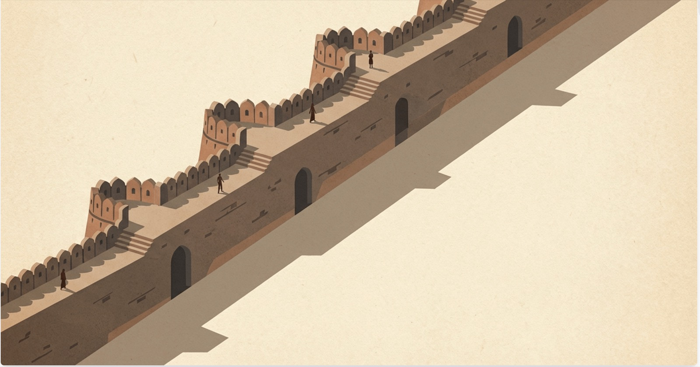

```{=html}
<div class="hero-banner">
  
  <div class="hero-overlay">
    <div class="hero-text">
      <h1 class="hero-title">First Break AI</h1>
      <p class="hero-tagline">Your first break in AI</p>
      <p class="hero-sub">Free, open cohort to upskill in training, inference, and AI product building.</p>
    </div>
  </div>
</div>
```

::: {.content-section}

**Cohort: 8 March 2026 — 7 June 2026 (3 months)**

First Break AI is a free, community-driven cohort for anyone who wants their first break in AI. It doesn't matter what you studied or where you work — what matters is that you're ready to learn by doing. We focus on what matters: running and training models, understanding inference, and shipping AI-powered products. Most learning is self-directed and peer-supported; the roadmap, checklist, and resources live in the open so you can contribute and others can follow. The goal is simple: **upskill, build, showcase** — and get that first role or first break in AI.

## Who it's for

You don't need a specific degree. You need a starting point. This cohort is for anyone — students, professionals, career switchers, the simply curious — who wants their first real break in AI. No applications, no prerequisites. Follow the roadmap, build in the open, and let your work speak for itself.

::: {.cta-banner}
### Ready to start your journey?

This is a free, community-driven cohort. To join, sign up on Discord — that's where the cohort lives, where you get help, and where you connect with fellow learners.

[Join Discord and start learning](https://discord.gg/QZuBvfcj){.cta-button}

**Office Hours:** Every Friday, 9:00 — 10:00 PM IST. Meeting link shared on Discord.
<span class="office-hours-local"></span>
:::

## Get started

| Section | Description |
|--------|--------------|
| [Roadmap](roadmap.qmd) | Learning path: Quarto blog, local inference, training, and beyond |
| [Checklist](checklist.qmd) | Accounts to create (Hugging Face, GitHub, BubblSpace, Colab) and who to follow |
| [AI Setup](setup.qmd) | AI-based IDE (Cursor / Claude Code), ChatGPT, Open Router |

:::

```{=html}
<script>
(function() {
  var els = document.querySelectorAll('.office-hours-local');
  if (!els.length) return;
  var tz = Intl.DateTimeFormat().resolvedOptions().timeZone;
  var fri = new Date();
  fri.setUTCHours(15, 30, 0, 0);
  var end = new Date(fri.getTime() + 3600000);
  var fmt = function(d) {
    return d.toLocaleTimeString([], { hour: '2-digit', minute: '2-digit', hour12: true });
  };
  var localStart = fmt(fri);
  var localEnd = fmt(end);
  var tzLabel = tz.replace(/_/g, ' ');
  if (tz !== 'Asia/Calcutta' && tz !== 'Asia/Kolkata') {
    els.forEach(function(el) {
      el.textContent = 'That\u2019s ' + localStart + ' \u2013 ' + localEnd + ' in your time (' + tzLabel + ').';
    });
  }
})();
</script>
```
