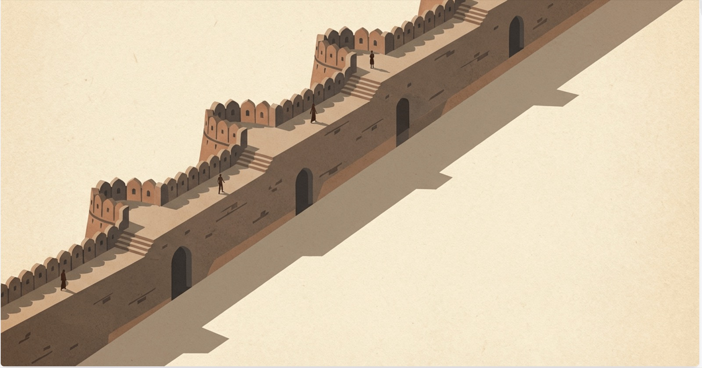
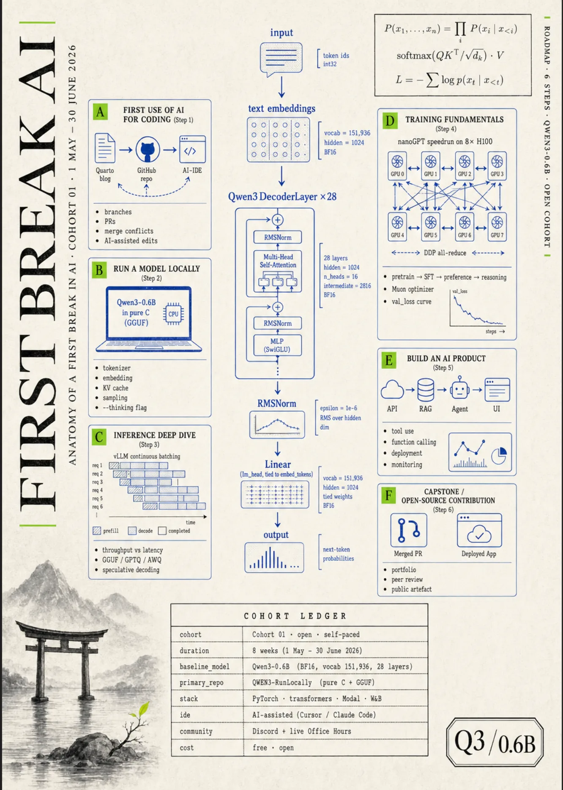

```{=html}
<div class="hero-banner">
  
  <div class="hero-overlay">
    <div class="hero-text">
      <h1 class="hero-title">First Break AI</h1>
      <p class="hero-tagline">The first fully agentic AI cohort — AI agents guide your journey from first commit to capstone</p>
      <p class="hero-sub">Community cohort for training, inference, and agentic AI — now evolving to <a href="https://bubblnet.com/" target="_blank" rel="noopener" style="color:#f0ebe1;text-decoration:underline">FBA Lab</a>. Powered by AI agents built on <a href="https://fetchlens.ai" target="_blank" rel="noopener" style="color:#f0ebe1;text-decoration:underline">FetchLens.ai</a></p>
      <a href="https://bubblnet.com/" class="hero-journey-btn" target="_blank" rel="noopener noreferrer">Start the Journey &#9654;</a>
    </div>
  </div>
</div>

<div class="whats-new-ticker" aria-label="What's new at First Break AI">
  <span class="ticker-label">What's New</span>
  <div class="ticker-viewport">
    <div class="ticker-track">
      <div class="ticker-group">
        <a class="ticker-item" href="https://bubblnet.com/" target="_blank" rel="noopener">
          <span class="ticker-pill new">New · FBA Lab</span>
          <span class="ticker-text">First Break AI is evolving — FBA Lab is the new hands-on front door. Real model code, diagrams, terminal logs. No GPU, no setup.</span>
        </a>
        <span class="ticker-sep" aria-hidden="true">●</span>
        <a class="ticker-item" href="lessons/lesson-1b-qwen3-fundamentals.qmd">
          <span class="ticker-pill new">New · Lesson 1b</span>
          <span class="ticker-text">Qwen3 Fundamentals — how a language model lives on disk and loads into memory, byte by byte.</span>
        </a>
        <span class="ticker-sep" aria-hidden="true">●</span>
        <a class="ticker-item" href="lessons/lesson-1-huggingface-beyond-upload.qmd">
          <span class="ticker-pill">Lesson 1</span>
          <span class="ticker-text">HuggingFace Beyond Upload — why an open model is not a file, it's a supply chain you can inspect.</span>
        </a>
        <span class="ticker-sep" aria-hidden="true">●</span>
      </div>
      <div class="ticker-group" aria-hidden="true">
        <a class="ticker-item" href="https://bubblnet.com/" target="_blank" rel="noopener" tabindex="-1">
          <span class="ticker-pill new">New · FBA Lab</span>
          <span class="ticker-text">First Break AI is evolving — FBA Lab is the new hands-on front door. Real model code, diagrams, terminal logs. No GPU, no setup.</span>
        </a>
        <span class="ticker-sep">●</span>
        <a class="ticker-item" href="lessons/lesson-1b-qwen3-fundamentals.qmd" tabindex="-1">
          <span class="ticker-pill new">New · Lesson 1b</span>
          <span class="ticker-text">Qwen3 Fundamentals — how a language model lives on disk and loads into memory, byte by byte.</span>
        </a>
        <span class="ticker-sep">●</span>
        <a class="ticker-item" href="lessons/lesson-1-huggingface-beyond-upload.qmd" tabindex="-1">
          <span class="ticker-pill">Lesson 1</span>
          <span class="ticker-text">HuggingFace Beyond Upload — why an open model is not a file, it's a supply chain you can inspect.</span>
        </a>
        <span class="ticker-sep">●</span>
      </div>
    </div>
  </div>
</div>

<div class="journey-preview">
  <div class="journey-preview-track">
    <a href="roadmap.qmd" class="journey-preview-card">
      <span class="journey-preview-num">1</span>
      <span class="journey-preview-label">Ship something real</span>
    </a>
    <a href="roadmap.qmd" class="journey-preview-card">
      <span class="journey-preview-num">2</span>
      <span class="journey-preview-label">See inside the machine</span>
    </a>
    <a href="roadmap.qmd" class="journey-preview-card">
      <span class="journey-preview-num">3</span>
      <span class="journey-preview-label">Think at production scale</span>
    </a>
    <a href="roadmap.qmd" class="journey-preview-card">
      <span class="journey-preview-num">4</span>
      <span class="journey-preview-label">Train your own</span>
    </a>
    <a href="roadmap.qmd" class="journey-preview-card">
      <span class="journey-preview-num">5</span>
      <span class="journey-preview-label">Ship a product</span>
    </a>
    <a href="roadmap.qmd" class="journey-preview-card">
      <span class="journey-preview-num">6</span>
      <span class="journey-preview-label">Prove it</span>
    </a>
  </div>
</div>

<section class="paths-strip" aria-labelledby="paths-headline">
  <div class="paths-strip-head">
    <span class="paths-eyebrow">Start here</span>
    <h2 class="paths-headline" id="paths-headline">Two ways into First Break AI</h2>
    <p class="paths-sub">Pick a path — they're built to work together. Most learners ping-pong between the map and the lessons.</p>
  </div>
  <div class="paths-grid">
    <a href="roadmap.html" class="path-card path-card-roadmap">
      <span class="path-card-step">01 · The map</span>
      <span class="path-card-title">Roadmap</span>
      <span class="path-card-desc">Six steps from first commit to capstone. Know where you're going before you start running.</span>
      <span class="path-card-cta">Open the roadmap <span class="path-card-arrow" aria-hidden="true">→</span></span>
    </a>
    <a href="lessons/" class="path-card path-card-lessons">
      <span class="path-card-step">02 · The build</span>
      <span class="path-card-title">Lessons</span>
      <span class="path-card-desc">Hands-on deep dives — HuggingFace, training, inference, and shipping AI-powered products.</span>
      <span class="path-card-cta">Start with Lesson 1 <span class="path-card-arrow" aria-hidden="true">→</span></span>
    </a>
  </div>
</section>
```

::: {.content-section}

**Cohort: August 2026 — September 2026** [<span class="cohort-live-badge"><span class="cohort-live-dot" aria-hidden="true"></span>Live</span>]{.cohort-live-wrap}

First Break AI is **live and fully agentic**. The first few steps live right here — set up your Quarto blog, run a model locally, and go deep on inference through the [roadmap](roadmap.qmd) and [lessons](lessons/index.qmd). No applications, no prerequisites.

The next steps continue in **[FBA Lab](https://bubblnet.com/)** — an interactive, hands-on lab with real model code, synced architecture diagrams, and live terminal logs. No GPU, no setup, no account required to start. Learn the fundamentals here, then build for real in the lab.

**Cohort 01: 1 May 2026 — 30 June 2026** [<span class="cohort-live-badge cohort-archived-badge"><span class="cohort-live-dot" aria-hidden="true"></span>Archived</span>]{.cohort-live-wrap}

Cohort 01 was the first fully agentic First Break AI cohort — live + async, guided end to end by AI agents. It is now archived, but nothing is lost: every lesson, office-hours recording, and interactive transcript stays online to work through anytime.

## Who it's for

You don't need a specific degree. You need a starting point. This cohort is for anyone — students, professionals, career switchers, the simply curious — who wants their first real break in AI. No applications, no prerequisites. Follow the roadmap, build in the open, and let your work speak for itself.

**Cohort lead:** [FireHacker](https://thefirehacker.github.io/) (blog, TIL) · [GitHub @thefirehacker](https://github.com/thefirehacker) · [About](about.qmd)

**For teams:** [First Break AI for Teams](teams.qmd) — instructor-led, with team dashboards, custom projects, and enterprise billing.
**For compute providers:** [Partner with us](sponsors.qmd) — your platform becomes the curriculum, not just a coupon.

::: {.cta-banner}
### Ready to build?

The cohort is **live** and fully async. Start the first steps here, then continue hands-on in FBA Lab — no GPU or setup required.

[Start with FBA Lab](https://bubblnet.com/){.cta-button}

**Focused sessions** run when there is real work to review: demos, project submissions, debugging, training runs, or walkthrough requests.

::: {.cta-fineprint}
Recommended for learners aged **16+**. If you are under 18, please join only with parent or guardian permission. By joining you agree to our [Community Guidelines](community-guidelines.qmd), [Terms](terms.qmd), and [Privacy Policy](privacy.qmd).
:::
:::

```{=html}
<div class="cohort-poster" id="cohort-poster-anchor">
  <div class="cohort-poster-header">
    <span class="cohort-poster-tag">Bonus · The Anatomy</span>
    <h2 class="cohort-poster-title">Want the full picture?</h2>
    <p class="cohort-poster-sub">The cohort drawn as one inference flow — six steps, every detail on a single poster. Click to enlarge.</p>
  </div>
  <a class="cohort-poster-link"
     href="public/images/firstbreakai-anatomy-poster.png"
     target="_blank"
     rel="noopener"
     aria-label="Open the First Break AI anatomy poster full-size in a new tab">
    
  </a>
</div>
```

## Get started

| Section | Description |
|--------|--------------|
| [Lesson 0: Welcome to First Break AI](lessons/lesson-0-welcome.qmd) | Cohort intro video with interactive transcript — start here. Also on [YouTube](https://www.youtube.com/watch?v=r9uykyGAdJQ&list=PLEzXCZNdmgBm-SbXuXHxn9_vXpvFbrKKL) (full [playlist](https://www.youtube.com/playlist?list=PLEzXCZNdmgBm-SbXuXHxn9_vXpvFbrKKL)) |
| [Roadmap](roadmap.qmd) | Learning path: Quarto blog, local inference, training, and beyond |
| [FBA Lab](https://bubblnet.com/) | The interactive lab for your next steps — real model code, diagrams, and live terminal logs. No GPU or setup. |
| [Checklist](checklist.qmd) | Accounts to create (Hugging Face, GitHub, Fetchlens.ai, Colab) and who to follow |
| [AI Setup](setup.qmd) | AI-based IDE (Cursor / Claude Code), ChatGPT, Open Router |

## Frequently asked

```{=html}
<div class="faq">

  <details open class="faq-item">
    <summary>What is FBA Lab?</summary>
    <div class="faq-body">
      <p><strong>FBA Lab is where First Break AI is heading.</strong> Cohort 01 started as a live + async cohort. The signal was clear: serious learners need a better way to touch real AI systems directly — not more passive sessions.</p>
      <p>FBA Lab is the new hands-on front door. It brings together real model code, synced architecture diagrams, terminal logs, and explanations that move together — so you can see how inference, training, and agentic AI actually work, step by step. No GPU required. No account required to start. No setup friction.</p>
      <p>The cohort roadmap, lessons, and office-hours archives stay online here. FBA Lab is where new hands-on content is being built.</p>
      <p><a href="https://bubblnet.com/" target="_blank" rel="noopener"><strong>Start with FBA Lab →</strong></a></p>
    </div>
  </details>

  <details class="faq-item">
    <summary>Do I need a CS or tech background?</summary>
    <div class="faq-body">
      <p>You need comfort with reading code (any language) and running terminal commands. That's the floor.</p>
      <p>Past learners have come from career switches, design, math/econ/physics, and self-taught backgrounds. There are <strong>no applications and no prerequisites</strong> — the <a href="roadmap.qmd">roadmap</a> and <a href="checklist.qmd">checklist</a> tell you exactly what to install on day one.</p>
    </div>
  </details>

  <details class="faq-item">
    <summary>How much time per week do I need to commit?</summary>
    <div class="faq-body">
      <p>Plan for <strong>5–8 hours a week</strong> to comfortably work through the lessons and roadmap. The async materials are self-paced — there is no required weekly commitment.</p>
      <p>Cohort 01 ran <strong>1 May 2026 – 30 June 2026</strong> and is now archived. Everything stays online, so you can move at your own pace.</p>
    </div>
  </details>

  <details class="faq-item">
    <summary>What hardware do I need? Mac, Windows, or do I need a GPU?</summary>
    <div class="faq-body">
      <p>Any modern laptop is enough to start. We design the lessons <strong>CPU-first</strong> — for example, <a href="lessons/lesson-1-huggingface-beyond-upload.qmd">Lesson 1</a> runs Qwen3-0.6B in pure C on your laptop's CPU with no GPU required.</p>
      <p>Mac (Apple Silicon or Intel), Windows (with WSL), and Linux all work. When the cohort hits larger training experiments in Step 4, the <a href="setup.qmd">AI Setup</a> page covers free-tier cloud GPU options.</p>
    </div>
  </details>

  <details class="faq-item">
    <summary>Will I get a certificate?</summary>
    <div class="faq-body">
      <p>All content in <strong>First Break AI and FBA Lab is free</strong>. For a certificate, <a href="https://bubblnet.com/" target="_blank" rel="noopener">log in to FBA Lab</a> and request access.</p>
    </div>
  </details>

  <details class="faq-item">
    <summary>What if I miss a session, or join mid-cohort?</summary>
    <div class="faq-body">
      <p>Everything is available to learners — all lessons, recaps, and transcripts stay online and searchable.</p>
      <p>New events and sessions are active, and the Discord stays open. You can join and start anytime.</p>
    </div>
  </details>

  <details class="faq-item">
    <summary>How is this different from fast.ai, Karpathy's lectures, or HuggingFace's free course?</summary>
    <div class="faq-body">
      <p>First Break AI is <strong>openly inspired by Andrej Karpathy's <a href="https://www.youtube.com/watch?v=l8pRSuU81PU"><em>Let's reproduce GPT-2 (124M)</em></a> and <a href="https://github.com/karpathy/llm.c"><code>llm.c</code></a></strong> — the from-scratch, no-magic, run-it-in-pure-C approach to teaching how LLMs actually work.</p>
      <p>fast.ai and HuggingFace's free course are excellent complementary reads, and the <a href="roadmap.qmd">Roadmap</a> links to them where they fit.</p>
    </div>
  </details>

</div>
```

:::

```{=html}
<script>
(function() {
  var els = document.querySelectorAll('.office-hours-local');
  if (!els.length) return;
  var tz = Intl.DateTimeFormat().resolvedOptions().timeZone;
  var fri = new Date();
  fri.setUTCHours(15, 30, 0, 0);
  var end = new Date(fri.getTime() + 3600000);
  var fmt = function(d) {
    return d.toLocaleTimeString([], { hour: '2-digit', minute: '2-digit', hour12: true });
  };
  var localStart = fmt(fri);
  var localEnd = fmt(end);
  var tzLabel = tz.replace(/_/g, ' ');
  if (tz !== 'Asia/Calcutta' && tz !== 'Asia/Kolkata') {
    els.forEach(function(el) {
      el.textContent = 'That’s ' + localStart + ' – ' + localEnd + ' in your time (' + tzLabel + ').';
    });
  }
})();
</script>
```
