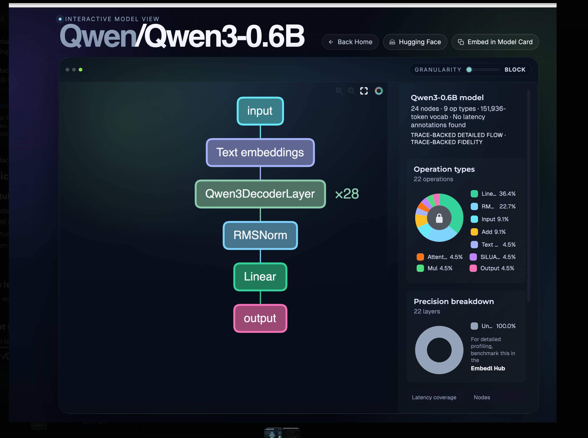
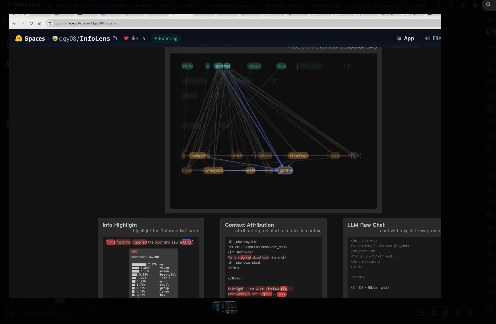

::: {.lesson-hero}
::: {.lesson-hero-tags}
[Lesson 01 · First Break AI]{.lesson-hero-eyebrow}
[● Draft · Under Review]{.lesson-hero-status .lesson-hero-status-review}
:::

# HuggingFace Beyond Upload {.lesson-hero-title}

##### Run Qwen3-0.6B locally, tour HuggingFace properly, and see open models as a supply chain. {.lesson-hero-subtitle}

::: {.lesson-hero-meta}
[~40 min read]{.lesson-hero-chip} [Cohort 01](../office-hours/2026-05-08.qmd){.lesson-hero-chip} [Run a model locally](../roadmap.qmd){.lesson-hero-chip}
:::
:::

This is the **full lesson** — everything you need is on this page. The video mirrors what's written here; the transcript is interactive, so you can click any line to jump the video to that point. Read it, watch it, do the homework, bring it to office hours.

::: {.callout-note appearance="minimal"}
**Video placeholder.** The Lesson 1 recording is being produced. The player below is wired with the Lesson 0 video for now so chapters and interactive transcript work end-to-end while you read along — the new recording drops into the same slot when it's published.
:::

## Navigate by roadmap

| Step | Topic | This lesson |
|------|-------|-------------|
| [Lesson 0](lesson-0-welcome.qmd) | Welcome to First Break AI | — |
| **Lesson 1** | **HuggingFace Beyond Upload** | **You are here** |
| [Step 2](../roadmap.qmd) | Run a model locally | Builds directly on this lesson |

[← Back to Lessons](index.qmd) · [← Back to Roadmap](../roadmap.qmd)


```{=html}
<div class="lesson-page lesson-page-theatre" data-size="compact">

  <div class="lesson-deck">
    <div class="lesson-video-wrap">
      <div id="ytPlayer"
           data-video-id="r9uykyGAdJQ"
           data-transcript="lesson-1-huggingface-beyond-upload.json"></div>
    </div>

    <div class="lesson-meta">
      <div class="lesson-now-playing">
        <span class="lesson-now-label">Chapter</span>
        <span class="lesson-chapter-title" id="lessonChapterTitle">The shallow view, and the deep view</span>
      </div>
      <div class="lesson-controls">
        <div class="lesson-size-group" role="group" aria-label="Video size">
          <button type="button" class="lesson-size-btn" data-size="compact">Compact</button>
          <button type="button" class="lesson-size-btn" data-size="theatre">Theatre</button>
          <button type="button" class="lesson-size-btn" data-size="wide">Wide</button>
        </div>
        <button type="button" class="transcript-toggle" id="lessonTranscriptToggle">Show Transcript</button>
      </div>
    </div>

    <div class="lesson-chapters">
      <div class="lesson-chapters-label">Chapters</div>
      <div class="lesson-chapter-list" id="lessonChapterList"></div>
    </div>
  </div>

  <div class="scene-transcript lesson-transcript" id="lessonTranscript"></div>

</div>
```

---

## A thought experiment to open with

Imagine, for a moment, that HuggingFace doesn't exist. There is no model hub, no `pip install transformers`, no friendly "Files and versions" tab. Someone hands you a flash drive. On it is a single file: `model.safetensors`. Just over a gigabyte. They tell you it contains the brain of a chatbot — roughly six hundred million floating-point numbers — and that, if you can wake it up, it will hold a coherent conversation with you about almost anything.

What would you actually *do* with it?

That is the question this lesson exists to answer. Once you have answered it for yourself, you will understand HuggingFace and the `transformers` library and `config.json` and `.gguf` and Xet storage not as a pile of disconnected tools, but as the specific things the world needed to invent in order to make that flash drive useful. We will travel from the file on the drive all the way to a running chat app on your laptop, and we will do it twice — once in Python through HuggingFace's library, and once in pure C through a tiny program small enough to read in an afternoon. By the end, the abstractions will dissolve.

This lesson is, in that sense, two journeys laid end-to-end. The first half is *practical*: how a model file becomes a running model. The second half is *cultural*: how to read a HuggingFace page like a professional, because a model release in 2026 is no longer a checkpoint file — it is a software supply chain. Most people skim the supply chain. You are going to learn to inspect it.

---

# Half one — From a file to a working model

## Three intuitions that hold the rest of the cohort together

Before we touch a single line of code, three ideas have to be true in your head. Every later topic in this cohort — tokenization, attention, training loss, sampling, fine-tuning, RAG — is a refinement of one of these three. If you internalize them now, the rest of the cohort will feel like *filling in detail*. If you skip them, every subsequent lesson will feel like swimming through fog.

**The first intuition is that a modern language model is a stack of repeated blocks.** When you open the architecture diagram for almost any modern LLM, the picture is the same: an input flows into an embedding lookup, then through a tower of identical decoder blocks, then through a final normalisation, a linear projection, and out. There is no exotic, bespoke wiring at the bottom of these models. Qwen3-0.6B, the model we will use throughout this cohort, is precisely this picture made concrete: twenty-eight copies of the *same* decoder block, stacked one on top of the other, fed by an embedding table whose vocabulary has 151,936 entries. If you understand one block — its attention layer, its feed-forward layer, its two normalisations — you understand the entire tower, because the tower is just that block twenty-eight times.

{fig-alt="Qwen3 0.6B architecture diagram: input → text embeddings → Qwen3DecoderLayer x28 → RMSNorm → Linear → output"}

You can explore this interactively at [hfviewer.com/Qwen/Qwen3-0.6B](https://hfviewer.com/Qwen/Qwen3-0.6B). Click into the decoder block; click into the attention layer; keep going. The repetition is the architecture. Two-thirds of every operation in the diagram is a matrix multiplication or a normalisation. There is no magic at the bottom — only weights.

**The second intuition is that LLMs generate one token at a time, and never anything else.** A model does not "write a sentence" or "answer a question." It takes the tokens of your prompt, runs them through the tower once, produces a single next token, appends that token to the input, and runs the whole thing again. And again. And again. The loop is called autoregressive decoding, and it is the same loop whether the model is writing a sonnet, a SQL query, or a thousand-line React component:

```python
tokens = tokenizer.encode(prompt)
while not done(tokens):
    logits = model.forward(tokens)
    next_id = sample(logits)
    tokens.append(next_id)
    yield tokenizer.decode([next_id])
```

Every architectural improvement you will hear about in this cohort — the KV cache, FlashAttention, speculative decoding, MoE routing — is, in the end, an optimisation of that loop. The KV cache makes the loop cheap by avoiding recomputation. Speculative decoding makes the loop *parallel* by guessing several tokens ahead and verifying them in a single forward pass. MoE makes the loop sparse by only routing through a fraction of the parameters per token. The loop itself never goes away.

If you would like to *see* the loop in action, the [InfoLens](https://huggingface.co/spaces/dqy08/InfoLens) space on HuggingFace draws an attribution graph for every token the model emits: which prompt tokens did it look at, how strongly, and through which layers. Watch it generate one token, then the next, then the next, and intuition two becomes physical.

{fig-alt="InfoLens HuggingFace space showing context-attribution DAG and info highlight panel"}

**The third intuition is the one most learners get subtly wrong, and getting it right will pay you back for the rest of your career.** When the model "produces the next token," it does not pick a word. It produces a probability — a single floating-point number — for *every one of its 151,936 vocabulary tokens, all at once*. The output of the model at every step is a vector of length one hundred and fifty-one thousand. Picking a word is something *we*, the runtime, do *after* the model has spoken.

Make this concrete. You type: *"What is the capital of India?"* The model thinks for a moment and produces 151,936 numbers. The number sitting in the slot for the token `"Delhi"` is, say, 0.71. The number in the slot for `"New"` is 0.18. `"Mumbai"` is around 0.04. `"Bangalore"` is 0.01. Down at the bottom of the list, in the slot for the token `"potato"`, there is a number on the order of one in ten million. The model has produced *all of those numbers in a single forward pass*. The reason you see `"Delhi"` on your screen is not that the model picked it; it is that *the sampler we wrapped around the model* looked at the list of 151,936 numbers and applied a rule — "take the highest" — to one of them.

That rule is called sampling, and the rule we pick changes the personality of the whole system. The simplest rule, greedy sampling, always takes the top entry; it is deterministic and often boring. Temperature is a dial that sharpens or flattens the distribution before we choose: low temperatures concentrate probability on a few strong candidates and produce safe, repetitive text; high temperatures flatten the distribution and let unlikely tokens win, producing creative, sometimes incoherent text. Top-k restricts attention to only the *k* highest-probability candidates and ignores the long tail entirely. Top-p, the most widely-used variant, dynamically takes whichever set of tokens has cumulative probability at least *p*, which adapts to how confident the model is at each step.

When somebody says *"the model wrote Delhi,"* a more honest sentence is *"the model produced 151,936 numbers, and our sampler ranked Delhi at the top."* Everything you will learn later about hallucination, repetition penalties, constrained decoding, beam search, and chain-of-thought prompting lives inside that one observation. The short [Decoding Strategies in LLMs](https://huggingface.co/blog/mlabonne/decoding-strategies) post on the HuggingFace blog walks through each strategy with diagrams; twenty minutes there will pay you back permanently.

Hold all three intuitions together. A model is a stack of identical blocks. It turns a context into a vocabulary-sized probability vector. We sample from that vector one token at a time. Everything else is detail.

---

## Why the smallest model is the right model to learn from

A reasonable question at this point is: *six hundred million parameters? Isn't that tiny? Aren't the real models hundreds of billions?* The answer is yes, the real models are much bigger, and that is precisely why we are not starting with one.

It helps to know how the landscape is laid out in 2026. At the very top of the size distribution sit the frontier models — Claude Sonnet, Claude Opus, GPT-5.5, the largest open-weight releases — somewhere between one hundred billion and three hundred billion parameters, served from large data-centre GPUs, mostly behind APIs. A tier below that are the *large open* models, in the thirty-to-one-hundred-billion range, like Qwen3-Coder, Llama-70B and DeepSeek-V3 — serious self-hosting territory, multi-GPU servers, production-ready but expensive. Below those are the *small* models, from roughly four billion up to thirty billion parameters, which fit comfortably on a single good GPU and are quietly running an enormous amount of production work today; Microsoft's Phi-4-Multimodal-Instruct is a personal favourite in this bracket. And at the bottom — three hundred million up to about four billion — are the *very small* models, the ones that run on a laptop CPU and that you can read end-to-end. Qwen3-0.6B lives at the boundary between that very-small tier and our cohort's hands.

The temptation, when you are new, is to assume that the small models are uninteresting toys and that real learning has to happen at frontier scale. That is exactly backwards. The architecture of Qwen3-0.6B is *structurally identical* to the architecture of Claude. Same decoder-only transformer. Same attention mechanism. Same RoPE-family positional encoding. Same sampling. The only differences between a 600M-parameter Qwen and a 300B-parameter Claude are scale — how many layers, how wide each layer is, how many attention heads — and training data. The shape is the same. The lessons transfer up.

This makes Qwen3-0.6B, in the language of the children's story, our Goldilocks model — neither too hot nor too cold, but just right. A seventy-billion-parameter model is too hot for a classroom: you cannot walk every line of code, you cannot read every layer, you cannot run it on a laptop. A one-million-parameter toy is too cold: the architecture works, but the outputs are so weak that learners draw the wrong conclusions about what LLMs feel like. Qwen3-0.6B is just right. It runs on the CPU you already own, every tensor shape is small enough to inspect in a notebook, and the outputs are coherent enough that you build real intuition about what these systems can and cannot do. We will occasionally drop down to smaller laboratories — GPT-2 at 124 million parameters is excellent for watching certain phenomena in slow motion — but Qwen3-0.6B is the model we keep returning to.

There is also a newer cousin worth knowing about: [`Qwen/Qwen3.5-0.8B`](https://huggingface.co/Qwen/Qwen3.5-0.8B). Still in our very-small tier, still laptop-friendly, but it has been downloaded **more than 2.8 million times in a single month**. That is a strange number when you think about it. Who is pulling an 800-million-parameter model two-point-eight million times every month, and what are they *doing* with it? Edge inference on phones and embedded devices? Generating synthetic training data for larger models? Cheap classification at scale? Fine-tuning bases for narrow domains? I have put the same question to X and Reddit and I genuinely do not know the answer yet. Reply with your best guess in `#cohort-01` on Discord — we will discuss it live in Friday's office hours, and whoever finds the most surprising real-world use case wins.

---

## HuggingFace is GitHub for models, and that comparison is exact

If you understand GitHub, you already understand most of HuggingFace. The mapping is not a loose analogy; it is precise enough to be technical. A HuggingFace model repository is, underneath, a Git repository. It has commits, branches, pull requests and issues. The model card that you read on the model's main page is a `README.md` file at the root of that repo. There are stars (called likes), forks, releases. There are even GitHub-Pages-equivalent demos, called [Spaces](https://huggingface.co/spaces), which let anyone publish an interactive app that uses the model. We used one of them earlier — InfoLens — to make intuition two physical.

So why does HuggingFace exist as a separate thing, instead of everyone just using GitHub? Because of one engineering constraint that breaks GitHub's model: file size. Source code is small, mostly textual, and diffs cleanly. Model weights are gigabytes of opaque binary numbers and diff terribly. GitHub puts a hard limit of roughly one hundred megabytes per file before things start failing; push a five-gigabyte `.safetensors` to vanilla Git and the push is rejected outright. GitHub solved part of this problem with **Git LFS** (Large File Storage), which keeps the big blobs in separate storage and leaves only small pointer files in the repository itself, so that cloning a repo does not drag the weights down with it. HuggingFace started with LFS too. But the access patterns for model files are unlike anything GitHub was designed for — millions of people pulling the same seven-billion-parameter blob, every five minutes, from every continent — and so the HuggingFace team built a successor called **Xet**, a content-addressed storage system that does chunk-level deduplication and is dramatically faster for the model-download workload. When you see the Xet tag on a file in a HuggingFace repo, that is what is happening underneath: the same Git semantics, a much more aggressive blob layer.

If you open the Qwen3-0.6B repository at [`Qwen/Qwen3-0.6B`](https://huggingface.co/Qwen/Qwen3-0.6B) and click "Files and versions," you will see something close to this:

```text
Qwen/Qwen3-0.6B/
├── README.md                    # the model card
├── config.json                  # the architecture blueprint
├── tokenizer.json               # the tokenizer's vocabulary and merge rules
├── tokenizer_config.json        # special tokens, chat template
├── generation_config.json       # default sampling parameters
├── special_tokens_map.json      # mapping for special tokens
├── model.safetensors            # the weights themselves
└── (sometimes) *.gguf           # a CPU-friendly alternative
```

Of those files, three carry the entire model. The `README.md` is the **model card**, and although it looks like decoration it is in fact the closest thing the model has to a contract: license, prompt template, evaluation numbers, intended use, known limitations. A good provider — and Qwen has been one — writes detailed model cards. A bad provider ships only weights and lets you guess at the rest, and the quality of the model card is probably the single best leading indicator of how seriously a release is being maintained. The `config.json` is the **architecture blueprint** — without it, the bytes in the weights file are meaningless. And `model.safetensors` is the weights themselves, stored in a format specifically designed to be safe to load (no arbitrary code execution on import, unlike Python's pickle) and fast to memory-map.

We are about to spend more time than may seem reasonable on `config.json`, because it is the file that ties the entire system together and the one most learners skim past.

---

## config.json is the blueprint, and then transformers is the builder

Here is what `config.json` looks like for Qwen3-0.6B, trimmed for clarity:

```json
{
  "architectures": ["Qwen3ForCausalLM"],
  "hidden_size": 1024,
  "intermediate_size": 2816,
  "num_attention_heads": 16,
  "num_hidden_layers": 28,
  "num_key_value_heads": 8,
  "vocab_size": 151936,
  "max_position_embeddings": 32768,
  "rope_theta": 1000000.0,
  "torch_dtype": "bfloat16"
}
```

Read those numbers against the diagram from the first intuition and everything snaps into place. `num_hidden_layers: 28` is the decoder block repeated twenty-eight times. `hidden_size: 1024` is the dimensional width of every tensor flowing through the tower. `vocab_size: 151936` is the size of the probability vector the model produces at every step. The config file is, literally, the shape of the thing before you ever touch the weights.

But there is one field in that config that does more work than any other: `"architectures": ["Qwen3ForCausalLM"]`. This is the name of the Python class that knows how to assemble *this specific model* out of those tensor shapes. And once you understand the workflow for going from that field to the actual source code, you will never be stuck on a new HuggingFace model again. The move is four steps and you should memorise it. Open the model on HuggingFace, click into `config.json`, copy the value of the `architectures` field, and paste it into a Google search prefixed with the word *transformers* — for example, `transformers Qwen3ForCausalLM`. You will land in two places at once: the [API documentation page](https://huggingface.co/docs/transformers/v5.8.0/en/model_doc/qwen3#transformers.Qwen3ForCausalLM) for the class, which tells you what it does from the outside; and the [source code](https://github.com/huggingface/transformers/blob/main/src/transformers/models/qwen3/modeling_qwen3.py#L442) for the class, in a file called `modeling_qwen3.py`, which tells you what it actually does, line by line. Bookmark both. If you take only one practical habit away from this lesson, take this one. The same move works for the newer variant: `Qwen3.5-0.8B`'s config names a class called `Qwen3_5ForConditionalGeneration`, and Googling `transformers Qwen3_5ForConditionalGeneration` puts you on its source.

Why does that class even need to exist? Because the weight file is a bag of named tensors — `model.layers.0.self_attn.q_proj.weight`, and twenty-eight layers' worth of those — and tensors do not know how to multiply themselves together in the right order. The class is the recipe. It allocates the right modules in the right order, wires them into a `forward()` pass that implements one step of the autoregressive loop from intuition two, and tells PyTorch which weight goes into which slot. Three pieces are required and none of them can be skipped: `config.json` tells you the *shape* of the model, the class tells you the *order of operations*, and `model.safetensors` tells you the *actual numbers*. Drop any one and the other two are inert.

The `transformers` library — that is, the Python library called `transformers`, created and maintained by HuggingFace and installable with `pip install transformers` — is what turns this three-piece system into the friendly two-line load you have probably seen before:

```python
from transformers import AutoModelForCausalLM, AutoTokenizer

tokenizer = AutoTokenizer.from_pretrained("Qwen/Qwen3-0.6B")
model     = AutoModelForCausalLM.from_pretrained("Qwen/Qwen3-0.6B")

inputs  = tokenizer("Why does attention work?", return_tensors="pt")
outputs = model.generate(**inputs, max_new_tokens=200)
print(tokenizer.decode(outputs[0]))
```

What is hidden behind those two `from_pretrained` calls is exactly the pipeline we just described. The library reads `config.json` from the repo, looks at the `architectures` field, picks the matching Python class (`Qwen3ForCausalLM`), constructs the architecture in PyTorch from the config, streams the weights from `model.safetensors` into the right tensor slots, and hands you back a ready-to-call PyTorch model. The rest of the cohort sits on top of this loop. Step 3 of the roadmap is about making it *faster*. Step 4 is about training one of your own. Step 5 is about building a product around it. Everything from here downstream is a layer above this single load.

A small practical recommendation, if you are teaching this section live: open the [HuggingFace Qwen3 documentation page](https://huggingface.co/docs/transformers/v5.8.0/en/model_doc/qwen3#transformers.Qwen3ForCausalLM) on one half of your screen and [`modeling_qwen3.py`](https://github.com/huggingface/transformers/blob/main/src/transformers/models/qwen3/modeling_qwen3.py#L442) on the other half, and flick between them while you talk. The docs are what the user sees. The source is what is actually running. Most learners have never read the inside of a library they import; reading this one for ten minutes changes that habit permanently.

---

## Markdown is the lingua franca of AI-assisted work

It is worth pausing on a small, unglamorous skill that will pay back every day of the cohort: markdown. Every model card is markdown. Every issue, every pull request, every Discord message, every note you take in Cursor or Claude Code, every README in every folder you publish — markdown. It is not a documentation format; it is the language in which all of us, humans and language models alike, write to each other now. If you are not fluent in it, you will spend the cohort fighting your own tools.

Each of the platforms you will use renders markdown automatically. On GitHub, a `README.md` file in any folder is rendered as a webpage whenever someone opens that folder in the GitHub UI, which is why important folders in a serious project always have one; other markdown files render when you click them. HuggingFace works the same way — the model card you read on every model's main page is just the `README.md` at the root of that model's Git repo. Discord supports a useful subset: headings with `#`, bold and italic, fenced code blocks, blockquotes, lists, and spoiler tags, and your cohort messages should use them. VS Code, Cursor and Claude Code all preview markdown side-by-side and treat it as the native format for planning, notes, and AI-assisted scratchpads.

If you do not already feel comfortable with the syntax, open [dillinger.io](https://dillinger.io/) — a browser-based markdown editor with live preview — and spend one hour there. Write a heading, a bullet list, a numbered list, a link, a fenced code block (try one with a language tag, like `` ```python ``, and watch the syntax highlight appear), a blockquote that begins with `>`, a table with pipes and dashes, and a math equation between dollar signs. That hour is the most leveraged hour you will spend this week.

Andrej Karpathy recently [posted on X](https://x.com/karpathy/status/2039805659525644595?s=20) about using markdown files as a personal LLM knowledge base, and the suggestion is worth understanding correctly. He is not advocating markdown as a database. He is describing a workflow: a folder of markdown files — one per topic, one per idea, one per project — that you and an AI agent like Claude Code or Cursor evolve together over time. The agent reads, writes, restructures, and cross-references the notes the way a diligent junior researcher would update a notebook. The format is markdown precisely because it is human-readable when the agent is wrong, it diffs cleanly in Git, every model on earth has been trained to read and write it fluently, and it mixes prose, code blocks, tables, and links in a single file — which happens to be exactly the shape of *what learning feels like*. The takeaway for the cohort is straightforward: start a markdown notebook today, drop everything you learn into it, let your AI tools enrich and reorganise it, back it up in a private Git repo, and by the time the cohort ends you will have a second brain.

---

## Do you need deep math for this?

This question comes up early and honestly from at least one learner every cohort: *I do not have a strong math background. Should I even be here? Can I contribute to open source without it?* The short answer is no, you do not need deep math up front, and yes you can absolutely contribute. But the reason has to do with the order in which we will study things, which is the opposite of how a typical machine-learning course is structured.

A typical course goes math first, code second. You learn linear algebra, then probability, then statistics, then optimisation, and only at the end of the semester do you ever load a model. The result is that the math feels disconnected from anything you can see, and the model feels like a magic black box you finally got to touch. This cohort goes in the other direction. We start by *running inference* — getting Qwen3 on your laptop, watching it generate tokens, feeling the autoregressive loop in real time. That requires zero math beyond the ability to read numbers off a screen. Then, when a concept genuinely starts mattering for the work we are doing, we cover it. When attention starts limiting our understanding of what the model is doing, we cover attention. When RoPE matters, we cover RoPE. Not before.

The reason this works is that math becomes legible *after* you have seen the thing it describes. Reading the attention equations after you have watched twenty-eight decoder layers run on your laptop is a fundamentally different experience from reading them cold. It is the same pedagogical move Karpathy uses in his "Let's reproduce GPT" series of lectures, and it is the way most working ML engineers actually picked the field up — by running models, breaking them, and *then* picking up the math, piece by piece, where it earned its keep. If you happen to have the math already, wonderful — it will speed you up. If you do not, that is fine; what you cannot skip is a willingness to read code and run experiments.

---

## Running Qwen3 in pure C

We have spent the last several pages loading Qwen3 the easy way — through `transformers`, with all of PyTorch's machinery doing the heavy lifting underneath. For learning, we now go further. We are going to throw away `transformers` entirely and run the same model with a single C file small enough to read in one sitting. This is the cohort's "from first principles" move, and it changes how the model feels.

There are three reasons to do this. The first is that, in pure C, every step from token IDs to logits is in code you can read; there are no abstractions to hide behind, no autograd graph to forget about, no kernel launches happening invisibly. The second is that the C program runs on your laptop's CPU, with no GPU required at all, which makes it the most portable demo in this entire cohort. The third is that the C code is *functionally identical* to what `Qwen3ForCausalLM` is doing inside `transformers`. The same architecture, just spelt out. Once you have seen the same arithmetic in both languages, the abstraction breaks open and the magic dissolves.

To make this work we need a different file format. Where `transformers` likes `.safetensors`, our C program reads **`.gguf`** — a single self-contained file that bundles weights, tokenizer, and config together in a layout designed for CPU inference. It is the same format that `llama.cpp` and `ollama` use. The bundling matters: with `.safetensors`, the weights are in one file, the tokenizer in another, the config in a third, and a Python framework stitches them together at load time; with `.gguf`, all of that lives in a single memory-mappable file that a tiny C program can read without external help. The two formats are not competitors so much as different specialisations — `.safetensors` for the GPU/PyTorch world, `.gguf` for the CPU/laptop world.

The cohort repository is [`github.com/thefirehacker/QWEN3-RunLocally`](https://github.com/thefirehacker/QWEN3-RunLocally). Clone it, follow the README. Inside that repo is a Git submodule pointing at [`thefirehacker/qwen3.c`](https://github.com/thefirehacker/qwen3.c/tree/a068f9cabd0d180b7160fabcbec368b7642c01d3), a tiny C file called `run.c` that runs Qwen3-shaped models on the CPU with no external ML libraries. **The C code is originally by [William Song](https://github.com/gigit0000/qwen3.c)** — the cohort fork pins it to a known-good commit so the `make run` step in this lesson is reproducible. If you have ever read Karpathy's `llama2.c`, this is the Qwen3-shaped sibling. Once you have built it, a single command runs the whole thing:

```bash
git clone https://github.com/thefirehacker/QWEN3-RunLocally
cd QWEN3-RunLocally
make
./run \
  --model qwen3-0.6b.gguf \
  --system "You are an AI expert running orientation for new hires at Accenture." \
  --thinking on \
  --multi-turn on
```

What that command does, under the hood, is exactly the loop from intuition two: load the weights and tokenizer from the GGUF file, apply your system prompt as the model's role, generate one token at a time on the CPU, optionally let the model produce an internal reasoning trace inside `<think>` tags before its real answer, and remember conversation history across turns.

The system-prompt flag is where the live demo becomes memorable. In office hours we set the system prompt to *"You are an AI expert running orientation for new hires at Accenture"*, asked the model a series of in-domain questions about transformer architecture and attention, and watched a six-hundred-million-parameter model produce perfectly competent answers — the kind of answers that, if you did not know the model's size, you would assume came from a frontier system. The architecture is the same as Claude's. Only the scale and the training data are different. Once you have seen this happen on your own laptop, with your own system prompt, large models stop feeling magical and start feeling like *bigger versions of the same thing*. If you are teaching this section, demo it live; type a system prompt that matches your audience — their company, their team, their role — and let the small model give a real answer in real time. It changes how learners think about what is possible on commodity hardware.

The two other flags are your first encounter with what will, by the end of the cohort, feel like an entire toolbox of levers. `--thinking on` lets the model produce an internal reasoning trace before answering: the same `<think>...</think>` block you have seen in ChatGPT-style products, where the model spends extra compute deliberating before it commits to a response. It costs more tokens, and in exchange you typically get better answers. `--multi-turn on` keeps conversation history between turns; with it off, every prompt starts from a blank slate, and with it on the model carries previous turns as context, which is where the KV cache will eventually earn its keep when we get to inference optimisation. These are levers. They trade compute for quality. Most of the "tuning" you will do for the rest of the cohort — sampling temperature, top-p, prompt structure, thinking budgets — is a flavour of the same trade-off.

### The same model, in two languages

Here is the move that, more than anything else in this lesson, makes the abstractions click: the Python class `Qwen3ForCausalLM` and the C file `run.c` describe the *same computation* in two different languages. Map them onto each other and the mystique disappears.

| Concept | Python (`transformers.Qwen3ForCausalLM`) | C (`qwen3.c / run.c`) |
|---|---|---|
| Hyperparameters | `Qwen3Config` (from `config.json`) | `struct Config` |
| All weight tensors | `nn.Module` parameters | `struct TransformerWeights` |
| Activation buffers | PyTorch intermediate tensors | `struct RunState` |
| Container object | `Qwen3ForCausalLM` instance | `struct Transformer` |
| Token embeddings | `model.embed_tokens` | `token_embedding_table` |
| Attention Q, K, V, O | `self_attn.{q,k,v,o}_proj` | `wq`, `wk`, `wv`, `wo` |
| Qwen3-specific Q/K norms | `self_attn.{q,k}_norm` | `wq_norm`, `wk_norm` |
| MLP (SwiGLU) | `mlp.{gate,up,down}_proj` | `w1`, `w3`, `w2` |
| Per-layer RMSNorms | `input_layernorm`, `post_attention_layernorm` | `rms_att_weight`, `rms_ffn_weight` |
| Final norm | `model.norm` | `rms_final_weight` |
| LM head | `lm_head` | `wcls` |
| One forward pass | `model.forward(input_ids)` | `forward(transformer, token, pos)` |
| RMS normalisation | `Qwen3RMSNorm.forward` | `rmsnorm()` |
| Matmul | `nn.Linear.forward` (BLAS / cuBLAS) | `matmul()` (OpenMP-parallel) |
| Softmax | `F.softmax` | `softmax()` |
| Tokenisation | `AutoTokenizer.{encode,decode}` | `encode()`, `decode_token_id()` |
| Sampling | `model.generate(..., temperature=, top_p=)` | `struct Sampler` + `sample()` |
| Chat loop | hand-rolled or `pipeline("conversational")` | `chat()` |
| CLI entry point | `python -m transformers ...` | `main()` |

Read that table top to bottom and notice that there is nothing magic happening in the Python — every concept has a direct C counterpart you can read, with your eyes, in roughly fifteen hundred lines. PyTorch is doing the *same arithmetic*; it is simply hidden behind autograd, GPU kernels, and a much friendlier API.

The exercise we recommend, the first time you sit with both files open, is this: open [`modeling_qwen3.py`](https://github.com/huggingface/transformers/blob/main/src/transformers/models/qwen3/modeling_qwen3.py#L442) in one window and [`run.c`](https://github.com/thefirehacker/qwen3.c/tree/a068f9cabd0d180b7160fabcbec368b7642c01d3) (originally by [William Song](https://github.com/gigit0000/qwen3.c)) in the other, pick one row from the table — RMSNorm is a good first choice — and read both implementations line by line. Twelve lines of C. Roughly ten lines of Python. Identical math. The first time you see it, something snaps into place that no amount of reading *about* transformers will ever produce. That moment is the point of this whole section.

---

## From random weights to Qwen3

There is one more story to tell in this half of the lesson, and it is the story of where Qwen3-0.6B came from. The model that, today, can answer questions about transformer architecture and write coherent essays on demand, was — three or four months before its release — a tensor of pure random noise. Every one of its six hundred million parameters was initialised from a random distribution, and the question of how a random tensor became Qwen3 is, in the end, the question of what training is.

The answer has four stages, and modern open-weight releases pass through all of them. The first stage is **pretraining**: the model is shown trillions of tokens of raw text — web pages, code, books, conversations, papers — and asked, again and again, to predict the next token. Nothing more. Across trillions of examples, the random tensors slowly resolve into a model that has absorbed the statistical structure of language. At the end of pretraining you have a *base model* — fluent at continuing text but unable to follow instructions, because it has never been asked to answer a question; it has only been asked to continue a passage.

The second stage is **supervised fine-tuning**, or SFT. The base model is shown thousands or hundreds of thousands of `(prompt, ideal response)` pairs, and it learns to produce *answers* rather than continuations. After SFT, asking the model "what is the capital of India?" produces "Delhi" rather than "is a question many travellers ask when planning their first trip to South Asia." The third stage is **preference optimisation** — DPO, RLHF, or one of their cousins — where the model is shown triples of `(prompt, better response, worse response)` and learns to prefer the better one. This is where the model becomes pleasant to talk to, learns when to refuse harmful requests, and develops the stylistic regularities that make it feel like *itself*. And the fourth stage, in modern releases like Qwen3 with `<think>` tags, is **reasoning training**: long chain-of-thought traces that teach the model when and how to deliberate out loud before answering, the way `--thinking on` lets you see in our pure-C demo.

The reason this trajectory matters for the cohort is that when we get to Step 4 of the roadmap and train our own small GPT, we will be reproducing only the *first* of these stages — pretraining — at toy scale. Pretraining is the hardest stage to get right, the most expensive, and the one that defines almost all of a model's eventual capability. Everything after pretraining is shaping a model that already exists. Pretraining is what *creates* it. When you watch your tiny model's loss curve descend during training, you are watching, in miniature, the same thing that happened to Qwen3 — random noise gradually becoming language.

---

# Half two — A model is not a file, it is a node in a graph

You can now run a model. That alone puts you ahead of most people who claim to "use AI" in 2026. But there is one more skill that separates a person who *uses* HuggingFace from a person who *understands* it, and it is the skill of *inspection*.

## The shallow view, and the deep view

The shallow view of HuggingFace is the one most newcomers arrive with, and it goes like this: find a model on the hub, click download, run it. That is fine for the first day, but it leaves you helpless the moment something goes wrong — when a load fails, when a benchmark number does not reproduce, when you have to choose between two similar-sounding models, when an unfamiliar repository asks you to pass `trust_remote_code=True` and you do not know what that means. The deep view, by contrast, is the one professionals use: a model release is the tip of a much larger tree, and that tree has structure you can read.

Underneath the line `Qwen/Qwen3-0.6B` on the model page is a graph. There is a paper somewhere upstream. There is a base model that the released model was fine-tuned from. There is the pretraining corpus, sometimes named, sometimes summarised, sometimes hidden. There are SFT and preference datasets, where they exist publicly. There are quantized derivatives — GGUF builds, GPTQ builds, AWQ builds — produced by the community and by official maintainers. There are third-party fine-tunes that took this model as their starting point. There are Spaces that wrap it, apps that depend on it, benchmark runs that evaluate it, GitHub issues that discuss its behaviour. A model hub *looks* like a website with files. Underneath, it is a graph database — models, datasets, spaces, papers, collections, evaluation runs, commits, licences — and every line you see on a model page is a node in that graph.

A good model page should, in the end, answer four questions. *What is this?* *Where did it come from?* *What depends on it?* *And what can I safely do with it?* If a page does not answer those, that is itself a signal — not about the page, but about the model.

## The engine and the car

A useful analogy, when you are first learning to read these pages, is to think of a model file the way you think of an engine. The weights are the engine. They are the thing that does the work. But a car is not an engine. A car needs a chassis. A fuel system. A safety certificate. A user manual. A service history. A dashboard. A road test. Ownership papers. A repair network. An engine on the floor of a garage, no matter how well-machined, is not a car; it is a *component*.

An open model is the same kind of thing. The weights are the engine. To turn them into something trustworthy and usable, you need a config file (the manual), a tokenizer (the fuel system), metadata (the dashboard), a license (the ownership papers), evaluations (the road test), dataset lineage (the service history), a security scan (the safety certificate), runtime options (the repair network), a demo (the test drive), and community feedback (the reputation). Each of those is a layer of the supply chain. Each is something you can inspect, and most of the work of being a professional in this field is learning to inspect them quickly.

You do not need to master every layer in this lesson; you need to know they exist and to be able to name them. From the *artifact* layer — what files actually define the model — through *storage* (LFS, Xet), *metadata*, *provenance* (official or derivative), *dataset* (what shaped it, what evaluated it), *security* (is it safe to load), *evaluation* (are the claims reproducible), *runtime* (how will it actually run — `transformers`, `llama.cpp`, vLLM, hosted), *compute* (where will inference run — CPU, GPU, serverless), *distribution* (how does it get discovered), all the way up to the *agent* layer (can an AI agent inspect and use this model without a human) and *governance* (who can access it, under what licence). That is the supply chain. In the time we have remaining, three of those layers deserve a deep look, because they are the three where most engineers get themselves into trouble: security, evaluation, and agent-readable metadata.

## Security, and the single most important sentence in this lesson

Here is the sentence. Memorise it.

> When you write `trust_remote_code=True` in `from_pretrained`, you are giving a stranger permission to run their Python code on your machine.

Not metaphorically. Literally. That flag, when set, causes the `transformers` library to download `modeling_*.py` files from the model's repository and *execute them on import*. Beginners hit a load error, see a Stack Overflow answer that says "pass `trust_remote_code=True`", paste it in, the load works, and they move on. That is not a workaround. That is a security decision, and most of the time it is being made without anyone realising they are making it.

The professional habit is to internalise the file tiering of a HuggingFace repo. Some files are *data*: `config.json`, `tokenizer.json`, `tokenizer_config.json`, `special_tokens_map.json`, `generation_config.json`, `model.safetensors`, `README.md`. These cannot execute code when loaded. Safetensors, in particular, was designed specifically to be a *safe* alternative to PyTorch's old pickle format precisely because pickle could execute arbitrary code on load. Other files are *code*: `pytorch_model.bin` (the pickle format, which can run code when unpickled), any `modeling_*.py` or `tokenization_*.py` in the repo (which will be executed if you pass `trust_remote_code=True`), `requirements.txt` (which may pull untrusted packages), `app.py` (used by Spaces). When you encounter an unfamiliar repository, read its file list before you load anything. If you see custom Python or pickle weights, slow down. Read the code, or pick a different repo.

Most of the major model families — Qwen, Llama, Mistral, the well-known ones — ship safetensors-only and need no custom code, and that absence is a feature, not a limitation. It means the repository is *boring* in exactly the way you want a piece of infrastructure to be boring.

```python
# Reasonable default — no custom code allowed.
model = AutoModelForCausalLM.from_pretrained(
    "Qwen/Qwen3-0.6B",
    # trust_remote_code defaults to False — keep it that way.
)
```

If a model *requires* `trust_remote_code=True`, treat the situation the way you would treat running a stranger's compiled binary. Read the `.py` files in the repo. Or look for a safetensors-only alternative. The cost of the second option is almost always lower than the cost of the first one going wrong.

## Datasets, Parquet, and Croissant — the queryable training surface

Half of the supply chain we have been talking about is models. The other half is *datasets* — and the dataset side of HuggingFace has infrastructure that almost no one pays attention to until the day they need it. This cohort uses two datasets. It is worth knowing both intimately, because they represent two completely different points on the spectrum of how training data can be packaged.

### The large one: FineWeb

[`HuggingFaceFW/fineweb`](https://huggingface.co/datasets/HuggingFaceFW/fineweb) is a cleaned, deduplicated snapshot of the English web — 54.8 TB of text, 52 billion rows, built from Common Crawl. It is the dataset behind many of the open pre-training runs you will read about, including the GPT-2-scale experiments we follow in this cohort.

Open the dataset on HuggingFace and click **Data Studio**. The viewer gives you a live, filterable grid over the data. It feels instant even on a 54 TB dataset because HuggingFace has silently done something behind the scenes: it has automatically converted the original text into **[Apache Parquet](https://parquet.apache.org/)** — a columnar binary format built for analytics. Parquet stores each column separately, so a query that only reads `token_count` does not touch a single byte of `text`. That is why the viewer is fast. When you eventually call `load_dataset("HuggingFaceFW/fineweb", streaming=True)`, it is those same Parquet shards you are streaming. *Parquet is the storage layer of the dataset hub.*

The viewer also tells you what is in each row. FineWeb has **9 columns**:

| Column | Type | What it contains |
|--------|------|-----------------|
| `text` | string | The full body of the crawled web page — the main training signal |
| `id` | string | A stable URN-style identifier for each document |
| `dump` | string | Which Common Crawl dump this document came from (e.g. `CC-MAIN-2025-26`) |
| `url` | string | Source URL of the page |
| `date` | string | Crawl timestamp |
| `file_path` | string | Internal S3-style path to the source shard |
| `language` | string | Detected language label |
| `language_score` | float64 | Confidence score for the language detection |
| `token_count` | int64 | Number of tokens in this document |

`text` is the column that matters for training. The rest is provenance and filtering metadata.

### What the `/croissant` endpoint adds that the viewer does not

The Dataset Viewer is for you. The `/croissant` endpoint is for your code — and for anything that cannot open a browser. Append `/croissant` to any dataset API URL and you get a **machine-readable description** of the dataset's schema, licence, splits, and where the actual files live, in a format a program can parse directly.

```bash
curl -s https://huggingface.co/api/datasets/HuggingFaceFW/fineweb/croissant
```

The file you get back is **JSON-LD** — JSON "for Linking Data". The opening block makes the vocabulary explicit:

```json
{
  "@context": {
    "@language": "en",
    "@vocab": "https://schema.org/",
    "cr": "http://mlcommons.org/croissant/",
    "sc": "https://schema.org/",
    "column": "cr:column",
    "dataType": { "@id": "cr:dataType", "@type": "@vocab" },
    "field": "cr:field",
    "recordSet": "cr:recordSet",
    "extract": "cr:extract"
  },
  "@type": "Dataset",
  "name": "fineweb",
  "conformsTo": "http://mlcommons.org/croissant/1.1",
  "license": "https://choosealicense.com/licenses/odc-by/",
  "url": "https://huggingface.co/datasets/HuggingFaceFW/fineweb"
}
```

Every key that looks like `cr:something` maps to `http://mlcommons.org/croissant/something`. Every key that looks like `sc:something` maps to `https://schema.org/something`. This is why the field called `license` is not just a string — it resolves to `https://schema.org/license`, which means the same thing in every Croissant document on the internet, whether it came from HuggingFace, Kaggle, or Google Dataset Search. That is what *interoperable* means: a program that knows the schema.org vocabulary can read any Croissant manifest without dataset-specific code.

Deeper in the file, each column is described as a `cr:Field` entry. Here is what the `text` column looks like inside the manifest:

```json
{
  "@type": "cr:Field",
  "@id": "default/text",
  "dataType": "sc:Text",
  "source": {
    "fileSet": { "@id": "parquet-files-for-config-default" },
    "extract": { "column": "text" }
  }
}
```

This tells a program: in the Parquet file set called `parquet-files-for-config-default`, extract the column named `text`, and its type is `sc:Text`. No human needed to describe the column — HuggingFace generated this entry automatically when the dataset was uploaded. The same entry exists for all nine columns, with `dataType` set to `cr:Float64` for `language_score` and `cr:Int64` for `token_count`.

To extract just the column names from the saved manifest in one shot:

```python
import json

with open("curl-output.txt") as f:
    d = json.load(f)

cols = set()

def walk(x):
    if isinstance(x, dict):
        ex = x.get("extract")
        if isinstance(ex, dict) and "column" in ex:
            cols.add(ex["column"])
        for v in x.values():
            walk(v)
    elif isinstance(x, list):
        for i in x:
            walk(i)

walk(d)
print(sorted(cols))
# ['date', 'dump', 'file_path', 'id', 'language', 'language_score', 'text', 'token_count', 'url']
```

Nine columns. The entire schema of a 54 TB dataset, in three seconds, without downloading a single row of training text.

That format is called **[Croissant](https://huggingface.co/docs/dataset-viewer/croissant)**. It is not a HuggingFace invention — it is an open standard published by [MLCommons](https://mlcommons.org/working-groups/data/croissant/) in 2024, now adopted by HuggingFace, Kaggle, and Google's dataset search. *Every HuggingFace dataset has a Croissant manifest whether its author wrote one or not.* An AI agent that wants to pick a dataset no longer has to scrape the README; it hits `<dataset>/croissant` and understands the schema structurally.

### The cohort dataset: `kjj0/fineweb10B-gpt2`

The second dataset we use is [`kjj0/fineweb10B-gpt2`](https://huggingface.co/datasets/kjj0/fineweb10B-gpt2) — a 20.7 GB subset of FineWeb that has already been tokenized with the GPT-2 tokenizer. Open its HuggingFace page and you will immediately see something different from FineWeb: *Dataset Viewer is not available because its heuristics could not detect any supported data files.*

That message is a clue, not a failure. The viewer works by detecting Parquet, CSV, or JSONL files and rendering rows. This repo has neither. Its file list is:

```
fineweb_train_000001.bin
fineweb_train_000002.bin
...
fineweb_train_000103.bin
fineweb_val_000000.bin
```

One hundred and three train shards and one validation shard, all `.bin`. There are no columns to show because there are no rows — just raw binary data.

Hit the `/croissant` endpoint for this one:

```bash
curl -s https://huggingface.co/api/datasets/kjj0/fineweb10B-gpt2/croissant
```

The response is 668 bytes — a skeleton:

```json
{
  "@context": "https://schema.org",
  "@type": "Dataset",
  "name": "fineweb10B-gpt2",
  "description": "This repo contains the GPT-2 tokens for fineweb10B...",
  "license": "https://choosealicense.com/licenses/mit/",
  "url": "https://huggingface.co/datasets/kjj0/fineweb10B-gpt2"
}
```

No `recordSet`. No `field` entries. No columns. Croissant can only describe what it can structurally understand; `.bin` files are opaque to it.

So how do you know what is inside the files? You follow the trail. The dataset card says it was generated using [KellerJordan/modded-nanogpt](https://github.com/KellerJordan/modded-nanogpt). That repo's training script contains the reader:

```python
def _load_data_shard(file: Path):
    header = torch.from_file(str(file), False, 256, dtype=torch.int32)
    assert header[0] == 20240520, "magic number mismatch in the data .bin file"
    assert header[1] == 1, "unsupported version"
    num_tokens = int(header[2])  # number of tokens in this shard
    with file.open("rb", buffering=0) as f:
        tokens = torch.empty(num_tokens, dtype=torch.uint16, pin_memory=True)
        f.seek(256 * 4)          # skip the 256-int32 header (1024 bytes)
        nbytes = f.readinto(tokens.numpy())
        assert nbytes == 2 * num_tokens
    return tokens
```

The binary layout of every `.bin` shard is:

```
Bytes 0–1023   : header — 256 × int32
  header[0]    = 20240520     (magic number, identifies format)
  header[1]    = 1            (version)
  header[2]    = N            (number of tokens in this shard)
  header[3..255] = reserved

Bytes 1024–end : N × uint16  (GPT-2 token IDs, range 0–50256)
```

Each shard holds roughly 100 million tokens. The entire dataset is 10 billion tokens — the "10B" in the name — split across 103 train shards.

Notice what has happened. `text` — the `sc:Text` column we saw in FineWeb — is **gone**. Every document's text has been converted into a sequence of integers from the GPT-2 vocabulary and written into a flat binary stream. There are no document boundaries visible in the token stream itself; a training loop simply slides a window of `max_seq_len` tokens across the flat array to generate batches. The `text` column existed in FineWeb so humans and tools could read the data. Once you are training, you do not need it — you need integers, and integers are what this dataset gives you.

The contrast between the two datasets is the contrast between two points in a pipeline: FineWeb is the *human-and-tool-readable* source; `fineweb10B-gpt2` is the *training-ready* derivative. The viewer works for one and not the other because the viewer is built around tabular schemas, and a flat token stream is not a table.

The lesson here is not about these two datasets specifically. It is that *the same question — what is in this thing? — gets answered in completely different ways depending on what kind of artifact you are looking at*. For a Parquet-backed tabular dataset, Croissant and the viewer both answer it in seconds. For a binary pre-tokenized shard, you read the code that wrote it. Knowing which tool to reach for, and why the other tools are silent, is what distinguishes an engineer who understands the stack from one who just follows tutorials.

## From pretraining to SFT — the other half of the data supply chain

FineWeb and `fineweb10B-gpt2` are *pretraining* data. They are what makes a base model possible. But a base model on its own is not yet a useful assistant — it can continue text fluently but it does not follow instructions, hold a conversation, or refuse harmful requests. The work that turns a base model into something like Claude or ChatGPT happens *after* pretraining, on a completely different shape of dataset. If you only ever look at FineWeb, you have seen half the supply chain. The other half is what this section is about.

Four datasets are worth knowing intimately, because together they cover the post-pretraining stages we walked through earlier — SFT, preference, and chat. Each is a public artifact you can open in the browser today.

[`databricks/databricks-dolly-15k`](https://huggingface.co/datasets/databricks/databricks-dolly-15k) is the easiest place to start. Fifteen thousand instruction–response pairs, human-written by Databricks employees, organised into eight task categories (open QA, classification, brainstorming, summarisation, and so on). It is small enough that you can scroll through it in an afternoon, which makes it the right "first dataset to inspect" for everyone in the cohort. Look at the **category** distribution and the **response length** spread — both tell you what the dataset is biased toward.

[`HuggingFaceH4/ultrachat_200k`](https://huggingface.co/datasets/HuggingFaceH4/ultrachat_200k) is the dataset behind the Zephyr family of fine-tunes — two hundred thousand multi-turn conversations distilled by GPT-4 from earlier UltraChat. It is split into `train_sft` / `test_sft` for supervised fine-tuning and `train_gen` / `test_gen` for generation-ranking work, which makes it the canonical example of *one dataset, several training stages*. Look at conversation **turn counts**, **prompt length distribution**, and the relationship between prompt and completion length — that is where the texture of an SFT dataset lives.

[`OpenAssistant/oasst1`](https://huggingface.co/datasets/OpenAssistant/oasst1) is structurally different from the other two: instead of flat `(prompt, response)` rows, it is a tree of messages with roles (`prompter` / `assistant`), languages, and human ratings. It is the public artifact behind the OpenAssistant project — human-generated, multilingual, with quality scores attached to each message. Look at **language distribution**, **role alternation patterns** (do the assistant turns really follow prompter turns?), and **rating distributions** by language.

[`Anthropic/hh-rlhf`](https://huggingface.co/datasets/Anthropic/hh-rlhf) — *helpfulness and harmlessness* — is the canonical *preference* dataset: each row contains a prompt and two completions, one marked `chosen` and one marked `rejected` by human labellers. This is the data shape DPO and RLHF feed on. Look at the **length bias** (do chosen responses tend to be longer than rejected? — there is a well-documented length effect in RLHF), and the **balance** between the helpfulness and harmlessness splits.

| Dataset | Purpose | What to analyse |
|---|---|---|
| [`databricks/databricks-dolly-15k`](https://huggingface.co/datasets/databricks/databricks-dolly-15k) | Instruction tuning, beginner-friendly | Category distribution, instruction/response length, missing context, task diversity |
| [`HuggingFaceH4/ultrachat_200k`](https://huggingface.co/datasets/HuggingFaceH4/ultrachat_200k) | Multi-turn SFT (Zephyr-style) | Turn count, prompt/completion length, train/test SFT split, suspiciously short prompts |
| [`OpenAssistant/oasst1`](https://huggingface.co/datasets/OpenAssistant/oasst1) | Human conversation trees, multilingual | Role alternation, languages, ratings, conversation structure |
| [`Anthropic/hh-rlhf`](https://huggingface.co/datasets/Anthropic/hh-rlhf) | Preference (RLHF/DPO) | Length bias in chosen vs rejected, helpfulness/harmlessness balance |

The thing to internalise is that these four datasets do not just have *different content* — they have different *shapes*. A flat `(instruction, response)` table is not the same artefact as a tree of role-labelled messages, which is not the same artefact as a `(prompt, chosen, rejected)` triple. *Analysis depends on what the data is supposed to teach the model.* We will come back to that idea in the cheat-sheet table at the end of the module.

## The dataset card reading checklist — seven questions before any code

Before you write a single line of Python, open the dataset's page on HuggingFace and answer seven questions. This is the same move you already do for models, applied to the upstream artefact.

1. **What is this dataset *for*?** Pretraining, supervised fine-tuning, preference training, evaluation, or RAG corpus? The answer changes which columns matter, which statistics matter, and what "good" looks like.
2. **What is the licence?** Can you use it commercially? Is attribution required? Is there a downstream-use clause? FineWeb is ODC-By; Dolly is CC-BY-SA; some HH datasets are research-only. Read the licence before you train on it.
3. **What are the splits?** `train` / `validation` / `test` is the minimum. SFT datasets often add `train_sft` / `test_sft`. Preference datasets add `helpful` / `harmless`. Knowing the splits tells you the dataset's intended training shape.
4. **What are the columns?** `text`, `prompt`, `response`, `messages`, `chosen`, `rejected`, `language`, `score` — the column list is the *signature* of the dataset. A column called `messages` means conversational; `chosen`/`rejected` means preference; `text` alone means pretraining.
5. **What is the shape?** How many rows? How big on disk? What is the average text length? What is the token length distribution under your tokenizer? You should know these numbers before you decide whether to download or stream.
6. **What is the quality story?** Was it filtered? Deduplicated? Human-written or synthetic? Multilingual? Safety-filtered? The dataset card should answer these; if it does not, treat the dataset as you would treat an unsigned model release.
7. **What can go wrong?** Duplicates. Empty rows. Suspiciously short rows. Suspiciously long rows. Train/test leakage. Benchmark contamination. Bad role formatting. Toxic content. The next sections of this module are mechanical checks for each of these.

The reason to make this a checklist is the same reason airline pilots use checklists: it is not that you don't *know* these questions, it is that under time pressure you will skip one. Run the checklist every time. After a dozen datasets, it takes ninety seconds.

## Hands-on, browser-only — the HuggingFace SQL Console

The fastest way to start is to never leave the browser. Open [`HuggingFaceH4/ultrachat_200k`](https://huggingface.co/datasets/HuggingFaceH4/ultrachat_200k), find the **Data Studio** panel, and switch from the row-grid view to **SQL Console**. The console runs **DuckDB compiled to WebAssembly** entirely inside your browser tab — no install, no kernel, no signup, no rate limit. It is the most under-used piece of infrastructure HuggingFace ships, and it changes how you think about a dataset on day one. *A dataset is a database. Queries are how you interview it.*

Four queries get you most of what you need. Start with shape:

```sql
SELECT COUNT(*) AS rows FROM train_sft;
```

Then the length-distribution one-liner:

```sql
SELECT
  AVG(length(prompt))     AS avg_prompt_chars,
  AVG(length(completion)) AS avg_completion_chars,
  MIN(length(prompt))     AS min_prompt_chars,
  MAX(length(prompt))     AS max_prompt_chars
FROM train_sft;
```

The third query is where it gets interesting — the *suspiciously short prompt* hunt. SFT datasets are full of rows that look fine on average but contain hundreds of one-word or templated prompts that teach the model bad habits. Find them:

```sql
SELECT prompt, completion
FROM train_sft
WHERE length(prompt) < 20
LIMIT 25;
```

And the inverse: completions so long they might exceed your training context window or just signal a different kind of distributional weirdness:

```sql
SELECT prompt,
       length(completion) AS completion_chars,
       completion
FROM train_sft
ORDER BY completion_chars DESC
LIMIT 10;
```

Run those four queries on every SFT dataset you ever consider using before you write any training code. It is five minutes of work; it has saved entire fine-tune runs from being wasted on data that was visibly broken.

## Hands-on, in a notebook — `datasets`, `pandas`, and Dolly-15K

When the browser console runs out of room — when you need a histogram, or a custom function over every row, or you want to save the analysis as an artefact you can rerun — drop into a notebook. We use Google Colab because it requires nothing on the learner's machine; the same code runs locally in Jupyter or Cursor if you prefer.

The cohort's companion notebook for this module is [`HF_DataSet_Analysis.ipynb`](https://github.com/thefirehacker/FirstBreakAI-Code/blob/main/Lesson01/HF_DataSet_Analysis.ipynb) in the [`FirstBreakAI-Code`](https://github.com/thefirehacker/FirstBreakAI-Code) repo. **Click here to open it directly in Colab** → [](https://colab.research.google.com/github/thefirehacker/FirstBreakAI-Code/blob/main/Lesson01/HF_DataSet_Analysis.ipynb). Run it cell by cell; what follows below is a guided tour of the moves so you understand *why* each cell exists, not just what it does.

The first move is to load Dolly into pandas:

```python
!pip install -q datasets pandas matplotlib duckdb

from datasets import load_dataset
import pandas as pd
import matplotlib.pyplot as plt

ds = load_dataset("databricks/databricks-dolly-15k", split="train")
df = ds.to_pandas()

print(df.shape)   # (15011, 4)
df.head()
```

Then schema. *Always* look at the schema before anything else.

```python
print(df.columns)        # ['instruction', 'context', 'response', 'category']
print(df.dtypes)         # all object (strings)
print(df.isna().sum())   # 0 nulls across the board — Dolly is clean
```

Then category counts — the cheapest possible distribution check, and the one that immediately tells you what the dataset is *biased toward*:

```python
df["category"].value_counts()
# open_qa                   3742
# general_qa                2191
# classification            2136
# closed_qa                 1773
# brainstorming             1766
# information_extraction    1506
# summarization             1188
# creative_writing           709
```

Open-QA dominates. That is fine for a generalist instruction dataset, but if you were fine-tuning a *summarisation* assistant, you would immediately know Dolly under-represents your target task.

Length distribution comes next:

```python
df["instruction_chars"] = df["instruction"].str.len()
df["response_chars"]    = df["response"].str.len()
df["context_chars"]     = df["context"].fillna("").str.len()

df[["instruction_chars", "response_chars", "context_chars"]].describe()
```

The `describe()` output is dense and useful. Pay attention to the gap between the median and the maximum — for Dolly's `response_chars`, the median is 186 and the max is 26,018. That is two orders of magnitude. A model trained on this without filtering will see very long examples occasionally; a tokenizer with a fixed `max_length` will truncate them; and you should know about the truncation before it silently happens.

Then plot, because numbers in a `describe()` row do not look like distributions:

```python
df["response_chars"].hist(bins=50)
plt.title("Response length distribution")
plt.xlabel("Characters")
plt.ylabel("Rows")
plt.xlim(0, 5000)        # tail goes much higher; chop for visibility
plt.show()
```

Finally, filter the *short* and *long* tails to look at concrete examples. Short:

```python
df[df["response_chars"] < 50][["instruction", "response", "category"]].head(20)
```

And long:

```python
df.sort_values("response_chars", ascending=False)[
    ["instruction", "response", "category", "response_chars"]
].head(10)
```

The short-row table is where you find templated or weak examples (*"Tope"*, *"Vermeer"*, *"Casablanca"* — one-word responses that may or may not be teaching the model what you want). The long-row table is where you find creative-writing and summarisation pieces that approach 26,000 characters — easily over 6,000 tokens, which exceeds the practical training context window of a small model. Both edges of the distribution are interesting; the middle is just the dataset.

## From characters to tokens — the cost lens

Character length is a free first pass. The number that actually matters for training is **token length** — that is what your model sees, what your loss is computed over, and what every cost calculation in a training run multiplies by.

Re-run the length analysis with the Qwen3-0.6B tokenizer, because that is the model the cohort uses:

```python
!pip install -q transformers
from transformers import AutoTokenizer

tokenizer = AutoTokenizer.from_pretrained("Qwen/Qwen3-0.6B")

def count_tokens(text):
    return len(tokenizer.encode(str(text or "")))

df["instruction_tokens"] = df["instruction"].apply(count_tokens)
df["response_tokens"]    = df["response"].apply(count_tokens)

df[["instruction_tokens", "response_tokens"]].describe()
```

The token numbers will be smaller than the character numbers — Qwen3's 151,936-vocab tokenizer averages roughly four characters per token on English text — but the *shape* of the distribution is what matters, and it is not always the same shape as the character distribution. Some rows have unusual token-per-character ratios; those are the multilingual rows, the code rows, the rows full of numbers or formatting.

Find the rows that would not fit in a 512-token training context:

```python
df[df["response_tokens"] > 512][
    ["instruction", "response", "category", "response_tokens"]
].head(10)
```

This connects back to Intuition 3 from earlier in the lesson — the same tokenizer that decides which of 151,936 candidate tokens gets sampled at inference time is what determines training cost at fine-tuning time. *The vocabulary is a single object with two jobs.*

## Streaming a multi-terabyte dataset — inspecting FineWeb without downloading it

For pretraining-scale datasets, downloading is not an option. FineWeb is 54.8 TB. You will run out of laptop disk before you finish copying a single dump. The `datasets` library knows this and offers a streaming mode that pulls samples one at a time from HuggingFace's servers without downloading the whole archive:

```python
from datasets import load_dataset
from itertools import islice

ds = load_dataset(
    "HuggingFaceFW/fineweb",
    name="sample-10BT",
    split="train",
    streaming=True
)

sample = list(islice(ds, 1000))   # pull the first 1,000 rows
print(sample[0].keys())            # the 9 FineWeb columns from earlier
```

A thousand rows is enough to start asking questions. Convert to a DataFrame and look at text length:

```python
import pandas as pd

df = pd.DataFrame(sample)
df["text_chars"] = df["text"].str.len()
df["text_chars"].describe()
```

Then look at the shortest and longest documents:

```python
df.sort_values("text_chars").head(10)[["text", "text_chars"]]
df.sort_values("text_chars", ascending=False).head(5)[["text", "text_chars"]]
```

The shortest rows reveal the floor of FineWeb's filtering — what made it past the quality filters but is still close to noise. The longest rows reveal the ceiling — full long-form articles. Streaming lets you form opinions about a 54 TB dataset in five minutes. *You are not training yet. You are learning to smell the data.*

## SFT-readiness — a small mechanical rubric

Data quality is partially subjective, but a surprising amount of it can be caught with a half-dozen mechanical rules. The point of a rubric is not that it replaces human review; it is that it focuses human review on the rows worth reading.

Apply this to Dolly:

```python
def sft_quality_flag(row):
    issues = []
    instruction = str(row.get("instruction", ""))
    response    = str(row.get("response", ""))

    if len(instruction.strip()) < 20:
        issues.append("short_instruction")

    if len(response.strip()) < 50:
        issues.append("short_response")

    if len(response) > 4000:
        issues.append("very_long_response")

    if instruction.strip().lower() in response.strip().lower():
        issues.append("response_copies_instruction")

    return issues

df["issues"]      = df.apply(sft_quality_flag, axis=1)
df["issue_count"] = df["issues"].apply(len)

df[df["issue_count"] > 0][["instruction", "response", "issues"]].head(20)
```

Four rules. None of them are sophisticated. Together they will surface dozens of rows that you would skip past in a scroll-through. Expand the rubric as you go — *for a code dataset, add a "missing code fence" check; for a translation dataset, add a "languages don't match" check.* The rubric is the artefact, not the specific rules.

## Duplicates, and why FineWeb cost so much to build

The single highest-leverage check on any new dataset is *duplicate detection*. Duplicates make a model look like it is generalising when it is actually memorising. A row that appears five times in training and once in evaluation is a contamination event that will only show up later as inexplicably strong eval numbers.

Two passes. First, exact duplicates with normalisation:

```python
df["instruction_norm"] = df["instruction"].str.lower().str.strip()
df["response_norm"]    = df["response"].str.lower().str.strip()

duplicates = df.duplicated(subset=["instruction_norm", "response_norm"]).sum()
print(f"exact (normalised) duplicate rows: {duplicates}")
```

Then prompt frequency — the same instruction appearing across many rows is a softer signal but often more interesting:

```python
df["instruction_norm"].value_counts().head(20)
```

If a prompt appears 50 times in a 15,000-row dataset, the model will see it 50 times during one epoch of training. That memorisation effect compounds.

The connection back to FineWeb is the punchline of the whole module. The reason FineWeb's pipeline is famous is that *deduplicating Common Crawl at trillion-token scale is one of the hardest engineering problems in modern ML*. HuggingFace built [`huggingface/datatrove`](https://github.com/huggingface/datatrove) specifically for that job — a library for large-scale text data processing, filtering, and deduplication that runs in shards across thousands of CPUs. When the FineWeb card says *"cleaned and deduplicated,"* the work behind those three words is what DataTrove exists to do. *Duplicates make training look better than it is. The cleaner the data, the more honest the model.*

## Dataset shape by task type — the cheat sheet

The last thing to leave with — and the table that earns its keep as a reference long after the cohort — is the *shape* of data by *task type*. There is no single "dataset analysis." Analysis depends on what the data is supposed to teach the model. Memorise the rough shapes:

| Dataset type | Typical columns | What to analyse |
|---|---|---|
| **Pretraining corpus** | `text`, `source`, `url`, `dump`, `language` | Length, language mix, source distribution, duplicates, quality filters, crawl coverage |
| **SFT dataset** | `instruction`, `input`, `output`, `messages` | Prompt quality, answer length, role formatting, task diversity, weak/templated rows |
| **Chat dataset** | `messages` (list of `{role, content}`), `conversation_id` | Turn count, role alternation, malformed conversations, multi-turn coherence |
| **Preference dataset** | `prompt`, `chosen`, `rejected` | Length bias (chosen often longer), weak preference pairs, harmlessness/helpfulness split |
| **Eval dataset** | `question`, `answer`, `choices`, `label` | Leakage risk, ambiguity, formatting, answer-distribution balance, contamination |
| **RAG corpus** | `text`, `title`, `url`, `metadata` | Chunk size, source quality, duplication, retrieval-field completeness |

If you internalise this table, you will know within ninety seconds of opening any dataset on HuggingFace what the first five questions to ask are. That is the whole point of this module.

The deeper claim, the one to leave with: a model is the shadow of its training data. If you have never looked at the data, you do not understand the model. *Never train on data you have not looked at.*

## Evaluations, and what "state of the art" actually means

The second layer worth dwelling on is evaluation, because almost every model card you will read makes claims about it, and almost none of them give you enough information to verify those claims.

Open any model card and you will see phrases like *strong reasoning, better coding, improved instruction following, fast inference, small but powerful*. Train yourself, every time you read those phrases, to ask the same set of questions. Compared to what? On which benchmark? With which prompt format? With which decoding parameters? On which hardware? Can I reproduce it? Where are the raw outputs? A serious evaluation is not a single number; it is a pipeline. A benchmark dataset feeds into a prompt template, which feeds into a model runner with specific parameters, which produces raw generations that are saved to disk, which are then scored by a script, producing metrics, producing a result file, producing a leaderboard entry. At every step there are choices, and at every step those choices can be selectively reported in a way that makes one model look better than another.

A leaderboard without reproducibility is, at best, an interesting prior; at worst, it is marketing. If a model claims a benchmark score and you cannot find the prompts used, the decoding parameters, or the raw outputs, treat the claim as advertising rather than data.

It also helps to know the major benchmarks by name, because almost every model card you read will reference at least a few of them, and the names themselves carry a lot of unstated information. The most-cited general-knowledge benchmark is **[MMLU](https://huggingface.co/datasets/cais/mmlu)** — *Massive Multitask Language Understanding* — fifty-seven multiple-choice subjects ranging from elementary mathematics to professional law, and it is the closest thing the field has to a default "is this model smart" number. **MMLU-Pro** is the harder revision with more reasoning. For math reasoning, **[GSM8K](https://huggingface.co/datasets/gsm8k)** (eight thousand grade-school word problems) is the standard early-stage check, while **MATH** and **AIME** ramp the difficulty up to competition level. For code, **[HumanEval](https://huggingface.co/datasets/openai_humaneval)** asks the model to complete one hundred and sixty-four Python functions from their docstrings; **MBPP** is the simpler sibling; **[SWE-Bench](https://huggingface.co/datasets/princeton-nlp/SWE-bench)** is the much harder cousin where the model has to resolve real GitHub issues from real open-source projects, end-to-end. For commonsense reasoning there is **HellaSwag**, **ARC** (science questions), and **TruthfulQA** (does the model fall for common misconceptions). For instruction-following, **IFEval** measures whether the model actually obeys format constraints, and **MT-Bench** measures whether it holds up across multi-turn conversation, with another LLM acting as the judge. And as the bundle-everything view, the **[Open LLM Leaderboard](https://huggingface.co/spaces/open-llm-leaderboard/open_llm_leaderboard)** on HuggingFace aggregates several of these into a single ranking — useful as a first pass, dangerous as a final answer.

The reason to memorise the names is that when a model card claims *"surpasses Llama-3 on reasoning,"* the next sentence almost always says *"on MMLU-Pro and BBH"* or *"on GSM8K and MATH,"* and knowing what those benchmarks actually measure is the difference between reading a model card and being sold a model card. MMLU rewards broad factual coverage. GSM8K rewards arithmetic chains. HumanEval rewards Python-shaped reasoning. None of them measure whether the model will be good *for your particular product*.

Even when reproducibility is solid and you know what each benchmark measures, accuracy is rarely the only number that matters in real product work. Latency, tokens-per-second, peak memory used, cost per hundred prompts, format-following score, and refusal behaviour all matter as much as the headline benchmark — sometimes more. The cheapest, fastest model that achieves ninety per cent of the quality often beats the prettiest leaderboard number that costs ten times more to serve. The leaderboard tells you which model is best at the benchmark. Your product tells you which model is best at your *job*.

## Agent-readable manifests, and the next two years

The third layer is the one almost nobody has heard of yet, and it is the one that is going to matter most over the next two years. Today, every model page on HuggingFace is written for a human reading a screen — markdown prose, screenshots, paragraphs. That is fine while humans are choosing models. But increasingly, model selection — for code-completion endpoints, for tool-using agents, for RAG pipelines — is being done not by humans clicking links but by *AI agents* calling APIs. A README is a fine artefact for a person. It is a poor artefact for a machine, which would much rather receive something like this:

```json
{
  "repo": "firstbreak/qwen-mini",
  "task": "text-generation",
  "parameter_count": 600000000,
  "weight_formats": ["safetensors", "gguf"],
  "recommended_runtimes": ["transformers", "llama.cpp", "vllm"],
  "safe_to_load": true,
  "requires_trust_remote_code": false,
  "license": "apache-2.0",
  "intended_use": ["education", "local inference demo"],
  "not_recommended_for": ["medical advice", "legal advice", "high-risk decisions"],
  "evals": [
    { "benchmark": "firstbreak-ai-systems-mini", "score": 0.72, "date": "2026-05-12" }
  ]
}
```

The point is not that this exact schema will become a standard — schemas come and go. The point is that the future of model distribution is *legible to other agents*, not just to humans, and the dataset side of HuggingFace already proves the principle works. Croissant did this for datasets in 2024, automatically, for every dataset on the hub. The model-side equivalent does not exist yet at the same level of polish, which is precisely why it is interesting territory for this cohort to work in. When you build something in this cohort, ask yourself: could an AI agent figure out how to use this without a human in the loop? If the answer is no, you have left work on the table. This is also the bridge to where the cohort is heading in Step 5, when we build a real AI product. The products that win over the next two years will be the ones that are legible to other agents, not the ones that are merely pretty for humans.

---

## Why this matters, in one line

A model hub is not a folder of files. It is a **trust, compute, metadata, and distribution layer for AI artifacts**. Most people use it. You are going to understand it. The rest of the cohort — inference in Step 3, training in Step 4, product in Step 5, capstone in Step 6 — sits on top of that mental model. Get it right now, and everything that follows clicks.

---

## Companion reading

If you want to go deeper on any of the threads we touched in this lesson, these are the places to start. The [Office Hours session from 8 May 2026](../office-hours/2026-05-08.qmd) is the live session this lesson was built from — the practical half is a polished version of it, the supply-chain framing in the second half is new. The cohort blog post on [Running Qwen3 0.6B in pure C](../blog/qwen3-run-locally.qmd) is a deeper walk through what is inside the `.gguf` file we ran. [GGUF vs SafeTensors](../blog/model-formats-gguf-safetensors.qmd) is the weight-format half of the supply chain. Andrej Karpathy's lecture series [*Let's reproduce GPT-2 (124M)*](https://www.youtube.com/watch?v=l8pRSuU81PU) is the work this cohort is modelled on. And [`modeling_qwen3.py`](https://github.com/huggingface/transformers/blob/main/src/transformers/models/qwen3/modeling_qwen3.py#L442) is the implementation we will return to in every later lesson.

---

## Homework — the supply-chain audit

Pick one model on HuggingFace and audit it. We recommend [`Qwen/Qwen3-0.6B`](https://huggingface.co/Qwen/Qwen3-0.6B), because we will be using it throughout the cohort and you may as well know it intimately. Write a short blog post on your Quarto blog answering the following thirteen questions for that model.

1. **Where did it come from?** What paper, what base model, what organisation released it? Is there a verified badge? Is there a paper link?
2. **What files define it?** List the repo's top-level files. Identify which are *data* and which are *code*.
3. **Can I inspect the dataset it was trained on?** Is the pretraining corpus listed? Is the SFT data available?
4. **Pick one dataset linked from the model card.** Open its HuggingFace page, scroll through the Dataset Viewer, then append `/croissant` to the URL and read the JSON-LD manifest. What columns does the dataset have? What's the license? What does the Croissant manifest expose that the README does not?
5. **Can I reproduce its benchmark claims?** Which benchmarks does the model card cite (MMLU, GSM8K, HumanEval, BBH, IFEval, MT-Bench, others)? Where are the raw outputs? Which prompts, which decoding parameters were used? Where does Qwen3-0.6B sit on the [Open LLM Leaderboard](https://huggingface.co/spaces/open-llm-leaderboard/open_llm_leaderboard)?
6. **Is it safe to load?** Are the weights in `.safetensors` or pickle?
7. **Does it require `trust_remote_code=True`?** If yes, what does that code do? Read it.
8. **What licence applies?** Can you use it commercially? Is attribution required?
9. **Can you run it locally?** Which runtime fits — `transformers`, `llama.cpp`, vLLM? Is there a `.gguf` variant?
10. **Can you deploy it?** What is the cheapest path to a working endpoint?
11. **What linked artefacts exist?** Spaces, derivative quantizations, datasets, papers, collections.
12. **Could an AI agent answer all of these by reading the repo?** What is missing? What would a `model_context.json` for this model look like if you had to write one — using the Croissant manifest you read in question 4 as your design reference?
13. **What is the single thing you would change about this model's HuggingFace page** to make it more legible to AI agents in 2027? One paragraph.

Drop the post in `#blog-share` on Discord when it is published. Bring the audit to Friday's office hours and we will dissect a few of them live.

---

## Homework — the Dataset X-Ray Report

The supply-chain audit above is the *model-side* output. This second artefact is the *dataset-side* output — the upstream half. Pick **one** of the four cohort datasets (or any other public HF dataset you want to study) and produce a single short blog post called *"X-Ray Report: \<dataset name\>"* with the twelve fields below.

**Pick your dataset:**

- **Easy mode** — [`databricks/databricks-dolly-15k`](https://huggingface.co/datasets/databricks/databricks-dolly-15k). Small, clean, fits in memory, scrollable. Best first dataset.
- **Intermediate** — [`HuggingFaceH4/ultrachat_200k`](https://huggingface.co/datasets/HuggingFaceH4/ultrachat_200k). Real SFT shape, multiple splits, run your analysis through the **SQL Console** in the browser before the notebook.
- **Hard** — [`OpenAssistant/oasst1`](https://huggingface.co/datasets/OpenAssistant/oasst1). Tree-shaped messages, multiple languages, ratings — bring the *role alternation* check.
- **Advanced** — [`HuggingFaceFW/fineweb`](https://huggingface.co/datasets/HuggingFaceFW/fineweb) (`sample-10BT` config, streaming only — do **not** download the full thing).

**The twelve fields:**

1. **Dataset name and HuggingFace URL.**
2. **Intended use** — pretraining / SFT / preference / chat / eval / RAG?
3. **Licence** — exact text from the dataset card. Can you use it commercially?
4. **Row count** — exact, from the dataset card or `len(ds)`.
5. **Splits** — list every split with its row count.
6. **Columns** — every column with its `dtype`. Identify the *signature* column that defines the dataset's shape (e.g. `messages` for chat, `chosen`/`rejected` for preference).
7. **Three example rows** — quote them verbatim in your post. Pick rows that *teach* something about the dataset, not the first three.
8. **Length distribution** — `describe()` table for character lengths *and* token lengths under the Qwen3-0.6B tokenizer. Comment on the gap between median and max.
9. **Three suspicious rows** — apply the [SFT-readiness rubric](#sft-readiness-a-small-mechanical-rubric) from earlier in this lesson. Show three rows that fail at least one rule and say *why* each is suspect.
10. **Duplicate-row count** — exact (normalised) duplicates, plus the top-5 most-repeated prompts.
11. **One chart** — a length-distribution histogram. Save it and embed it in the post.
12. **Final verdict** — would you train on this dataset? For what task? What would you filter or remove first? One paragraph.

**Submit the post to `#blog-share` on Discord** along with your supply-chain audit from the previous homework. Together those two artefacts — one *model* X-Ray, one *dataset* X-Ray — are a portfolio piece that proves you can read both halves of the supply chain. That is the thing a hiring manager wants to see in 2026.

**Companion notebook for this homework** → [](https://colab.research.google.com/github/thefirehacker/FirstBreakAI-Code/blob/main/Lesson01/HF_DataSet_Analysis.ipynb). Start there with Dolly; adapt for whichever dataset you choose.

---

## Next steps

When you are ready, do five things. **Watch** the lesson video with the transcript open and click around the chapters until the mental model has settled. **Do** the supply-chain audit; pick a model, answer all thirteen questions, publish the post. **Do** the Dataset X-Ray Report above on your chosen dataset; publish that too. **Run** Qwen3-0.6B locally using [QWEN3-RunLocally](https://github.com/thefirehacker/QWEN3-RunLocally), with your own system prompt and `--thinking on` and `--multi-turn on`. And then **continue** to [Step 2 — Run a model locally](../roadmap.qmd) with both halves of the supply chain fresh in your head: every model you load from here on is an artefact in a graph, and every dataset you train on is the upstream half of that same graph.
