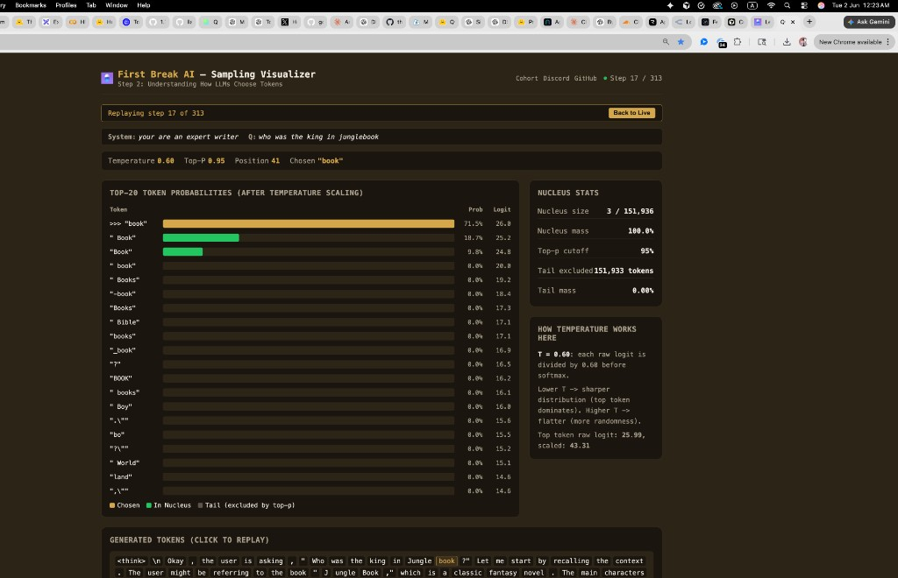

::: {.lesson-hero}
::: {.lesson-hero-tags}
[Lesson 1b · First Break AI]{.lesson-hero-eyebrow}
[● Draft]{.lesson-hero-status .lesson-hero-status-draft}
:::

# Qwen3 Fundamentals {.lesson-hero-title}

##### How a language model lives on disk and loads into memory — byte by byte. {.lesson-hero-subtitle}

::: {.lesson-hero-meta}
[~80 min read]{.lesson-hero-chip} [Cohort 01](../office-hours/2026-05-08.qmd){.lesson-hero-chip} [Run a model locally](../roadmap.qmd){.lesson-hero-chip}
:::
:::

This is the **full lesson** — everything you need is on this page. The video mirrors what's written here; the transcript is interactive, so you can click any line to jump the video to that point. Read it, watch it, do the exercises, bring it to office hours.

## Navigate by roadmap

| Step | Topic | This lesson |
|------|-------|-------------|
| [Lesson 0](lesson-0-welcome.qmd) | Welcome to First Break AI | — |
| [Lesson 1](lesson-1-huggingface-beyond-upload.qmd) | HuggingFace Beyond Upload | Prerequisite |
| **Lesson 1b** | **Qwen3 Fundamentals** | **You are here** |
| [Step 2](../roadmap.qmd) | Run a model locally | Builds directly on this lesson |

[← Back to Lessons](index.qmd) · [← Back to Roadmap](../roadmap.qmd)


```{=html}
<div class="lesson-page lesson-page-theatre" data-size="wide">

  <div class="lesson-deck">
    <div class="lesson-video-wrap">
      <div id="ytPlayer"
           data-video-id="MjZio-A9oUY"
           data-transcript="lesson-1b-qwen3-fundamentals.json"></div>
    </div>

    <div class="lesson-meta">
      <div class="lesson-now-playing">
        <span class="lesson-now-label">Chapter</span>
        <span class="lesson-chapter-title" id="lessonChapterTitle">Lesson 1b Overview: Qwen3 Fundamentals</span>
      </div>
      <div class="lesson-controls">
        <div class="lesson-size-group" role="group" aria-label="Video size">
          <button type="button" class="lesson-size-btn" data-size="compact">Compact</button>
          <button type="button" class="lesson-size-btn" data-size="theatre">Theatre</button>
          <button type="button" class="lesson-size-btn" data-size="wide">Wide</button>
        </div>
        <button type="button" class="transcript-toggle" id="lessonTranscriptToggle">Show Transcript</button>
      </div>
    </div>

    <div class="lesson-chapters">
      <div class="lesson-chapters-label">Chapters</div>
      <div class="lesson-chapter-list" id="lessonChapterList"></div>
    </div>
  </div>

  <div class="scene-transcript lesson-transcript" id="lessonTranscript"></div>

</div>
```

---

> **Prerequisites:** Basic comfort reading code. No prior knowledge of C, memory mapping, or model file formats required.
>
> **Codebase:** `repos/qwen3.c/` — a minimal, from-scratch Qwen3 inference engine in pure C
>
> **Goal:** Understand exactly how a 600-million-parameter language model is stored in a file, loaded into RAM, and wired up for inference — byte by byte.

:::: {.repo-link-card data-repo="thefirehacker/QWEN3-RunLocally"}
::: {.repo-link-header}
<svg viewBox="0 0 16 16"><path d="M2 2.5A2.5 2.5 0 0 1 4.5 0h8.75a.75.75 0 0 1 .75.75v12.5a.75.75 0 0 1-.75.75h-2.5a.75.75 0 0 1 0-1.5h1.75v-2h-8a1 1 0 0 0-.714 1.7.75.75 0 1 1-1.072 1.05A2.495 2.495 0 0 1 2 11.5Zm10.5-1h-8a1 1 0 0 0-1 1v6.708A2.486 2.486 0 0 1 4.5 9h8ZM5 12.25a.25.25 0 0 1 .25-.25h3.5a.25.25 0 0 1 .25.25v3.25a.25.25 0 0 1-.4.2l-1.45-1.087a.249.249 0 0 0-.3 0L5.4 15.7a.25.25 0 0 1-.4-.2Z"/></svg>
[thefirehacker/QWEN3-RunLocally](https://github.com/thefirehacker/QWEN3-RunLocally){.repo-link-name}
:::

[Companion codebase — qwen3.c inference engine in pure C, conversion scripts, and sampling visualizer.]{.repo-link-desc}

::: {.repo-link-meta}
:::
::::

::: {.callout-tip}
## Looking for how to run `run.c`, tokenization, or sampling?
This lesson focuses on the **file and memory layer** — how model weights are stored, loaded, and wired up. For the runtime side — how to build and run the model, what tokens are, how BPE works, chat templates, temperature, top-p sampling, and the full chat loop — see the [Step 2 guide: Run a Model Locally](../blog/qwen3-run-locally.qmd).
:::

---

## Chapter 1: What Even Is a Model File?

When someone says "I downloaded Qwen3-0.6B," what did they actually get?

They got a **file** — typically 1–3 GB in size — that contains **numbers**. Millions and millions of numbers. These numbers are the **weights** (also called **parameters**) of the neural network. They were determined during training, and they encode everything the model "knows."

Think of it like this:

- A **recipe** tells you the structure: "mix flour, eggs, and sugar, then bake at 350°F."
- The **ingredient amounts** tell you the specifics: "2 cups flour, 3 eggs, 1.5 cups sugar."

In a language model:

- The **architecture** is the recipe: "do attention, then feed-forward, repeat 28 times."
- The **weights** are the ingredient amounts: the specific numbers that make this particular model produce coherent text.

The architecture is described by **code** (like our `run.c`). The weights are stored in a **model file** (the `.gguf` file). To do inference (generate text), you need both.

### How Many Numbers Are We Talking About?

Qwen3-0.6B has approximately **600 million** parameters. Each parameter is a 32-bit floating-point number (in our case), which takes 4 bytes. So:

```
600,000,000 parameters × 4 bytes each = 2,400,000,000 bytes ≈ 2.4 GB
```

That's what takes up most of the model file. The rest is metadata (a tiny fraction by comparison).

### What Does "Inference" Mean?

Inference is the process of using a trained model to generate predictions. For a language model, inference means: given some text (the prompt), generate the next token (word/subword), then the next, then the next, one at a time.

Every time the model generates one token, it performs hundreds of matrix multiplications using those 600 million numbers. That's why inference, even for a "small" model, requires significant compute.

---

## Chapter 2: The GGUF File Format — A Container for Brains

### The Problem GGUF Solves

Imagine you're given a file that's just 2.4 billion raw bytes. You know they're model weights, but:

- Where does the token embedding end and the attention weights begin?
- How many layers does this model have?
- What's the vocabulary size?
- Is this Qwen3, LLaMA, or Mistral?

Without metadata, the file is just a soup of numbers. You'd need a separate config file, a separate tokenizer file, and exact knowledge of the weight layout to make any sense of it.

**GGUF** (GGML Universal Format) solves this by being a **self-contained** file format. One single `.gguf` file holds:

1. **Everything about the model's architecture** (number of layers, embedding size, etc.)
2. **The tokenizer** (vocabulary, merge rules for BPE)
3. **Every single weight tensor** with its name, shape, and data type
4. **The raw weight data** itself

### The Four Regions of a GGUF File

Every GGUF file is divided into four sequential regions, one after the other:

```
Byte 0                                                          Last byte
|                                                                       |
v                                                                       v
+----------+------------------+------------------+---------+------------+
|  HEADER  |  METADATA BLOCK  |  TENSOR INFO     | PADDING | TENSOR DATA|
| (24 bytes|  (variable size) |  (variable size) |         | (the big   |
|  fixed)  |                  |                  |         |  part)     |
+----------+------------------+------------------+---------+------------+
```

Let's walk through each one.

### Region 1: The Header (24 bytes, fixed)

The very first 24 bytes of every GGUF file are always structured the same way:

| Bytes | What It Is | Example Value |
|-------|-----------|---------------|
| 0–3 | Magic number | `GGUF` (the ASCII characters G, G, U, F) |
| 4–7 | Version number | `3` (the current GGUF spec version) |
| 8–15 | Tensor count | `311` (how many weight tensors are in this file) |
| 16–23 | Metadata KV count | `34` (how many metadata key-value pairs follow) |

The **magic number** is a signature that lets any program quickly verify "yes, this is a GGUF file" before trying to parse it. If the first four bytes aren't `GGUF`, something is wrong.

You can see these exact values in our `header.txt` file (which was generated by `header.py` parsing the binary GGUF):

```
MAGIC=GGUF
VERSION=3
TENSOR_COUNT=311
METADATA_COUNT=34
```

### Region 2: The Metadata Block (variable size)

Immediately after the 24-byte header comes a series of **key-value pairs**. Each pair has:

- A **key** (a string, like `"qwen3.block_count"`)
- A **value type** (integer, float, string, array, etc.)
- A **value** (the actual data)

For our Qwen3-0.6B model, the 34 metadata entries include things like:

```
GENERAL_ARCHITECTURE    = qwen3          (what kind of model this is)
GENERAL_NAME            = Qwen3 0.6B     (human-readable name)
QWEN3_BLOCK_COUNT       = 28             (number of transformer layers)
QWEN3_EMBEDDING_LENGTH  = 1024           (the "dimension" of the model)
QWEN3_FEED_FORWARD_LENGTH = 3072         (hidden dimension in FFN layers)
QWEN3_ATTENTION_HEAD_COUNT = 16          (number of attention heads)
QWEN3_ATTENTION_HEAD_COUNT_KV = 8        (number of key/value heads — GQA!)
QWEN3_ROPE_FREQ_BASE    = 1000000.0      (base frequency for positional encoding)
QWEN3_ATTENTION_KEY_LENGTH = 128         (dimension per attention head)
TOKENIZER_GGML_MODEL    = gpt2           (tokenizer type — BPE)
TOKENIZER_GGML_TOKENS   = [151936 strings] (the full vocabulary!)
TOKENIZER_GGML_MERGES   = [151387 strings] (BPE merge rules!)
```

This is incredibly powerful. A program reading this file can learn everything it needs to know about the model without any external files. It knows it's a Qwen3 model with 28 layers, 1024-dimensional embeddings, 16 attention heads, and a vocabulary of 151,936 tokens — all from the file itself.

### Region 3: The Tensor Info Block (variable size)

After all the metadata comes a directory listing of every tensor in the file. For each of the 311 tensors, the file stores:

| Field | What It Means | Example |
|-------|--------------|---------|
| Name | The tensor's standardized name | `"blk.0.attn_q.weight"` |
| Number of dimensions | How many axes the tensor has | `2` (a matrix) |
| Dimensions | The size along each axis | `[1024, 2048]` |
| Type | The data type / quantization format | `0` (= F32, 32-bit float) |
| Offset | Where this tensor's data starts within the data blob | `1257251328` |

This is like a **table of contents** for the weights. It tells you: "the Q projection for layer 0 is a 1024×2048 matrix of 32-bit floats, and its data starts at byte offset 1,257,251,328 within the tensor data region."

### Region 4: Padding + Tensor Data (the bulk of the file)

After the tensor info block, there's some **padding** (zero bytes) to align the start of the data to a 32-byte boundary. Then comes the actual weight data — just raw numbers, one after another.

Why 32-byte alignment? Modern CPUs have special instructions (called SIMD — Single Instruction, Multiple Data) that can process 8 floats at once, but only if the data starts at a memory address that's a multiple of 32. Alignment ensures that when the file is memory-mapped (we'll explain this in Chapter 4), the weights are already perfectly aligned for fast math.

---

## Chapter 3: Our Qwen3 GGUF File — A Concrete Example

Let's look at the actual tensor layout in our Qwen3-0.6B GGUF file. The `header.txt` file (generated by `header.py`) shows us every tensor.

### The Global Tensors (Not Part of Any Layer)

The first three tensors are the "global" ones — they don't belong to any specific transformer layer:

```
TENSOR_0:  OUTPUT_WEIGHT         shape=[1024, 151936]  offset=0
TENSOR_1:  OUTPUT_NORM_WEIGHT    shape=[1024]           offset=622,329,856
TENSOR_2:  TOKEN_EMBD_WEIGHT     shape=[1024, 151936]  offset=622,333,952
```

**`OUTPUT_WEIGHT`** (also called `wcls` in the code, or the "LM head"): This is the very last matrix multiplication in the model. It takes the model's internal representation (a 1024-dimensional vector) and projects it to a probability distribution over all 151,936 tokens in the vocabulary. Size: 1024 × 151,936 = 155,582,464 floats = 622,329,856 bytes.

**`OUTPUT_NORM_WEIGHT`**: A small 1024-element vector used for RMSNorm right before the output projection. Just 4,096 bytes.

**`TOKEN_EMBD_WEIGHT`** (the token embedding table): This is the very first thing used in the model. When a token comes in (say, token ID 5032), we look up row 5032 in this table to get a 1024-dimensional vector. Same size as OUTPUT_WEIGHT: 1024 × 151,936.

### The Per-Layer Tensors (Repeated 28 Times)

Starting from TENSOR_3, we see the same pattern repeat for each of the 28 transformer layers. Here's layer 0 (block 0):

```
TENSOR_3:   BLK_0_ATTN_K_WEIGHT          [1024, 1024]   — Key projection
TENSOR_4:   BLK_0_ATTN_K_NORM_WEIGHT     [128]           — Key RMSNorm
TENSOR_5:   BLK_0_ATTN_NORM_WEIGHT       [1024]          — Pre-attention RMSNorm
TENSOR_6:   BLK_0_ATTN_OUTPUT_WEIGHT     [2048, 1024]    — Attention output projection
TENSOR_7:   BLK_0_ATTN_Q_WEIGHT          [1024, 2048]    — Query projection
TENSOR_8:   BLK_0_ATTN_Q_NORM_WEIGHT     [128]           — Query RMSNorm
TENSOR_9:   BLK_0_ATTN_V_WEIGHT          [1024, 1024]    — Value projection
TENSOR_10:  BLK_0_FFN_DOWN_WEIGHT        [3072, 1024]    — FFN down projection
TENSOR_11:  BLK_0_FFN_GATE_WEIGHT        [1024, 3072]    — FFN gate projection
TENSOR_12:  BLK_0_FFN_NORM_WEIGHT        [1024]          — Pre-FFN RMSNorm
TENSOR_13:  BLK_0_FFN_UP_WEIGHT          [1024, 3072]    — FFN up projection
```

That's **11 tensors per layer**. With 28 layers, that's 308 per-layer tensors, plus 3 global tensors = **311 total**. Exactly matching our `TENSOR_COUNT=311`.

**Important observation:** Within each block, the tensors are in **alphabetical order** by their GGUF name: attn_k, attn_k_norm, attn_norm, attn_output, attn_q, attn_q_norm, attn_v, ffn_down, ffn_gate, ffn_norm, ffn_up. This is not the order llama.cpp normally uses — this is a **deliberate choice** made by our custom conversion script, and it's essential for our loading code to work. We'll explain why in Chapter 6.

### Understanding the Shapes

Let's decode what each tensor's shape means for Qwen3-0.6B:

- **dim** = 1024 (the model's internal working dimension)
- **n_heads** = 16 (number of attention heads)
- **n_kv_heads** = 8 (number of key/value heads — this is Grouped Query Attention)
- **head_dim** = 128 (each head works with 128-dimensional vectors; 16 heads × 128 = 2048)
- **hidden_dim** = 3072 (the expanded dimension inside the FFN)

So:

- `ATTN_Q_WEIGHT [1024, 2048]`: Projects a 1024-dim input to a 2048-dim query vector (16 heads × 128 per head)
- `ATTN_K_WEIGHT [1024, 1024]`: Projects 1024-dim input to a 1024-dim key vector (8 KV heads × 128 per head)
- `ATTN_V_WEIGHT [1024, 1024]`: Same as K (8 KV heads × 128 per head)
- `ATTN_OUTPUT_WEIGHT [2048, 1024]`: Projects the 2048-dim attention output back to 1024-dim
- `FFN_UP_WEIGHT [1024, 3072]`: Expands 1024 → 3072
- `FFN_DOWN_WEIGHT [3072, 1024]`: Compresses 3072 → 1024

---

## Chapter 4: Memory Mapping — Opening the File Without Reading It

### The Naive Approach (and Why It's Bad)

The obvious way to load a 2.4 GB model file would be:

```c
// DON'T do this for large files
FILE *f = fopen("model.gguf", "rb");
char *buffer = malloc(2400000000);  // allocate 2.4 GB of RAM
fread(buffer, 1, 2400000000, f);    // read entire file into RAM
fclose(f);
```

This works, but it has problems:

1. **It uses 2.4 GB of RAM** just for the weights. Your program also needs RAM for activations, KV cache, etc.
2. **It's slow to start** — you have to read the entire file from disk before you can do anything.
3. **It makes a copy** — the data exists on disk AND in RAM, doubling the effective memory usage from the OS's perspective.

### The Memory Mapping Approach

Memory mapping (`mmap`) is an operating system feature that creates a **virtual window** into a file. Instead of reading the file into RAM, you tell the OS: "make this file appear as if it were already in my memory."

```c
// What our run.c actually does
int fd = open("model.gguf", O_RDONLY);      // open the file
void *data = mmap(NULL, file_size,           // create a memory mapping
                  PROT_READ, MAP_PRIVATE,
                  fd, 0);
```

After this call, `data` is a pointer. You can read `data[0]`, `data[1000]`, `data[2000000000]` — any byte in the file — and the OS handles the rest. Here's what's actually happening behind the scenes:

1. **No data is loaded yet.** The `mmap` call returns almost instantly. It just sets up address space.
2. **When you access a byte,** the OS loads just that 4 KB page from disk into RAM (this is called a "page fault," but it's normal and fast).
3. **Pages you don't access are never loaded.** If there are tensors you never use, their data stays on disk.
4. **The OS manages the memory.** If RAM gets tight, the OS can evict mapped pages and reload them later from disk, since the file is the backing store.

This is why `mmap` is the standard way to load model weights in inference engines. For our 2.4 GB model:

- **Startup is nearly instant** (just a system call, no data movement)
- **Memory efficient** (only pages actually accessed are in RAM)
- **Zero-copy** (we read directly from the OS page cache — no duplicate in application memory)

Here's the actual code from `run.c`:

```c
void read_checkpoint(char *checkpoint, Config *config, TransformerWeights* weights,
                     int* fd, float** data, ssize_t* file_size) {
    FILE *file = fopen(checkpoint, "rb");
    fseek(file, 0, SEEK_END);
    *file_size = (ssize_t)ftell(file);    // get total file size
    fclose(file);

    *fd = open(checkpoint, O_RDONLY);
    *data = mmap(NULL, *file_size, PROT_READ, MAP_PRIVATE, *fd, 0);

    void* weights_ptr = ((char*)*data) + 5951648;  // skip header to reach tensor data
    memory_map_weights(weights, config, weights_ptr);
}
```

Let's break that down line by line:

1. Open the file just to get its size (`fseek` to end, `ftell` to read position), then close it
2. Open the file again with `open()` (the low-level system call, needed for `mmap`)
3. Call `mmap()` to create the memory mapping over the entire file
4. Calculate `weights_ptr` by skipping past the header to reach the raw weight data
5. Call `memory_map_weights()` to set up pointers to each weight tensor

---

## Chapter 5: The Header Skip — Jumping to the Weights

### The Problem

After memory-mapping the GGUF file, the pointer `data` points to the very beginning of the file — the magic number `GGUF`. But we don't want to do math with the string "GGUF". We want the actual weight numbers, which are in Region 4 (the tensor data blob), thousands of bytes into the file.

We need to figure out: **how many bytes do we skip to reach the tensor data?**

### Where the Number 5,951,648 Comes From

In our code, the skip is hardcoded:

```c
void* weights_ptr = ((char*)*data) + 5951648;
```

This number was calculated from the GGUF file itself. Here's the logic:

The tensor info block in our `header.txt` tells us that the **last tensor** (TENSOR_310, which is `BLK_27_FFN_UP_WEIGHT`) has:

```
TENSOR_310_DIMENSIONS=1024,3072
TENSOR_310_TYPE=0          (F32 = 4 bytes per number)
TENSOR_310_OFFSET=2993946624
```

The offset tells us this tensor's data starts at byte 2,993,946,624 **relative to the start of the tensor data blob**. Its size is 1024 × 3072 × 4 bytes = 12,582,912 bytes. So the total tensor data size is:

```
tensor_data_size = last_offset + last_tensor_size
                 = 2,993,946,624 + 12,582,912
                 = 3,006,529,536 bytes
```

And the header size (everything before the tensor data) is:

```
header_size = total_file_size - tensor_data_size
            = 3,012,481,184 - 3,006,529,536
            = 5,951,648 bytes
```

That's where the magic number `5951648` comes from. It represents:

- 24 bytes of GGUF header
- Several thousand bytes of metadata (34 key-value pairs, including the huge tokenizer vocabulary and merge tables)
- Several thousand bytes of tensor info (311 tensor descriptions)
- A few bytes of padding for alignment

### Why This Is "Fragile" (and That's OK for Learning)

This hardcoded number is correct **only for this exact file**. If you:

- Used a model with a different vocabulary size (the tokenizer arrays in the metadata would be different sizes)
- Used a model with more or fewer layers (different number of tensor info entries)
- Changed any metadata field

...the header size would change, and 5,951,648 would be wrong. The code would point to the wrong place and the model would produce garbage (or crash).

In a production system like llama.cpp, this offset is calculated dynamically by actually parsing the header. But for learning, the hardcoded value lets us focus on what matters: understanding the tensor data itself.

The comment in the code even acknowledges this with a `TODO`:

```c
void* weights_ptr = ((char*)*data) + 5951648; // skip header bytes. header_size = 5951648 TODO
```

---

## Chapter 6: memory_map_weights() — The Pointer Walk

This is the heart of the weight-loading logic, and it's worth understanding in extreme detail.

### The Setup

After skipping the header, `weights_ptr` points to the very first byte of the tensor data blob. We know from our `header.txt` that the tensors are laid out in this order:

```
[OUTPUT_WEIGHT][OUTPUT_NORM_WEIGHT][TOKEN_EMBD_WEIGHT][BLK_0_ATTN_K][BLK_0_ATTN_K_NORM]...
```

All the numbers are 32-bit floats (4 bytes each), packed tightly together (with alignment padding between some tensors).

### The Code, Fully Annotated

```c
void memory_map_weights(TransformerWeights* w, Config* p, void* pt) {
    unsigned long long n_layers = p->n_layers;  // = 28
    float *ptr = (float*) pt;   // Cast the raw byte pointer to a float pointer
                                // Now ptr[0] is the first float, ptr[1] is the second, etc.

    // --- TENSOR 0: output.weight (wcls) ---
    // Shape: [1024, 151936] = 155,582,464 floats
    w->wcls = ptr;
    ptr += p->vocab_size * p->dim;      // advance by 151936 * 1024 = 155,582,464 floats

    // --- TENSOR 1: output_norm.weight (rms_final_weight) ---
    // Shape: [1024] = 1,024 floats
    w->rms_final_weight = ptr;
    ptr += p->dim;                       // advance by 1024 floats

    // --- TENSOR 2: token_embd.weight ---
    // Shape: [1024, 151936] = 155,582,464 floats
    w->token_embedding_table = ptr;
    ptr += p->vocab_size * p->dim;      // advance by 155,582,464 floats

    // --- TENSOR 3: blk.0.attn_k.weight ---
    // Shape: [1024, 1024] (dim × n_kv_heads * head_dim = 1024 × 8*128)
    w->wk = ptr;
    ptr += p->dim * (p->n_kv_heads * p->head_dim);

    // --- TENSOR 4: blk.0.attn_k_norm.weight ---
    // Shape: [128] (one per head_dim)
    w->wk_norm = ptr;
    ptr += p->head_dim;

    // --- TENSOR 5: blk.0.attn_norm.weight (pre-attention RMSNorm) ---
    // Shape: [1024]
    w->rms_att_weight = ptr;
    ptr += p->dim;

    // --- TENSOR 6: blk.0.attn_output.weight ---
    // Shape: [2048, 1024] (n_heads * head_dim × dim)
    w->wo = ptr;
    ptr += (p->n_heads * p->head_dim) * p->dim;

    // --- TENSOR 7: blk.0.attn_q.weight ---
    // Shape: [1024, 2048] (dim × n_heads * head_dim)
    w->wq = ptr;
    ptr += p->dim * (p->n_heads * p->head_dim);

    // --- TENSOR 8: blk.0.attn_q_norm.weight ---
    // Shape: [128]
    w->wq_norm = ptr;
    ptr += p->head_dim;

    // --- TENSOR 9: blk.0.attn_v.weight ---
    // Shape: [1024, 1024] (dim × n_kv_heads * head_dim)
    w->wv = ptr;
    ptr += p->dim * (p->n_kv_heads * p->head_dim);

    // --- TENSOR 10: blk.0.ffn_down.weight (w2) ---
    // Shape: [3072, 1024] (hidden_dim × dim)
    w->w2 = ptr;
    ptr += p->hidden_dim * p->dim;

    // --- TENSOR 11: blk.0.ffn_gate.weight (w3) ---
    // Shape: [1024, 3072] (dim × hidden_dim)
    w->w3 = ptr;
    ptr += p->dim * p->hidden_dim;

    // --- TENSOR 12: blk.0.ffn_norm.weight (pre-FFN RMSNorm) ---
    // Shape: [1024]
    w->rms_ffn_weight = ptr;
    ptr += p->dim;

    // --- TENSOR 13: blk.0.ffn_up.weight (w1) ---
    // Shape: [1024, 3072] (dim × hidden_dim)
    w->w1 = ptr;
    ptr += p->dim * p->hidden_dim;

    // ptr now points to TENSOR 14: blk.1.attn_k.weight
    // But the function ends here! It only recorded the pointer to layer 0.
    // The forward pass accesses other layers using an offset. See Chapter 7.
}
```

### What Just Happened?

We walked a pointer through memory, assigning each weight struct member to point to the correct location in the memory-mapped file. No data was copied. Each `w->something` is just a pointer to a position within the mmap'd file.

Here's a visual of what memory looks like after this function:

```
Memory-mapped file (starting from tensor data):

Byte 0                                                    Byte ~3 billion
|                                                                      |
v                                                                      v
[output.weight ......][norm][token_embd ......][blk0.attn_k][blk0.k_norm]...
^                      ^     ^                  ^            ^
|                      |     |                  |            |
w->wcls          w->rms_final w->token_embd    w->wk        w->wk_norm
```

Each pointer is essentially a bookmark into this giant contiguous block of memory. When the forward pass needs to do a matrix multiplication with the Q projection weights, it just uses `w->wq` — which is already pointing at the right spot in the file.

### The Critical Requirement: Order Must Match

This entire scheme depends on the tensors being physically laid out in the file in **exactly the order** that `memory_map_weights()` expects. If `output_norm.weight` came before `output.weight` in the file, the pointer walk would assign wrong sizes and every subsequent pointer would be in the wrong place. The model would produce garbage.

This is why we use the custom `convert_hf_to_gguf_ordered.py` script instead of the standard llama.cpp converter. Our script **sorts the tensors** into the exact order our code expects.

---

## Chapter 7: How the Forward Pass Uses These Pointers

### The Layer Offset Trick

`memory_map_weights()` only stored pointers to **layer 0's** weights. But Qwen3-0.6B has 28 layers. How does the forward pass access layer 5, or layer 27?

The answer is a constant called `layer_offset`:

```c
int layer_offset = 62923776 / 4;  // = 15,730,944 floats
```

This is the **stride** between consecutive layers' tensors of the same type. Because our GGUF file arranges tensors as [all of block 0, all of block 1, all of block 2, ...], and every block has the exact same sizes, the distance from `blk.0.attn_k.weight` to `blk.1.attn_k.weight` is always the same.

That distance is 62,923,776 bytes (= the total size of all 11 tensors in one block). Divided by 4 (bytes per float) = 15,730,944 floats.

So to access layer `l`'s Q projection weights, the code does:

```c
w->wq + l * layer_offset
```

This is pointer arithmetic: "start at layer 0's wq, then jump forward by `l` blocks."

### Walking Through One Forward Pass Layer

Here's the forward pass for one layer, annotated:

```c
for (int l = 0; l < p->n_layers; l++) {     // for each of the 28 layers

    // Step 1: RMSNorm the input (normalize before attention)
    rmsnorm(s->xb, s->x, w->rms_att_weight + l * layer_offset, p->dim);

    // Step 2: Compute Q, K, V projections
    matmul(s->q, s->xb, w->wq + l * layer_offset, p->dim, att_head_dim);
    matmul(s->k, s->xb, w->wk + l * layer_offset, p->dim, kv_dim);
    matmul(s->v, s->xb, w->wv + l * layer_offset, p->dim, kv_dim);

    // Step 3: Apply QK norms (Qwen3-specific!)
    rmsnorm(q, q, w->wq_norm + l * layer_offset, p->head_dim);
    rmsnorm(k, k, w->wk_norm + l * layer_offset, p->head_dim);

    // Step 4: Apply RoPE (Rotary Position Embedding)
    // ... (rotates q and k vectors based on position)

    // Step 5: Attention (dot product of Q and K, softmax, weighted sum of V)
    // ... (the classic attention mechanism)

    // Step 6: Output projection
    matmul(s->xb2, s->xb3, w->wo + l * layer_offset, att_head_dim, p->dim);

    // Step 7: Residual connection (add attention output back to input)
    for (int i = 0; i < p->dim; i++)
        s->x[i] += s->xb2[i];

    // Step 8: FFN RMSNorm
    rmsnorm(s->xb, s->x, w->rms_ffn_weight + l * layer_offset, p->dim);

    // Step 9: FFN (SwiGLU activation)
    matmul(s->hb,  s->xb, w->w1 + l * layer_offset, p->dim, p->hidden_dim);  // up
    matmul(s->hb2, s->xb, w->w3 + l * layer_offset, p->dim, p->hidden_dim);  // gate
    // SwiGLU: gate * silu(up), then project down
    matmul(s->xb, s->hb2, w->w2 + l * layer_offset, p->hidden_dim, p->dim);  // down

    // Step 10: Residual connection (add FFN output back)
    for (int i = 0; i < p->dim; i++)
        s->x[i] += s->xb[i];
}
```

After all 28 layers, one final step:

```c
// Final RMSNorm
rmsnorm(s->x, s->x, w->rms_final_weight, p->dim);

// Project to vocabulary-sized logits
matmul(s->logits, s->x, w->wcls, p->dim, p->vocab_size);
```

The `logits` array now has 151,936 values — one score for every possible next token. The highest-scoring token (or a sampled one) becomes the model's output.

---

## Chapter 8: How llama.cpp Does It Differently

Now that you understand the "simple" approach in run.c, let's see how the production-grade llama.cpp handles the same problem.

### Name-Based Lookup Instead of Pointer Walking

llama.cpp does **not** assume any particular order of tensors in the file. Instead, it:

1. Parses the GGUF header and metadata (dynamically, not from a separate text file)
2. Reads the entire tensor info block, building a **dictionary** mapping tensor names to their offsets
3. When it needs a tensor (like `blk.5.attn_q.weight`), it looks up the name in the dictionary, gets the offset, and computes the pointer

This means the tensors could be in any order in the file and llama.cpp would still work. It's like the difference between:

- **run.c:** "The milk is the third item on the second shelf" (positional — breaks if you rearrange the fridge)
- **llama.cpp:** "The milk is labeled 'MILK'" (named — works regardless of where it's placed)

### Dynamic Header Parsing

llama.cpp reads the GGUF metadata directly from the binary file at startup. It doesn't need a pre-generated `header.txt`. The parsing code:

1. Reads the magic number and validates it
2. Reads the version number
3. Reads tensor count and metadata KV count
4. Loops through each KV pair, reading keys and values based on their type codes
5. Loops through each tensor info entry, recording name, shape, type, and offset
6. Calculates the tensor data start position (after padding)

This means llama.cpp can load **any** GGUF file — Qwen3, LLaMA, Mistral, Phi, Gemma — without modification. The architecture-specific code only needs to know which tensor names to look for.

### Quantization Support

This is one of the biggest practical differences. Our run.c only handles `TYPE=0` (F32 — full 32-bit floats). llama.cpp supports many quantization formats:

| Type | Bits per Weight | Size of 0.6B Model | Quality Loss |
|------|----------------|--------------------:|-------------|
| F32 | 32 | ~2.4 GB | None (reference) |
| F16 | 16 | ~1.2 GB | Negligible |
| Q8_0 | 8 | ~0.6 GB | Very small |
| Q4_K_M | ~4.5 | ~0.35 GB | Small |
| Q4_0 | 4 | ~0.3 GB | Moderate |
| Q2_K | ~2.6 | ~0.2 GB | Noticeable |

Quantization dramatically reduces file size and memory usage, making it possible to run larger models on consumer hardware. A 7B model at Q4_K_M fits in about 4 GB of RAM. At F32, it would need 28 GB.

In GGUF, each tensor declares its own quantization type. Some tensors (like embeddings and norms) might be kept at higher precision (F32 or F16) while the bulk of attention and FFN weights are quantized to Q4 or Q8. llama.cpp's inference code knows how to dequantize each format on the fly.

### The Standard Tensor Naming Convention

llama.cpp standardizes tensor names across all model architectures. The convention is:

```
token_embd.weight              — Token embedding
output_norm.weight             — Final RMSNorm before output
output.weight                  — LM head (vocabulary projection)

blk.{i}.attn_norm.weight       — Pre-attention RMSNorm for layer i
blk.{i}.attn_q.weight          — Query projection for layer i
blk.{i}.attn_k.weight          — Key projection for layer i
blk.{i}.attn_v.weight          — Value projection for layer i
blk.{i}.attn_output.weight     — Attention output projection for layer i
blk.{i}.ffn_norm.weight        — Pre-FFN RMSNorm for layer i
blk.{i}.ffn_gate.weight        — FFN gate (for SwiGLU)
blk.{i}.ffn_up.weight          — FFN up projection
blk.{i}.ffn_down.weight        — FFN down projection
```

These names are **different** from the HuggingFace names (e.g., `model.layers.0.self_attn.q_proj.weight`). A mapping table (`tensor_mapping.py`) translates between the two during conversion.

---

## Chapter 9: The Custom Conversion Script — Making the Two Worlds Meet

### The Bridge Between HuggingFace and run.c

Our codebase includes `convert_hf_to_gguf_ordered.py` — a **modified version** of llama.cpp's standard conversion script. This script takes a HuggingFace model (SafeTensors format) and produces a GGUF file that our run.c can load.

The standard llama.cpp script writes tensors in whatever order they come from the source files. Our modified version adds a **sorting step**.

### The Sorting Logic

Here's the key addition (in the `prepare_tensors()` method):

```python
def sort_key(tensor_info):
    new_name, data_torch, name, bid, old_dtype = tensor_info
    if bid is None:
        return (-1, new_name)   # Global tensors first (output, norm, embedding)
    else:
        return (bid, new_name)  # Then block 0 (alphabetical), block 1, ...

all_tensors.sort(key=sort_key)
```

This sort produces exactly the tensor order that `memory_map_weights()` expects:

1. **Global tensors first** (bid = None, sorted to -1): `output.weight`, `output_norm.weight`, `token_embd.weight` (alphabetical by name)
2. **Block 0** (bid = 0): all 11 tensors, alphabetically by GGUF name
3. **Block 1** (bid = 1): all 11 tensors, alphabetically
4. ... and so on through block 27

### Why Alphabetical?

The alphabetical ordering within each block is what gives us the specific sequence: `attn_k, attn_k_norm, attn_norm, attn_output, attn_q, attn_q_norm, attn_v, ffn_down, ffn_gate, ffn_norm, ffn_up`. This happens to match the order in `memory_map_weights()` because that function was written to match this alphabetical layout.

### The Full Pipeline

```
HuggingFace Model                    Our Custom GGUF              run.c
(SafeTensors + config.json)     (ordered, FP32, sorted)      (pointer walk)

model.safetensors  ──────>  convert_hf_to_gguf_ordered.py  ──>  Qwen3-0.6B-F32.gguf
config.json        ──────>       (sorts tensors!)
tokenizer files    ──────>

                                                             header.py ──> header.txt
                                                                              |
                                                             extract_v_m.py ──> vocab.txt
                                                                              |  merges.txt
                                                                              v
                                                             run.c reads header.txt for config,
                                                             mmaps the GGUF, walks pointers,
                                                             runs inference
```

---

## Chapter 10: Putting It All Together — The Full Pipeline

Let's trace the entire journey from "you have a model" to "it generates a token."

### Step 1: Convert the Model

```bash
python convert_hf_to_gguf_ordered.py /path/to/Qwen3-0.6B --outtype f32 --outfile Qwen3-0.6B-F32.gguf
```

This reads the HuggingFace model, maps tensor names to GGUF standard names, **sorts them** by block then alphabetically, and writes the GGUF file with all weights in F32.

### Step 2: Extract the Header

```bash
python header.py Qwen3-0.6B-F32.gguf
```

This parses the GGUF binary header and writes `header.txt` — a human-readable version that `run.c` can parse for the model's configuration (dimensions, layer count, etc.).

### Step 3: Extract Vocabulary and Merges

```bash
python extract_v_m.py Qwen3-0.6B-F32.gguf
```

This extracts the BPE tokenizer data (`vocab.txt` and `merges.txt`) that `run.c` needs to convert text to token IDs and back.

### Step 4: Compile and Run

```bash
gcc -O3 -o run run.c -lm
./run Qwen3-0.6B-F32.gguf
```

At startup, `run.c`:

1. Calls `load_config()` — reads `header.txt` to fill the `Config` struct (dim=1024, n_layers=28, etc.)
2. Calls `build_transformer()` which:
   - Opens the GGUF file and gets its size
   - Memory-maps the entire file with `mmap()`
   - Skips 5,951,648 bytes to reach the tensor data
   - Walks the pointer through `memory_map_weights()`, setting up all weight pointers
   - Allocates runtime buffers (activations, KV cache) with `malloc_run_state()`
3. Loads the tokenizer (vocabulary and merge rules from text files)
4. Enters the generation loop:
   - Encode the prompt text into token IDs
   - For each position: call `forward()` to get logits, sample a token, decode it to text
   - Print each generated token

### The Beauty of This Design

Even though it's simplified, this design captures the **essential** structure of every LLM inference engine:

1. **Load weights from a file** (GGUF, SafeTensors, or raw binary)
2. **Point weight matrices at the data** (via mmap, GPU upload, or copy)
3. **Run the transformer forward pass** (embedding → [attention + FFN] × N layers → logits)
4. **Sample the next token** (from the logit distribution)
5. **Repeat**

The difference between this and llama.cpp or vLLM or TensorRT-LLM is one of **flexibility and optimization** (quantization, batching, GPU kernels, speculative decoding), not fundamental structure.

---

## Chapter 11: SafeTensors — The Other File Format

In the previous chapters, we studied GGUF in detail. But when you download a model from HuggingFace, you don't get a GGUF file. You get **SafeTensors** files. So what are those, and why do we need to convert them?

### Why SafeTensors Was Created: A Security Story

Before SafeTensors existed, PyTorch models were stored as **pickle files** (`.bin` or `.pt`). Pickle is a Python serialization format, and here's its dangerous secret: pickle can **execute arbitrary code** when a file is loaded.

That means a malicious model file — one that looks perfectly normal — could run harmful code on your machine the moment you call `torch.load()`:

```python
import torch

# This single line could execute hidden malicious code
# embedded in a poisoned .pt file
model = torch.load("innocent_looking_model.pt")
```

This isn't a theoretical risk. It's a real attack vector. Anyone who shared a `.pt` model file was implicitly asking you to trust them with arbitrary code execution on your machine.

HuggingFace created **SafeTensors** in 2022 specifically to eliminate this risk. The format is mathematically incapable of executing code. It stores **only** two things:

1. A JSON header describing each tensor's name, shape, data type, and position
2. Raw numbers (the weight data itself)

No code. No Python objects. No serialization magic. Just metadata and numbers. You can verify this yourself — the entire header is human-readable JSON.

GGUF shares this safety property. Both formats are "data-only" — they cannot execute code when loaded.

### The SafeTensors File Structure

SafeTensors is dramatically simpler than GGUF. Where GGUF has four regions with custom binary encoding, SafeTensors has just **three parts**:

```
+-------------------+---------------------+------------------+
| HEADER LENGTH     |  JSON HEADER        |  TENSOR DATA     |
| (8 bytes, uint64) |  (N bytes, UTF-8)   |  (bulk)          |
+-------------------+---------------------+------------------+
```

Let's walk through each one.

#### Part 1: Header Length (8 bytes)

The first 8 bytes of a SafeTensors file are a single unsigned 64-bit integer (little-endian). This number tells you how many bytes the JSON header occupies.

That's it. No magic number like GGUF's `0x47475546`. No version field. No tensor count. Just one number: the size of the header that follows.

This extreme minimalism is intentional. The less structure there is, the fewer things can go wrong.

#### Part 2: The JSON Header (N bytes)

This is where SafeTensors and GGUF diverge most dramatically. Instead of GGUF's compact binary encoding (which requires custom parsing code to read), SafeTensors uses **plain JSON** — the same format used by web APIs everywhere.

Here's what the JSON header actually looks like for a model. You could open it in any text editor and read it:

```json
{
  "model.layers.0.self_attn.q_proj.weight": {
    "dtype": "BF16",
    "shape": [2048, 1024],
    "data_offsets": [0, 4194304]
  },
  "model.layers.0.self_attn.k_proj.weight": {
    "dtype": "BF16",
    "shape": [1024, 1024],
    "data_offsets": [4194304, 6291456]
  },
  "model.layers.0.self_attn.v_proj.weight": {
    "dtype": "BF16",
    "shape": [1024, 1024],
    "data_offsets": [6291456, 8388608]
  },
  "__metadata__": {
    "format": "pt"
  }
}
```

Each tensor entry has exactly three fields:

- **`dtype`**: The data type. Common values are `"BF16"` (bfloat16, the most common training precision), `"F16"` (float16), `"F32"` (float32). These are all standard numeric types — no quantized types like GGUF's Q4_0 or Q8_0.

- **`shape`**: The dimensions of the tensor, as an array of integers. For example, `[2048, 1024]` means a matrix with 2048 rows and 1024 columns.

- **`data_offsets`**: A two-element array `[BEGIN, END]` giving the byte range of this tensor's data within the data buffer. The total size of the tensor in bytes is `END - BEGIN`. These offsets are **relative to the start of the data buffer**, not the start of the file. To find a tensor in the actual file, you need to calculate: `file_position = 8 + header_length + BEGIN`.

There's also an optional special key `"__metadata__"` for arbitrary string-to-string metadata. Unlike GGUF's rich typed metadata (integers, floats, arrays), SafeTensors metadata values can only be strings.

#### Part 3: The Tensor Data Buffer (the rest of the file)

Just like GGUF, the remainder of the file is raw tensor bytes packed together. The JSON header tells you where each tensor starts and ends within this buffer.

One important rule: **the byte buffer must be entirely covered** — no gaps or holes between tensors. This prevents someone from hiding extra data in the file (another security measure).

### How Big Is a SafeTensors Header?

For our Qwen3-0.6B model with 311 tensors, each tensor entry in JSON takes roughly 100–150 characters (the full framework tensor name plus dtype, shape, and offsets). So the JSON header is roughly 30–50 KB.

Compare this with our GGUF header which is 5,951,648 bytes (~5.7 MB). The GGUF header is much larger because it includes the **entire tokenizer** (151,936 vocabulary entries and 151,387 merge rules) and the chat template. SafeTensors doesn't store any of that.

### Reading a SafeTensors File in Python

Because the header is JSON, reading it in Python is trivially simple:

```python
import json
import struct

with open("model.safetensors", "rb") as f:
    # Read the 8-byte header length
    header_length = struct.unpack('<Q', f.read(8))[0]

    # Read and parse the JSON header
    header_json = f.read(header_length).decode('utf-8')
    header = json.loads(header_json)

    # Now you can inspect any tensor
    for name, info in header.items():
        if name == "__metadata__":
            continue
        print(f"{name}: dtype={info['dtype']}, shape={info['shape']}")
```

Compare this with `header.py` in our codebase, which needs 130 lines of manual binary parsing code (reading struct-packed integers, handling different value types, iterating through variable-length strings) to read the GGUF header. SafeTensors trades compactness for simplicity.

---

## Chapter 12: SafeTensors vs GGUF — A Detailed Comparison

Now that you understand both formats, let's compare them systematically.

### What SafeTensors Does NOT Have (That GGUF Does)

This is the most important thing to understand. SafeTensors is **deliberately incomplete** as a model format. It stores the weights and nothing else. Here's what each format includes:

| What You Need to Run Inference | GGUF | SafeTensors |
|---|---|---|
| Model weights (the numbers) | In the file | In the file |
| Tensor names + shapes + types | In the file (binary struct) | In the file (JSON header) |
| Model architecture (layer count, dim, head count) | In the file (metadata KV pairs) | **NOT in the file** — needs separate `config.json` |
| Tokenizer vocabulary | In the file (metadata array of 151,936 strings) | **NOT in the file** — needs separate `tokenizer.json` |
| BPE merge rules | In the file (metadata array of 151,387 strings) | **NOT in the file** — needs separate `merges.txt` |
| Chat template | In the file (metadata string) | **NOT in the file** — needs separate `tokenizer_config.json` |
| Quantization formats | Built-in (Q4_0, Q4_K_M, Q8_0, etc.) | **No support** — only standard dtypes (F32, F16, BF16) |
| RoPE frequency base | In the file (metadata float) | **NOT in the file** — in `config.json` |
| Special token IDs (EOS, BOS, PAD) | In the file (metadata integers) | **NOT in the file** — in `special_tokens_map.json` |

### GGUF Is Self-Contained; SafeTensors Is Not

**GGUF is a complete package.** You can take a single `.gguf` file, move it to any machine, and an inference engine can load and run it without any other files. Everything needed — weights, config, tokenizer, chat template — is inside.

**SafeTensors is just the weights.** To actually run a model from SafeTensors, you need the entire HuggingFace model directory:

```
Qwen3-0.6B/
├── config.json                    ← architecture (28 layers, 1024 dim, 16 heads, etc.)
├── generation_config.json         ← generation parameters (temperature, top_p, etc.)
├── tokenizer.json                 ← full tokenizer definition
├── tokenizer_config.json          ← special tokens, chat template
├── special_tokens_map.json        ← EOS, BOS, PAD token IDs
├── merges.txt                     ← BPE merge rules (151,387 entries)
├── vocab.json                     ← token vocabulary (151,936 entries)
├── model.safetensors              ← THE ACTUAL WEIGHTS (this is the SafeTensors file)
└── model.safetensors.index.json   ← shard index (if model is split across files)
```

That's 8–9 files just to load one model. If any of these files is missing or mismatched, the model won't load correctly.

This is why the conversion pipeline exists: the conversion script reads all of these files and packs everything into one self-contained GGUF.

### Data Types and Precision

**SafeTensors supports standard numeric types only:**

| Type | Bytes per Value | Description |
|------|----------------|-------------|
| F64 | 8 | 64-bit float (rarely used for model weights) |
| F32 | 4 | 32-bit float (full precision) |
| F16 | 2 | 16-bit float (IEEE half-precision) |
| BF16 | 2 | bfloat16 (most common training precision) |
| I64, I32, I16, I8 | 8, 4, 2, 1 | Signed integers |
| U8 | 1 | Unsigned byte |
| BOOL | 1 | Boolean |

Most models on HuggingFace are distributed in **BF16** (bfloat16). This is the precision most commonly used during training. Each parameter takes 2 bytes.

**GGUF supports all of the above PLUS many quantized types:**

| Type | Approx. Bits per Weight | Description |
|------|------------------------|-------------|
| F32 | 32 | Full precision (what run.c uses) |
| F16 | 16 | Half precision |
| Q8_0 | 8 | 8-bit quantization |
| Q6_K | ~6.5 | 6-bit K-quant |
| Q5_K_S, Q5_K_M | ~5.5 | 5-bit K-quant (small/medium) |
| Q4_K_S, Q4_K_M | ~4.5 | 4-bit K-quant (most popular) |
| Q4_0 | 4 | Basic 4-bit quantization |
| Q3_K_S, Q3_K_M | ~3.5 | 3-bit K-quant |
| Q2_K | ~2.6 | 2-bit K-quant (aggressive) |
| IQ2_XXS | ~2.1 | Importance-weighted 2-bit |
| TQ1_0 | ~1.6 | Ternary quantization |

This is a fundamental design difference. SafeTensors preserves training precision for **distribution and fine-tuning**. GGUF enables aggressive compression for **inference and deployment**.

For our Qwen3-0.6B model, here's how file sizes compare:

```
SafeTensors (BF16, HuggingFace default):  ~600M params × 2 bytes = ~1.2 GB
GGUF (F32, what run.c uses):             ~600M params × 4 bytes = ~2.4 GB
GGUF (Q8_0):                              ~600M params × 1 byte  = ~0.6 GB
GGUF (Q4_K_M, most popular):             ~600M params × 0.56 bytes = ~0.35 GB
GGUF (Q2_K, aggressive):                  ~600M params × 0.33 bytes = ~0.2 GB
```

Notice something surprising: our run.c's F32 GGUF file is actually **larger** than the original SafeTensors file. That's because we "un-quantized" the weights from BF16 to F32 during conversion. In practice, most people convert to a quantized GGUF (like Q4_K_M) which is much smaller.

### Memory Mapping: Both Support It, but Differently

Both formats support `mmap` for zero-copy loading (as we learned in Chapter 4). But there are practical differences:

**SafeTensors:** The JSON header gives `data_offsets: [BEGIN, END]` relative to the data buffer start. To mmap a specific tensor, you calculate: `file_position = 8 + header_length + BEGIN`. This makes each tensor independently addressable — you can load just the tensors you need without touching the rest of the file.

**GGUF:** Tensor offsets are also relative to the data blob start. But GGUF adds explicit **32-byte alignment padding** between the header and data, ensuring tensor data starts at a memory address divisible by 32. This alignment matters for SIMD (Single Instruction, Multiple Data) instructions that process multiple floats at once — they often require data to be aligned to specific boundaries.

SafeTensors doesn't enforce alignment. The JSON header can be padded with trailing whitespace to achieve alignment, but this is optional rather than required by the spec.

For our run.c, the difference is irrelevant because we skip the entire header with a hardcoded offset and walk pointers sequentially. But for production engines, alignment guarantees enable faster vectorized math.

### Sharding: How Big Models Split Across Files

Models with billions of parameters can produce files too large for convenient handling. Both formats support splitting across multiple files.

**SafeTensors sharding:** A larger model like Qwen3-32B might be split like this:

```
Qwen3-32B/
├── model-00001-of-00004.safetensors     ← ~8 GB each
├── model-00002-of-00004.safetensors
├── model-00003-of-00004.safetensors
├── model-00004-of-00004.safetensors
└── model.safetensors.index.json         ← maps tensor names to shard files
```

The index file is a JSON document that tells you which shard contains which tensor:

```json
{
  "weight_map": {
    "model.embed_tokens.weight": "model-00001-of-00004.safetensors",
    "model.layers.0.self_attn.q_proj.weight": "model-00001-of-00004.safetensors",
    "model.layers.15.mlp.down_proj.weight": "model-00002-of-00004.safetensors",
    "lm_head.weight": "model-00004-of-00004.safetensors"
  }
}
```

Each shard is an independent SafeTensors file with its own JSON header.

**GGUF sharding:** GGUF files can also be split, but it's less common because quantized GGUF files are already much smaller. A 32B model at Q4_K_M is about 18 GB — large but manageable as a single file. At Q8_0, you might split into a few shards.

### The Header Comparison: JSON vs Binary

Let's look at how the same tensor is described in each format.

**In SafeTensors (JSON — human-readable):**

```json
"model.layers.0.self_attn.q_proj.weight": {
    "dtype": "BF16",
    "shape": [2048, 1024],
    "data_offsets": [0, 4194304]
}
```

**In GGUF (binary — needs parsing code):**

```
[string length: 8 bytes][name bytes: "blk.0.attn_q.weight"]
[n_dimensions: 4 bytes = 2]
[dim_0: 8 bytes = 1024]
[dim_1: 8 bytes = 2048]
[type: 4 bytes = 0 (F32)]
[offset: 8 bytes = 1257251328]
```

**In our header.txt (the parsed GGUF, human-readable):**

```
TENSOR_7_NAME=BLK_0_ATTN_Q_WEIGHT
TENSOR_7_DIMENSIONS=1024,2048
TENSOR_7_TYPE=0
TENSOR_7_OFFSET=1257251328
```

The JSON approach is simpler to implement (any language can parse JSON), but the binary approach is more compact and faster to parse for large files with hundreds of tensors.

---

## Chapter 13: Tensor Names — Framework Names vs Standardized Names

This deserves its own chapter because tensor naming is the core of the translation between the two worlds.

### SafeTensors Uses Framework-Native Names

When a model is trained in PyTorch using HuggingFace Transformers, the weights are stored with the **exact names** used in the Python code. These names follow PyTorch's module hierarchy:

```
model.embed_tokens.weight                              ← Token embedding
model.layers.0.input_layernorm.weight                  ← Pre-attention RMSNorm, layer 0
model.layers.0.self_attn.q_proj.weight                 ← Query projection, layer 0
model.layers.0.self_attn.k_proj.weight                 ← Key projection, layer 0
model.layers.0.self_attn.v_proj.weight                 ← Value projection, layer 0
model.layers.0.self_attn.o_proj.weight                 ← Output projection, layer 0
model.layers.0.self_attn.q_norm.weight                 ← Query RMSNorm, layer 0 (Qwen3-specific)
model.layers.0.self_attn.k_norm.weight                 ← Key RMSNorm, layer 0 (Qwen3-specific)
model.layers.0.post_attention_layernorm.weight         ← Pre-FFN RMSNorm, layer 0
model.layers.0.mlp.gate_proj.weight                    ← FFN gate (SwiGLU), layer 0
model.layers.0.mlp.up_proj.weight                      ← FFN up projection, layer 0
model.layers.0.mlp.down_proj.weight                    ← FFN down projection, layer 0
model.layers.1.input_layernorm.weight                  ← Same pattern for layer 1
...                                                    ← (repeat for all 28 layers)
model.layers.27.mlp.down_proj.weight                   ← Last layer
model.norm.weight                                      ← Final RMSNorm
lm_head.weight                                         ← Output projection (LM head)
```

These names directly reflect the Python class hierarchy. `model.layers.0.self_attn.q_proj.weight` means: "in the `model` object, in the `layers` list, at index `0`, in the `self_attn` submodule, in the `q_proj` linear layer, the `weight` parameter."

Different model architectures use different names:

```
Qwen3:   model.layers.0.self_attn.q_proj.weight
LLaMA:   model.layers.0.self_attn.q_proj.weight     (same! Qwen3 follows LLaMA naming)
GPT-2:   transformer.h.0.attn.c_attn.weight          (completely different)
Falcon:  transformer.h.0.self_attention.query_key_value.weight  (fused QKV!)
MPT:     transformer.blocks.0.attn.Wqkv.weight       (also fused, different name)
```

### GGUF Uses Standardized, Architecture-Independent Names

GGUF's naming convention is designed so that **any model architecture** maps to the same set of canonical names. This is what allows llama.cpp to support dozens of architectures with shared loading code:

```
token_embd.weight                    ← Token embedding (any architecture)
blk.0.attn_norm.weight               ← Pre-attention norm, layer 0
blk.0.attn_q.weight                  ← Query projection, layer 0
blk.0.attn_k.weight                  ← Key projection, layer 0
blk.0.attn_v.weight                  ← Value projection, layer 0
blk.0.attn_output.weight             ← Attention output, layer 0
blk.0.attn_q_norm.weight             ← Query norm, layer 0
blk.0.attn_k_norm.weight             ← Key norm, layer 0
blk.0.ffn_norm.weight                ← Pre-FFN norm, layer 0
blk.0.ffn_gate.weight                ← FFN gate, layer 0
blk.0.ffn_up.weight                  ← FFN up, layer 0
blk.0.ffn_down.weight                ← FFN down, layer 0
...                                  ← (repeat for all layers)
output_norm.weight                   ← Final normalization
output.weight                        ← LM head
```

Notice the pattern: `blk.{layer_number}.{component}.weight`. Clean, consistent, and the same whether the source model was Qwen3, LLaMA, Mistral, or anything else.

### The Mapping Table

The conversion script (`convert_hf_to_gguf_ordered.py`) contains a massive mapping table (in llama.cpp's `gguf-py/gguf/tensor_mapping.py`) that translates between the two naming schemes. Here's a simplified version for Qwen3:

```
HuggingFace (SafeTensors) Name              GGUF Name
─────────────────────────────────────────    ──────────────────────────
model.embed_tokens.weight                →  token_embd.weight
model.layers.{bid}.input_layernorm       →  blk.{bid}.attn_norm
model.layers.{bid}.self_attn.q_proj      →  blk.{bid}.attn_q
model.layers.{bid}.self_attn.k_proj      →  blk.{bid}.attn_k
model.layers.{bid}.self_attn.v_proj      →  blk.{bid}.attn_v
model.layers.{bid}.self_attn.o_proj      →  blk.{bid}.attn_output
model.layers.{bid}.self_attn.q_norm      →  blk.{bid}.attn_q_norm
model.layers.{bid}.self_attn.k_norm      →  blk.{bid}.attn_k_norm
model.layers.{bid}.post_attention_layernorm → blk.{bid}.ffn_norm
model.layers.{bid}.mlp.gate_proj         →  blk.{bid}.ffn_gate
model.layers.{bid}.mlp.up_proj           →  blk.{bid}.ffn_up
model.layers.{bid}.mlp.down_proj         →  blk.{bid}.ffn_down
model.norm                               →  output_norm
lm_head                                  →  output
```

The `{bid}` placeholder gets replaced with the actual layer number (0, 1, 2, ..., 27).

The mapping table also handles architectures that use different names. For example, the attention norm tensor has these aliases across different model families:

```python
MODEL_TENSOR.ATTN_NORM: (
    "gpt_neox.layers.{bid}.input_layernorm",           # GPT-NeoX
    "transformer.h.{bid}.ln_1",                         # GPT-2, GPT-J, Qwen1
    "transformer.blocks.{bid}.norm_1",                  # MPT
    "model.layers.{bid}.input_layernorm",               # LLaMA, Qwen2/3
    "encoder.layers.{bid}.input_layernorm",              # encoder models
    # ... many more
)
```

All of these different source names get mapped to the same GGUF name: `blk.{bid}.attn_norm.weight`. This is how one inference engine can load models from many different training frameworks.

### How Our header.txt Maps to run.c Field Names

Finally, in our codebase there's one more level of translation. The `header.py` script converts GGUF dotted names to uppercase underscore names for C compatibility:

```
GGUF name                        header.txt name               run.c field
──────────────                   ────────────────              ──────────────
output.weight                 →  OUTPUT_WEIGHT              →  w->wcls
output_norm.weight            →  OUTPUT_NORM_WEIGHT         →  w->rms_final_weight
token_embd.weight             →  TOKEN_EMBD_WEIGHT          →  w->token_embedding_table
blk.0.attn_q.weight           →  BLK_0_ATTN_Q_WEIGHT       →  w->wq
blk.0.attn_k.weight           →  BLK_0_ATTN_K_WEIGHT       →  w->wk
blk.0.attn_v.weight           →  BLK_0_ATTN_V_WEIGHT       →  w->wv
blk.0.attn_output.weight      →  BLK_0_ATTN_OUTPUT_WEIGHT  →  w->wo
blk.0.ffn_gate.weight         →  BLK_0_FFN_GATE_WEIGHT     →  w->w3
blk.0.ffn_up.weight           →  BLK_0_FFN_UP_WEIGHT       →  w->w1
blk.0.ffn_down.weight         →  BLK_0_FFN_DOWN_WEIGHT     →  w->w2
```

So the full translation chain from training to inference is:

```
model.layers.0.self_attn.q_proj.weight     (PyTorch / SafeTensors)
        ↓  tensor_mapping.py
blk.0.attn_q.weight                        (GGUF standard name)
        ↓  header.py name sanitization
BLK_0_ATTN_Q_WEIGHT                        (header.txt)
        ↓  memory_map_weights() pointer assignment
w->wq                                      (run.c struct field)
        ↓  forward() with layer offset
w->wq + l * layer_offset                   (actual pointer used for layer l)
```

---

## Chapter 14: The Conversion Pipeline — SafeTensors In, GGUF Out

Now we can see the full picture of how a model travels from HuggingFace to our run.c inference engine. This ties together everything from the previous chapters.

### The Two Worlds

Think of SafeTensors and GGUF as belonging to two different worlds:

**The Training World (SafeTensors):**

- Models are trained in Python (PyTorch, JAX, etc.)
- Weights are stored in BF16 or F16 (training precision)
- Tensor names match the Python code hierarchy
- Config, tokenizer, and weights are separate files
- Designed for researchers who need to inspect, fine-tune, and share models
- Framework: HuggingFace Transformers, PyTorch

**The Inference World (GGUF):**

- Models run in C/C++ (llama.cpp, run.c, etc.)
- Weights can be quantized to 2–8 bits for efficiency
- Tensor names are standardized across all architectures
- Everything packed into one self-contained file
- Designed for deployment where you just want fast text generation
- Framework: llama.cpp, Ollama, LM Studio, run.c

### What the Conversion Script Actually Does

Our `convert_hf_to_gguf_ordered.py` script is the bridge. Here's what happens step by step when you run it:

**Step 1: Read the HuggingFace model directory**

The script opens `config.json` to learn the architecture:

```json
{
    "hidden_size": 1024,
    "intermediate_size": 3072,
    "num_attention_heads": 16,
    "num_key_value_heads": 8,
    "num_hidden_layers": 28,
    "vocab_size": 151936,
    "rope_theta": 1000000.0,
    "head_dim": 128
}
```

**Step 2: Write GGUF metadata**

These config values become GGUF metadata key-value pairs:

```
qwen3.embedding_length    = 1024       (from hidden_size)
qwen3.feed_forward_length = 3072       (from intermediate_size)
qwen3.attention.head_count = 16        (from num_attention_heads)
qwen3.attention.head_count_kv = 8      (from num_key_value_heads)
qwen3.block_count         = 28         (from num_hidden_layers)
```

**Step 3: Read and write the tokenizer**

The script reads `tokenizer.json`, `merges.txt`, `vocab.json`, etc. and writes them as GGUF metadata arrays. This is the bulk of the header size — 151,936 vocabulary strings and 151,387 merge rule strings take up about 5.7 MB.

**Step 4: Read each tensor from SafeTensors**

```python
from safetensors import safe_open
ctx = safe_open("model.safetensors", framework="pt", device="cpu")
for name in ctx.keys():
    tensor = ctx.get_tensor(name)
```

**Step 5: Translate tensor names**

```python
gguf_name = self.map_tensor_name(name)
# "model.layers.0.self_attn.q_proj.weight" → "blk.0.attn_q.weight"
```

**Step 6: Convert data type (if needed)**

If the source is BF16 and the target is F32 (our case), the script converts:

```python
if data_torch.dtype not in (torch.float16, torch.float32):
    data_torch = data_torch.to(torch.float32)  # BF16 → F32
```

**Step 7: Sort the tensors (our custom addition)**

This is the step that makes our GGUF compatible with run.c's pointer walk:

```python
def sort_key(tensor_info):
    new_name, data_torch, name, bid, old_dtype = tensor_info
    if bid is None:
        return (-1, new_name)    # Global tensors first
    else:
        return (bid, new_name)   # Then by layer, then alphabetically

all_tensors.sort(key=sort_key)
```

**Step 8: Write the GGUF file**

The `gguf.GGUFWriter` handles the binary encoding: write the 24-byte header, write all metadata KV pairs in binary, write all tensor info entries, add alignment padding, then write all tensor data.

### Why Not Just Use SafeTensors Directly in run.c?

You might wonder: if both formats store the same numbers, why not just load SafeTensors in C?

Several reasons:

1. **JSON parsing in C is painful.** GGUF's binary header can be parsed with simple `struct` reads. Parsing JSON in C requires either a library or hundreds of lines of parser code.

2. **No tokenizer.** SafeTensors doesn't contain the vocabulary or merge rules. You'd need to separately parse `tokenizer.json` (a complex JSON file) in C.

3. **No config.** You'd need to parse `config.json` separately. (We already do this with `header.txt`, but GGUF makes it unnecessary for production engines.)

4. **BF16 is awkward.** Most SafeTensors files use BF16, which is not natively supported on most CPUs (it's a GPU-oriented format). You'd need conversion code. GGUF files are typically in F32, F16, or quantized formats that are directly usable.

5. **No quantization.** If you want to run a model smaller, SafeTensors can't help. GGUF lets you quantize to 4-bit and run a 7B model in 4 GB of RAM.

### The Complete Journey Visualized

```
TRAINING / DISTRIBUTION                       INFERENCE / DEPLOYMENT
(Python, HuggingFace)                          (C, llama.cpp / run.c)

config.json ─────────────┐
tokenizer.json ──────────┤
merges.txt ──────────────┤
vocab.json ──────────────┤                    ┌─────────────────────┐
special_tokens_map.json ─┤   conversion       │  Qwen3-0.6B-F32.gguf│
tokenizer_config.json ───┤   script           │                     │
                         ├─────────────────>  │  GGUF header:       │
model.safetensors ───────┤                    │    metadata (config) │
  BF16 weights           │                    │    metadata (vocab)  │
  Framework tensor names │                    │    metadata (merges) │
  ~1.2 GB                │                    │    tensor info × 311 │
                         │                    │  Tensor data:        │
                         │                    │    F32 weights        │
                         │                    │    sorted by block    │
                         │                    │    ~2.4 GB            │
                         │                    └──────────┬────────────┘
                         │                               │
                         │                        mmap + pointer walk
                         │                               │
                         │                               v
                         │                    ┌─────────────────────┐
                         │                    │  run.c inference     │
                         │                    │  Generates text!     │
                         │                    └─────────────────────┘
```

### Quick Reference: SafeTensors vs GGUF

| Feature | SafeTensors | GGUF |
|---------|------------|------|
| Created by | HuggingFace (2022) | Georgi Gerganov / ggml-org (2023) |
| Primary purpose | Model distribution, training, fine-tuning | Inference, deployment |
| Header format | JSON (human-readable) | Custom binary (compact, fast to parse) |
| Self-contained | No (needs 6–9 companion files) | Yes (everything in one file) |
| Quantization | No (F32, F16, BF16 only) | Yes (Q2 through Q8, many variants) |
| Security | Safe (no code execution) | Safe (no code execution) |
| Memory-mappable | Yes | Yes (with alignment guarantees) |
| Tensor names | Framework-native (PyTorch hierarchy) | Standardized (architecture-independent) |
| Typical file size (0.6B) | ~1.2 GB (BF16) | ~0.35 GB (Q4_K_M) to ~2.4 GB (F32) |
| Who reads it | PyTorch, TensorFlow, JAX, HuggingFace | llama.cpp, Ollama, LM Studio, run.c |
| Predecessor | pickle `.bin` files (unsafe!) | GGML, GGJT formats |

---

## Chapter 15: From Logits to Text — Prefill, Sampling, and What You Can See

The previous chapters traced how weights get from disk into memory. This chapter traces what happens *after* the forward pass produces logits — and introduces the two-phase structure that every inference engine uses.

### The Two Phases of Generation

When you type a prompt and press Enter, the model does not immediately start generating text. It first **reads your entire prompt**, then starts **writing its answer**. These are two distinct phases in the code, and understanding them is essential.

**Phase 1: Prefill** — The model processes every token from your prompt, one at a time. Each `forward()` call builds up the KV cache (key/value attention states) so the model "remembers" the full prompt. During prefill:

- The token fed in comes from the prompt buffer (`tb->data[pos]`)
- The logits produced are *discarded* (we don't sample from them)
- No text is printed to screen

Think of it like the model reading your question silently.

**Phase 2: Decode** — Now the model generates one token at a time:

- The token fed in is the *previous generated* token
- The logits are used to sample the next token
- The chosen token is printed to screen

Think of it like the model writing its answer, one word at a time.

Here's how the code decides which phase it's in:

```c
if (pos < (multi_turn ? tb->size : num_prompt_tokens)) {
    token = (multi_turn) ? tb->data[pos] : prompt_tokens[pos];  // prefill
} else {
    token = next;  // decode — use last generated token
}
```

A single variable — `pos` compared to the prompt length — is the entire boundary between the two phases. The same `forward()` function runs in both; only the source of the input token and the handling of the output differ.

### TTFT and TPS — The Two Numbers That Matter

In production inference engines (vLLM, TensorRT-LLM, llama.cpp server), two metrics dominate:

**TTFT (Time to First Token)** — How long from pressing Enter to seeing the first generated word. This measures the prefill phase. In our `run.c`, you can measure it with `-f 1`:

```bash
OMP_NUM_THREADS=4 ./run Qwen3-0.6B-FP32.gguf -f 1
# TTFT: 1823 ms
```

TTFT scales linearly with prompt length in our serial C implementation — every prompt token requires one full `forward()` call. Production engines optimize this heavily with batched prefill and parallelism.

**TPS (Tokens Per Second)** — How fast the model generates during the decode phase. Measured with `-r 1`:

```bash
OMP_NUM_THREADS=4 ./run Qwen3-0.6B-FP32.gguf -r 1
# tok/s: 6.686930
```

The TPS timer starts *after* the first generated token (after prefill is complete), so it measures pure decode speed. On a 4-core machine with OpenMP, expect roughly 6–7 tokens per second for Qwen3-0.6B at FP32.

### Nucleus Sampling — What Happens After the Forward Pass

Chapter 7 ended with 151,936 logits — raw scores, one per vocabulary token. But logits are not probabilities, and even after converting them to probabilities, we still need to *choose* a token. This is where sampling lives.

The `sample()` function in `run.c` implements the full pipeline:

```c
int sample(Sampler* sampler, float* logits) {
    int next;
    if (sampler->temperature == 0.0f) {
        next = sample_argmax(logits, sampler->vocab_size);
    } else {
        for (int q = 0; q < sampler->vocab_size; q++) {
            logits[q] /= sampler->temperature;
        }
        softmax(logits, sampler->vocab_size);
        float coin = random_f32(&sampler->rng_state);
        if (sampler->topp <= 0 || sampler->topp >= 1) {
            next = sample_mult(logits, sampler->vocab_size, coin);
        } else {
            next = sample_topp(logits, sampler->vocab_size,
                               sampler->topp, sampler->probindex, coin);
        }
    }
    return next;
}
```

Three strategies, selected by the temperature and top-p parameters:

**Greedy (temperature = 0):** Always pick the highest-probability token. Fully deterministic — same input always produces the same output. Fast but often repetitive.

**Temperature scaling:** Divide every logit by the temperature before softmax. Lower temperature → sharper distribution (top token dominates). Higher temperature → flatter distribution (more randomness). The default is 0.6.

**Nucleus (top-p) sampling:** After temperature scaling and softmax, sort tokens by probability descending. Walk down the sorted list, accumulating probability mass. Stop when you've covered `p` of the total mass (default 0.95). Sample only from this "nucleus" of high-probability tokens. Everything in the long tail is excluded.

The `sample_topp()` function implements this with an efficiency trick — it pre-filters tokens below a cutoff threshold before sorting:

```c
const float cutoff = (1.0f - topp) / (n - 1);
for (int i = 0; i < n; i++) {
    if (probabilities[i] >= cutoff) {
        probindex[n0].index = i;
        probindex[n0].prob = probabilities[i];
        n0++;
    }
}
```

This avoids sorting all 151,936 tokens when only a handful have meaningful probability.

### How the Nucleus Is Built — Step by Step

The nucleus is not a fixed size. It is whatever number of top tokens you need so their probabilities add up to at least your top-p cutoff. One sentence rule:

> **Sort tokens by probability (highest first), add them one by one, and stop as soon as the running sum reaches ≥ top-p. That set is the nucleus; everything else is the tail.**

```
         ┌──────────────────┐
         │ Sort tokens by   │
         │ prob descending   │
         └────────┬─────────┘
                  │
                  ▼
         ┌──────────────────┐
         │ Add next token   │
         │ to running sum   │
         └────────┬─────────┘
                  │
            sum ≥ top-p?
           ╱            ╲
         yes             no
          │               │
          ▼               └──→ (loop back up)
  ┌───────────────┐
  │ Token is IN   │
  │ the nucleus   │
  └───────────────┘
  All remaining tokens → tail (excluded)
```

In `run.c`, `sample_topp()` does this after temperature scaling and softmax. The dashboard's **Nucleus size** is the count of tokens included before the cutoff is crossed.

#### Example 1: Nucleus size = 1

The model is very confident — one token carries almost all the mass:

| Token | Prob | Cumulative |
|-------|------|-----------|
| " be" | 99.9% | 99.9% ← crosses 95% |
| " have" | 0.1% | — |
| … | ~0% | — |

After token #1: cumulative = 99.9% → already ≥ 95%. **Stop. Nucleus = 1 token.**

The model was very confident after T=0.6. One token carries almost all the mass, so top-p does not need a second candidate. Sampling is effectively deterministic on this step.

#### Example 2: Nucleus size = 3

The distribution is flatter — no single token dominates:

| Token | Prob | Cumulative |
|-------|------|-----------|
| " tradition" | 58.3% | 58.3% |
| " magic" | 34.6% | 92.9% |
| " kindness" | 2.4% | 95.3% ← crosses 95% |
| " folklore" | 1.2% | (tail — not in nucleus) |

After #1: 58.3% — not enough. After #2: 92.9% — still under 95%. After #3: 95.3% — done. **Nucleus = 3 tokens.**

" folklore" stays grey (tail) because the nucleus was already full at 95.3% before it was reached. The model randomly picks among " tradition", " magic", and " kindness" according to their relative probabilities (58% / 35% / 2%) after re-normalizing.

#### Why Nucleus Size Changes from Step to Step

Same run, same `-t 0.6 -p 0.95` — only the shape of the probability distribution at that step changes:

| Factor | Effect on nucleus size |
|--------|----------------------|
| How peaked the distribution is | Sharp winner → often 1; several strong options → 2–10+ |
| Temperature (T=0.6) | Lower T → sharper → tends toward smaller nucleus |
| Top-p (0.95) | Lower p (e.g. 0.5) → fewer tokens; higher p (e.g. 0.99) → more tokens |
| Where you are in the text | Mid-sentence glue words (" be") → small; open choices (" tradition" / " magic") → larger |

#### What Top-p Actually Does at Sampling Time

1. **Build the nucleus** — the smallest set of top tokens with cumulative mass ≥ 95%.
2. **Re-normalize** — scale probabilities inside the nucleus so they sum to 1.0.
3. **Sample** — randomly pick one token from the nucleus using the re-normalized probabilities.
4. **Ignore the tail** — the 151,933+ tokens not in the nucleus are never chosen, no matter what.

When nucleus = 1, sampling is almost deterministic (one real choice). When nucleus = 3, there's genuine randomness among the candidates.

#### Reading the Dashboard

{fig-alt="Qwen3 sampling visualizer showing nucleus size 3 with book token selected"}

Quick read of the dashboard:

- **Green bars** = in the nucleus (eligible to be chosen)
- **Grey bars** = tail (excluded by top-p)
- **Gold bar** = the token that was actually sampled
- **Nucleus mass** shows the cumulative probability of all nucleus tokens
- **Tail excluded** shows how many of the 151,936 vocabulary tokens were cut

### Seeing It Live — The Sampling Visualizer

The cohort has built a live dashboard that visualizes exactly what happens at every decode step. When you run the model with `-v 1`, each generated token emits a JSONL event containing the top-20 token probabilities, nucleus membership, and which token was chosen. You can replay any step and see the nucleus build up token by token.

{fig-alt="Qwen3 sampling visualizer showing top-20 token probabilities with nucleus membership highlighted"}

{fig-alt="Qwen3 sampling visualizer during thinking mode showing wider nucleus distribution"}

To run the visualizer yourself:

```bash
# Build the viz-enabled binary
make runviz

# Terminal 1: Start the dashboard
cd ../../apps/sampling-viz && npm install && npm run dev

# Terminal 2: Run inference with viz hook
node ../../tools/sampling-bridge.mjs ./run_viz Qwen3-0.6B-FP32.gguf -v 1 -t 0.6 -p 0.95
```

Then open `http://localhost:3000` and chat in Terminal 2. Every generated token streams to the dashboard in real time.

### Why the Prefill/Decode Split Matters for the Viz

In the code, when viz is enabled, we copy the raw logits on *every* step (both prefill and decode) because `sample()` mutates the logits array in-place. But we only emit the visualization event during decode steps — prefill logits are discarded since we're not choosing a token from them:

```c
// copy raw logits before sample() mutates them (for viz)
float* raw_logits_copy = NULL;
if (viz) {
    raw_logits_copy = malloc(sampler->vocab_size * sizeof(float));
    memcpy(raw_logits_copy, logits, sampler->vocab_size * sizeof(float));
}

next = sample(sampler, logits);  // this mutates logits!
```

During decode, the copy is emitted and freed. During prefill, the copy is never emitted — so it must be freed separately to avoid a memory leak:

```c
// free logits copy if not emitted (prefill steps)
if (raw_logits_copy) { free(raw_logits_copy); }
```

Without that line, every prefill step would leak ~600 KB (151,936 floats × 4 bytes). For a 100-token prompt, that's 60 MB leaked before the first word appears.

::: {.callout-note}
## For the full runtime walkthrough
This chapter introduced prefill, decode, sampling, and the viz as they relate to the model's weight and memory pipeline. For the complete treatment — how to build and run `run.c`, what tokens are, how BPE tokenization works, chat templates, the transformer forward pass layer by layer, and the full chat loop — see the [Step 2 guide: Run a Model Locally](../blog/qwen3-run-locally.qmd).
:::

---

## Chapter 16: The KV Cache — Why the Model Remembers

### The Problem

When the model generates token 50, it needs to attend to *all 49 previous tokens*. That means computing the attention score between the current query and every past key, then weighting every past value. Without caching, you'd have to recompute K and V for all 49 tokens through all 28 layers — from scratch — just to generate one new token. Then for token 51, you'd recompute all 50. Then all 51 for token 52. The cost would be quadratic in the number of tokens generated.

The **KV cache** eliminates this waste. Every time the model processes a token, it stores that token's key and value vectors in a persistent buffer. On the next step, it only computes K and V for the *new* token and reads all previous ones from the cache. One compute, then reuse forever.

### Allocation — Two Giant Flat Arrays

The KV cache is allocated once at startup, sized for the maximum context length the model supports:

```c
int kv_dim = p->n_kv_heads * p->head_dim;  // 8 * 128 = 1024

s->key_cache   = calloc(p->n_layers * p->seq_len * kv_dim, sizeof(float));
s->value_cache = calloc(p->n_layers * p->seq_len * kv_dim, sizeof(float));
```

For Qwen3-0.6B, the numbers are:

- `n_layers` = 28
- `seq_len` = 40,960 (maximum context length)
- `kv_dim` = 1,024 (8 KV heads × 128 per head)

Each cache is `28 × 40,960 × 1,024 × 4 bytes` = **4.7 GB**. Both caches together = **9.4 GB**. This is *larger than the model weights themselves* (2.4 GB). The KV cache is the reason GPU memory is the bottleneck in inference, not model size.

In practice, the cache only fills up to the actual sequence length used, but the memory is allocated for the maximum up front.

### The Memory Layout

The cache is a 3D array flattened into a 1D buffer. Here's how it's organized:

```
key_cache (one contiguous block):

Layer 0:  [pos 0: 1024 floats][pos 1: 1024 floats]...[pos 40959: 1024 floats]
Layer 1:  [pos 0: 1024 floats][pos 1: 1024 floats]...[pos 40959: 1024 floats]
...
Layer 27: [pos 0: 1024 floats][pos 1: 1024 floats]...[pos 40959: 1024 floats]
```

To find the slot for layer `l` at position `pos`:

```c
int loff = l * p->seq_len * kv_dim;   // jump to this layer's section
// then: loff + pos * kv_dim           // jump to this position's slot
```

### The Write Step — Filling the Cache

At the start of each layer in the forward pass, the code sets the K and V pointers to point *directly into the cache* at the current position:

```c
for (int l = 0; l < p->n_layers; l++) {
    int loff = l * p->seq_len * kv_dim;
    s->k = s->key_cache + loff + pos * kv_dim;
    s->v = s->value_cache + loff + pos * kv_dim;
```

Then the K and V matmuls write their results straight into the cache:

```c
    matmul(s->k, s->xb, w->wk + l * layer_offset, p->dim, kv_dim);
    matmul(s->v, s->xb, w->wv + l * layer_offset, p->dim, kv_dim);
```

There is no separate "store to cache" step. The pointer `s->k` already *is* the cache slot. The matmul output goes directly into the right place. This is the same pointer-trick philosophy as `memory_map_weights()` from Chapter 6 — no copying, just pointing.

Here's a visual of what happens as the model processes three tokens:

```
After pos=0 ("What"):
  key_cache layer 0:  [K₀ filled][empty][empty]...
  value_cache layer 0: [V₀ filled][empty][empty]...

After pos=1 ("is"):
  key_cache layer 0:  [K₀][K₁ filled][empty]...
  value_cache layer 0: [V₀][V₁ filled][empty]...

After pos=2 ("attention"):
  key_cache layer 0:  [K₀][K₁][K₂ filled]...
  value_cache layer 0: [V₀][V₁][V₂ filled]...
```

Each `forward()` call fills one column in the cache. During prefill, this happens for every prompt token. During decode, one column per generated token.

### The Read Step — Attention Looks Back

After storing the current K and V, the attention mechanism reads back *all* previous positions. For each query head, the code loops over every position from 0 to `pos`:

```c
for (int h = 0; h < p->n_heads; h++) {
    float* q = s->q + h * p->head_dim;
    float* att = s->att + h * p->seq_len;

    // Score: dot product of current Q with every past K
    for (int t = 0; t <= pos; t++) {
        float* k = s->key_cache + loff + t * kv_dim + (h / kv_mul) * p->head_dim;
        float score = 0;
        for (int i = 0; i < p->head_dim; i++)
            score += q[i] * k[i];
        att[t] = score / sqrtf(p->head_dim);
    }

    softmax(att, pos + 1);

    // Weighted sum: blend every past V using the attention weights
    float* xb3 = s->xb3 + h * p->head_dim;
    memset(xb3, 0, p->head_dim * sizeof(float));
    for (int t = 0; t <= pos; t++) {
        float* v = s->value_cache + loff + t * kv_dim + (h / kv_mul) * p->head_dim;
        float a = att[t];
        for (int i = 0; i < p->head_dim; i++)
            xb3[i] += a * v[i];
    }
}
```

Two loops, both `0..pos`:

1. **Score loop** — Compute the dot product of the current query with every past key. Divide by `√head_dim` for numerical stability. Then softmax to get attention weights.
2. **Value loop** — Weighted sum of all past values using those weights. The result is the "contextualised" representation of the current token.

Without the cache, both of these loops would require recomputing K and V for every past token through the full layer stack. With the cache, they just read from memory.

### GQA in the Cache — Why `h / kv_mul`

Notice the expression `(h / kv_mul) * p->head_dim` in the cache read. This is **Grouped Query Attention** at work.

Qwen3-0.6B has 16 query heads but only 8 KV heads. The ratio `kv_mul = n_heads / n_kv_heads = 2` means each KV head serves 2 query heads. Integer division groups them:

| Query head `h` | `h / kv_mul` | KV head used |
|---------------|-------------|-------------|
| 0 | 0 | KV head 0 |
| 1 | 0 | KV head 0 |
| 2 | 1 | KV head 1 |
| 3 | 1 | KV head 1 |
| ... | ... | ... |
| 14 | 7 | KV head 7 |
| 15 | 7 | KV head 7 |

This halves the KV cache size. Instead of storing 16 heads × 128 dims = 2,048 floats per position, we store 8 heads × 128 dims = 1,024 floats. For long contexts, this saves gigabytes.

### Why Context Length Is Expensive

The attention loop `for (int t = 0; t <= pos; t++)` is the cost centre. At position 100, each head does 100 dot products. At position 10,000, it does 10,000. Across 16 heads and 28 layers, generating one token at position 10,000 requires:

```
16 heads × 28 layers × 10,000 dot products × 128 multiplies = ~573 million operations
```

This is why:

- **Long contexts are slow.** Each new token gets more expensive as the conversation grows.
- **KV cache memory grows linearly** with context length. At position 10,000: `28 layers × 10,000 × 1,024 × 4 bytes × 2 caches = 2.2 GB` of cache in use.
- **Production engines** (vLLM, TensorRT-LLM) use techniques like **paged attention** (allocating cache in chunks rather than one giant block), **KV cache compression**, and **multi-query attention** (even fewer KV heads) to manage this cost.

### The Cache Connects Prefill and Decode

Now the connection from Chapter 15 is complete:

- **Prefill exists to build the KV cache.** Each `forward()` call during prefill fills one position's K and V across all 28 layers. After a 200-token prompt, the cache has 200 rows filled — the model "remembers" the entire prompt.
- **Decode reads the cache on every step.** Each generated token attends to everything in the cache — the entire prompt plus all previously generated tokens.
- **Multi-turn with prefix caching** reuses the cache from prior turns. If the first turn filled positions 0–199, the second turn starts at position 200 instead of reprocessing from scratch. This is what the `[Sep-01-25] Prefix caching` update in the codebase implements.

The KV cache is the single data structure that makes autoregressive generation practical. Without it, LLM inference would be orders of magnitude slower.

---

## Exercises

### Exercise 1: Calculate the Header Size Yourself

Using `header.txt`, verify the magic number 5,951,648. You'll need the total file size and the last tensor's offset + size.

**Hint:** TENSOR_310's offset is 2,993,946,624. Its shape is [1024, 3072] with TYPE=0 (F32 = 4 bytes per element).

### Exercise 2: Count the Parameters

Using the tensor shapes in `header.txt`, calculate the total number of parameters in the model. Group them by category:

- Embedding parameters (token_embd + output)
- Per-layer attention parameters (Q, K, V, O projections + norms) × 28
- Per-layer FFN parameters (up, gate, down + norm) × 28
- Global norms

Does your total match approximately 600 million?

### Exercise 3: Predict the Layer Offset

The code uses `layer_offset = 62923776/4`. Verify this by calculating the total size (in bytes) of all 11 tensors in one block using the dimensions from `header.txt`.

### Exercise 4: What Would Break?

Describe what would happen in each scenario:

1. The GGUF file was regenerated with a different tokenizer (more vocabulary entries)
2. Someone reordered the tensors in the GGUF to put FFN weights before attention weights
3. The model was quantized to Q4_0 instead of F32

### Exercise 5: Read the Forward Pass

Trace through the `forward()` function with a single token at position 0, layer 0 only. Write down the shape of every matrix multiplication (input dimensions × output dimensions).

### Exercise 6: SafeTensors Header Size

A SafeTensors JSON header entry for one tensor looks roughly like this (about 120 characters):

```
"model.layers.0.self_attn.q_proj.weight":{"dtype":"BF16","shape":[2048,1024],"data_offsets":[0,4194304]},
```

Estimate the JSON header size for a model with 311 tensors. Then compare that with the GGUF header size of 5,951,648 bytes. Why is the GGUF header so much larger, even though its binary format is more compact than JSON?

### Exercise 7: Trace the Name Translation

Pick any three tensors from `header.txt`. For each one, trace backwards through all four naming levels:

1. The `run.c` struct field name (e.g., `w->wq`)
2. The `header.txt` name (e.g., `BLK_0_ATTN_Q_WEIGHT`)
3. The GGUF standard name (e.g., `blk.0.attn_q.weight`)
4. The original PyTorch/SafeTensors name (e.g., `model.layers.0.self_attn.q_proj.weight`)

### Exercise 8: File Size Comparison

Calculate the file sizes for Qwen3-0.6B in each format:

- SafeTensors with BF16 (2 bytes per parameter)
- GGUF with F32 (4 bytes per parameter, what run.c uses)
- GGUF with Q4_K_M (approximately 0.56 bytes per parameter)

For each, estimate what percentage of the file is header/metadata vs actual weight data.

### Exercise 9: Prefill Cost

A user types a 200-token prompt. How many `forward()` calls happen during prefill? How many during decode if the model generates 50 tokens? What is the total? Now imagine the user sends a follow-up message in multi-turn mode with 30 more tokens — with prefix caching, how many prefill calls does the second turn need?

### Exercise 10: Nucleus Math

The model produces these top-5 probabilities after temperature scaling and softmax: `[0.45, 0.25, 0.15, 0.08, 0.04]`. With `top_p = 0.95`:

1. Which tokens are in the nucleus?
2. What is the nucleus mass?
3. How many tokens from the 151,936-token vocabulary are excluded?
4. If you lower `top_p` to 0.7, which tokens remain in the nucleus?

### Exercise 11: KV Cache Memory

Qwen3-0.6B has 28 layers, 8 KV heads, head_dim 128, and seq_len 40,960.

1. Calculate the KV cache size per position (both keys and values, in bytes).
2. After processing a 500-token prompt, how much cache memory is in use?
3. At the full context length (40,960 tokens), how much total memory do the key and value caches consume?
4. The model weights are 2.4 GB. At what context length does the KV cache exceed the model weights?
5. If the model used full multi-head attention (16 KV heads instead of 8), what would the cache size be at full context? How much does GQA save?

---

## Glossary

**Activation:** An intermediate result computed during the forward pass. Unlike weights, activations are different for every input and are computed (not stored in the file).

**BF16 (bfloat16):** A 16-bit floating-point format developed by Google Brain. It has the same exponent range as FP32 (8 bits) but fewer mantissa bits (7 vs 23). This makes it ideal for training — it can represent the same range of values as FP32, just with less precision. Most HuggingFace models are distributed in BF16.

**BPE (Byte Pair Encoding):** A tokenization algorithm that breaks text into subword units by iteratively merging the most frequent pair of adjacent tokens. Used by GPT-2, Qwen, and many other models.

**FP32 (Float32):** A 32-bit floating-point number format. Each weight takes 4 bytes. This is full precision — no information is lost.

**GGUF (GGML Universal Format):** The file format used by llama.cpp and related projects to store model weights, tokenizer data, and metadata in a single self-describing file. Succeeded older GGML and GGJT formats.

**GQA (Grouped Query Attention):** A variant of multi-head attention where multiple query heads share a single key/value head. Qwen3-0.6B has 16 query heads but only 8 KV heads (`kv_mul = 2`). In `run.c`, the expression `(h / kv_mul) * head_dim` routes query head pairs to the same KV cache slot, halving the cache size from 2,048 to 1,024 floats per position per layer.

**Head Dimension:** The dimensionality of each individual attention head. For Qwen3-0.6B, this is 128. Total attention dimension = n_heads × head_dim = 16 × 128 = 2048.

**KV Cache:** Two flat arrays (`key_cache` and `value_cache`), each sized `n_layers × seq_len × kv_dim`, that store previously computed key and value vectors during autoregressive generation. In `run.c`, the K/V pointers are set directly into the cache (`s->k = s->key_cache + loff + pos * kv_dim`), so matmul writes straight into the cache slot with no copy. The attention loop reads positions `0..pos` from the cache to compute scores and weighted sums. Without the cache, each new token would require recomputing K and V for all previous positions from scratch.

**Layer Offset:** The distance (in floats or bytes) between the same tensor type in consecutive layers. Because all layers have identical structure, this is a constant.

**Logits:** The raw output scores of the model, one per vocabulary token. Before sampling, these are typically converted to probabilities via softmax.

**Nucleus Sampling (Top-p):** A sampling strategy that keeps only the smallest set of tokens whose cumulative probability exceeds a threshold `p` (typically 0.95). Prevents the model from ever choosing very low-probability tokens, even at high temperatures.

**mmap (Memory Map):** An operating system feature that maps a file into virtual memory, allowing the program to access file contents through pointer dereferencing without explicitly reading the file into a buffer.

**Pickle:** A Python serialization format that can store arbitrary Python objects, including executable code. Previously used for PyTorch model files (`.bin`, `.pt`). Replaced by SafeTensors due to security risks (arbitrary code execution during deserialization).

**Prefill:** The first phase of inference where the model processes every token of the user's prompt sequentially, building up the KV cache. No text is generated during prefill. The duration of this phase determines TTFT.

**Quantization:** Reducing the precision of weights (e.g., from 32-bit float to 4-bit integer) to reduce file size and memory usage, at the cost of some accuracy.

**Residual Connection:** Adding the input of a layer directly to its output. This helps gradients flow during training and is a defining feature of the transformer architecture.

**RMSNorm (Root Mean Square Normalization):** A normalization technique that scales a vector by the inverse of its root mean square. Simpler and faster than LayerNorm. Used in Qwen3, LLaMA, and most modern LLMs.

**RoPE (Rotary Position Embedding):** A method for encoding position information by rotating the query and key vectors. The rotation angle depends on the token's position and a frequency base (1,000,000 for Qwen3).

**SafeTensors:** A secure, minimal file format created by HuggingFace for storing tensor data. Uses a JSON header for metadata and a contiguous byte buffer for tensor data. Cannot execute code. Does not include model configuration or tokenizer data — only weights.

**Sharding:** Splitting a large model file across multiple smaller files. Both SafeTensors and GGUF support sharding. An index file maps tensor names to their respective shard files.

**SwiGLU:** An activation function used in the FFN layers. It combines the Swish (SiLU) activation with a gating mechanism: `SwiGLU(x) = Swish(W_gate × x) × (W_up × x)`. Requires two separate projections (gate and up) instead of one.

**Temperature:** A scaling factor applied to logits before softmax. Lower temperature (e.g. 0.2) sharpens the distribution, making the top token dominate. Higher temperature (e.g. 1.5) flattens it, increasing randomness. Temperature 0 is greedy (always pick the highest).

**Tensor:** A multi-dimensional array of numbers. A 1D tensor is a vector, a 2D tensor is a matrix. Model weights are stored as tensors.

**Tensor Name Mapping:** The process of translating framework-specific tensor names (like PyTorch's `model.layers.0.self_attn.q_proj.weight`) to standardized GGUF names (like `blk.0.attn_q.weight`). Handled by the conversion script's mapping table.

**TPS (Tokens Per Second):** The decode-phase generation speed — how many tokens the model produces per second after the first token. Measured with `-r 1` in run.c.

**TTFT (Time to First Token):** The time from submitting a prompt to receiving the first generated token. Measures prefill duration. Measured with `-f 1` in run.c. In production engines, this is the primary latency metric.

**Transformer:** The neural network architecture underlying modern LLMs. Consists of repeated blocks of self-attention followed by feed-forward networks, with residual connections and normalization.

---

## Companion reading

The [Lesson 1: HuggingFace Beyond Upload](lesson-1-huggingface-beyond-upload.qmd) is the prerequisite — it covers the three LLM intuitions, `config.json`, and running Qwen3 in pure C that this lesson builds on. The cohort blog post on [Running Qwen3 0.6B in pure C](../blog/qwen3-run-locally.qmd) is a deeper walk through what is inside the `.gguf` file. [GGUF vs SafeTensors](../blog/model-formats-gguf-safetensors.qmd) covers the weight-format comparison from a different angle. The [QWEN3-RunLocally](https://github.com/thefirehacker/QWEN3-RunLocally) repo contains the `run.c` code referenced throughout this lesson.

---

## Next steps

When you are ready, do four things. **Read** the `run.c` source code with this lesson open beside it — map every struct field back to its GGUF tensor name. **Do** the exercises above — especially Exercise 5, which will cement the forward-pass flow. **Open** [modeling_qwen3.py](https://github.com/huggingface/transformers/blob/main/src/transformers/models/qwen3/modeling_qwen3.py#L442) and compare it to `run.c` side by side — they describe the same computation. And then **continue** to [Step 2 on the Roadmap](../roadmap.qmd) with a clear mental model of how bytes on disk become logits in memory.
