# Autoresearch Fork and Community Usage Analysis

## Executive summary

The **core technical “product” of autoresearch is not a new optimizer or a new NAS/HPO algorithm; it is a *closed-loop research harness***: a fixed, cheap evaluation signal (val_bpb), a tight wall‑clock budget (5 minutes), and a structured interface that lets an agent repeatedly propose code changes and keep/revert them using git as the ledger. This design is explicit in the repository’s division of responsibilities (human edits `program.md`, agent edits `train.py`, evaluation is fixed in `prepare.py`) and the instructions for an indefinite autonomous loop. fileciteturn17file0L1-L1 fileciteturn18file0L1-L1 fileciteturn16file0L1-L1

“Community usage” has quickly split into **two layers**:

1. **Ports + operability (run it anywhere, run it safely)**: PRs/Issues cluster around MLX/Mac/Windows support, multi‑GPU/perf knobs, security hardening, and tool reliability (notably Codex/agent workflow friction). This maps directly to the repo’s intentional constraints (single-GPU, minimal dependencies) and the social desire to run it on commodity hardware. fileciteturn0file0 citeturn32view0
2. **Generalization of the loop (“autoresearch as a pattern”)**: tweets show the autoresearch loop being treated as a reusable template for *many domains*—distributed agent networks, “skill factories,” search/ranking, quant strategy evolution, and “autocontext” harnesses that generate rubrics and iteratively improve outputs. citeturn19view0turn33view0turn32view0

On your “frequency has dropped” hypothesis: **if “frequency” means “new PRs/day,” the provided dump shows a peak earlier in the week (Mar 10–11) and fewer new PRs by Mar 13**, which is consistent with hype cooling after an initial surge—*but the absolute volume remains high* (double-digit PRs/day in the dump). If “frequency” means stars or tweet volume, I can confirm continued growth and ongoing discussion, but I cannot produce a complete time-series within the available primary data; I flag those as partially evidenced. fileciteturn0file0 citeturn1view1turn5search7turn32view0

## Repository activity snapshot

### What thefirehacker/autoresearch contains

Via the GitHub connector, the fork exposes the same core structure and constraints as upstream:

- **`program.md`** defines a strict *autonomous experimentation loop*: create a branch, run `uv run train.py` repeatedly under a fixed budget, grep metrics, keep/revert commits, and never stop. fileciteturn17file0L1-L1  
- **`prepare.py`** pins evaluation and runtime constants, including **`TIME_BUDGET = 300` seconds (5 minutes)** and **BPB evaluation** (`evaluate_bpb`) as the ground truth metric. fileciteturn18file0L1-L1  
- **`README.md`** describes the human/agent split (“human iterates on `.md` prompt, agent iterates on `.py` training code”), the fixed five-minute runs, and the intent to keep the repo small to fit modern model contexts. fileciteturn16file0L1-L1

This strongly supports an interpretation of autoresearch as a **minimal, agent-controllable “research environment”** (tight loop + cheap evaluation), rather than a conventional AutoML framework. fileciteturn17file0L1-L1 fileciteturn18file0L1-L1

### Snapshot metrics and comparison

Because the web tool could not directly fetch thefirehacker fork’s GitHub landing page (cache limitations) and the GitHub connector’s repository metadata output is minimal in this environment, **I can only confirm PR/issue counts for the fork via connector searches**. For upstream (karpathy/autoresearch), GitHub’s public page provides a reliable snapshot.

| Repo | Stars | Forks | Open issues | Open PRs | Notes |
|---|---:|---:|---:|---:|---|
| thefirehacker/autoresearch | *Unavailable from primary web snapshot* | *Unavailable* | 0 (connector search) | 0 (connector search) | Fork is being used as an analysis surface; core files match upstream design (program loop + fixed eval). fileciteturn17file0L1-L1 |
| karpathy/autoresearch | ~32k | ~4.3k | 38 | 74 | Snapshot from GitHub UI (public). citeturn1view1 |

A second GitHub view (fork network page) shows a different star/PR/issue snapshot (likely captured at a different time), which qualitatively supports rapid early growth but should be treated as **time-sensitive**. citeturn6view0

### Interpreting “frequency has dropped”

Because “frequency” is ambiguous, here are the most defensible interpretations from the data you provided:

- **PR/Issue creation frequency (from your dump)**: peaked around Mar 10–11, then fell by Mar 13 (still high). fileciteturn0file0  
- **Stars**: the repo is in the “tens of thousands” of stars and was tracked as a fast riser early on (exceptionally high star “velocity” at launch is reported by third-party trackers; treat as supporting, not primary). citeturn1view1turn5search7  
- **Tweet volume**: cannot be accurately quantified from the accessible data alone, but your supplied tweet set shows continued derivative projects and “pattern generalization,” which is usually what happens *after* the initial launch hype. citeturn33view0turn19view0turn32view0

## Aggregate analysis of your PR/issue dump

This section uses your two uploaded dumps: the “raw” open PR/issue list and the “updated” summaries. fileciteturn0file0 fileciteturn0file1

### Volume and timeline

From the raw dump (as extracted on/around Mar 13, 2026), there are **~66 open PRs** and **~24 open issues** listed. fileciteturn0file0

The same dump shows a **front-loaded spike** in new PRs and issues over a one‑week window. The chart below is reconstructed from the relative timestamps in the dump (assumption: the dump’s “as of 13 March 2026” timestamp is the reference point for “yesterday / N days ago / last week”). fileciteturn0file0

```mermaid
xychart-beta
  title "New PRs & issues per day (from provided dump; reconstructed)"
  x-axis ["Mar 07","Mar 08","Mar 09","Mar 10","Mar 11","Mar 12","Mar 13"]
  y-axis "count opened" 0 --> 25
  bar "PRs" [2,4,14,15,15,6,10]
  bar "Issues" [0,1,4,8,3,4,4]
```

This is consistent with your “frequency has dropped” intuition *if* you mean **creation rate**: the surge is highest mid-week, then tapers. But it is not consistent with “the project is dead”; the baseline is still high. fileciteturn0file0

### Theme clustering and counts

I clustered PRs/issues by *primary intent* using titles (and where available, your summary file). Because labels are not reliably present in the dumps, this is a **heuristic classification**—useful for big-picture signal, not perfect taxonomy. fileciteturn0file0 fileciteturn0file1

**Open PRs appear dominated by “making the harness usable in more environments” and “making multi-agent / tooling workflows practical.”** fileciteturn0file0

| Category | PR count | Issue count | What it implies about usage |
|---|---:|---:|---|
| Agent orchestration & ResearchOps | 15 | 5 | People want multi-agent coordination, dashboards, standardized buses/interfaces, and longer-running “research org” workflows. fileciteturn0file0 fileciteturn0file1 |
| Platform support & performance | 10 | 3 | Strong demand to run on non-H100 setups (Windows RTX, MLX/Mac, perf knobs, multi-GPU). fileciteturn0file0 |
| Security & supply-chain hardening | 7 | 2 | Running autonomous code pushes contributors to add guardrails (cache integrity, safer serialization, sandboxing expectations). fileciteturn0file0 |
| Search strategy & experiment design | 6 | 4 | Users are scrutinizing DFS-like behavior, pre-verification, diversity/triage, early stopping—i.e., “taste” and search policy. fileciteturn0file0 |
| Notable forks & ecosystem | 5 | 2 | The repo is becoming a hub linking compute‑specific forks, not just a single canonical implementation. fileciteturn0file0 citeturn32view0 |
| Evaluation, telemetry & interpretability | 4 | 4 | People want better measurement, logging, traces, and understanding of when improvements are real vs Goodharted. fileciteturn0file0 |
| Documentation & project hygiene | 9 | 1 | A lot of PRs are “make it legible / reproducible / contributable,” typical for early viral OSS. fileciteturn0file0 |
| Other / uncategorized | 9 | 1 | Misc fixes and ideas not cleanly classifiable from titles alone. fileciteturn0file0 |

### Top PRs/issues by activity

Your raw PR dump includes a small numeric indicator that looks like a GitHub UI “activity” marker (likely comments/reviews), but it is not available for every PR. I therefore define “activity” as **the numeric marker captured in the dump when present; otherwise 0**. Labels are mostly missing from the dump, so they’re marked “—”. fileciteturn0file0

| Rank | Item | Title (abridged) | Author | Opened (reconstructed) | Labels | Short summary (from title + your summaries where present) | Status |
|---:|---|---|---|---|---|---|---|
| 1 | PR #75 | “Improve update for window choice + add profiler traces…” | sebasmos | 2026-03-09 | — | Performance/telemetry improvements; profiling/tracing to understand training behavior. fileciteturn0file0 | Open |
| 2 | PR #116 | “Fix bug in analysis notebook” | ip5070 | 2026-03-10 | — | Addresses errors in analysis tooling; improves interpretability workflow. fileciteturn0file0 | Open |
| 3 | PR #114 | “Compute MFU inside get_metrics” | ip5070 | 2026-03-10 | — | Better compute efficiency reporting (“model flops utilization”) for comparing runs. fileciteturn0file0 | Open |
| 4 | PR #138 | “Add Phase2 results” | entrpn | 2026-03-10 | — | Adds/records phase results (evidence/logging of research outcomes). fileciteturn0file0 | Open |
| 5 | PR #117 | “Turbocharge autoresearch – general pre-verification…” | ip5070 | 2026-03-10 | — | Search-policy change: pre-verify/triage candidate changes before spending full runs. fileciteturn0file0 | Open |
| 6 | PR #92 | “Implementing BFS…” | nullones | 2026-03-09 | — | Search strategy alteration (breadth-first vs depth-first). fileciteturn0file0 | Open |
| 7 | PR #193 | “Bearer token for update means it’s open…” | ristorp | 2026-03-11 | — | Operational/security or API-surface hardening; reduces unprotected update channels. fileciteturn0file0 | Open |
| 8 | PR #161 | “Add AgentHub” | kandluis | 2026-03-11 | — | Adds an agent orchestration layer (“hub”), indicating multi-agent workflows forming. fileciteturn0file0 fileciteturn0file1 | Open |
| 9 | PR #142 | “Harden cache poisoning / verify cached dataset shards” | sah1b | 2026-03-10 | — | Security hardening for cached artifacts; recognizes supply-chain risk in autonomous loops. fileciteturn0file0 | Open |
| 10 | PR #70 | “Early stopping detection signal” | tskuznetsov | 2026-03-09 | — | Adds stop criteria / plateau detection; tries to reduce wasted runs. fileciteturn0file0 | Open |

If you want a stricter “activity” measure (comments, review threads, reactions), that requires live GitHub API pulls for karpathy/autoresearch (not permitted via connector in this run, per your constraints), so I’m staying grounded in your dump. fileciteturn0file0

## Synthesis from the listed X posts

Because direct X pages are not accessible in-line from the environment, I used TwStalker snapshots for the accounts where available. One of the listed tweets (by @manthanguptaa) could not be retrieved due to caching limits, so I explicitly mark it as missing. citeturn33view0turn19view0turn32view0

### The “autoresearch pattern” is being generalized beyond ML training

A prominent thread in the retrievable posts is: **the value is the loop, not the specific nanochat training target**.

- A post describes **“autocontext”** as a “recursive self-improving harness” that helps agents succeed on tasks, framed as a response to the community momentum around autoresearch, and explicitly references open-sourcing due to that momentum. This is a direct example of productization: *wrapping a metric-driven improvement loop into a reusable harness (spec → rubric → evaluate → revise).* citeturn33view0
- Another post lays out a **distributed / multi-agent extrapolation**: “connecting autoresearcher agents in a volatile and hostile peer-to-peer network… is the true path to AGI,” pointing to a “research report.” Even if you discount the AGI claim, the concrete “usage” signal is that teams are turning autoresearch into **networked, collaborative agent systems**. citeturn19view0

### Karpathy’s own “next steps” clarify the intended direction

In the TwStalker snapshot, Karpathy explicitly identifies the next step as **asynchronous, massively collaborative agents** (SETI@home analogy), and notes GitHub’s assumptions (one “master” branch; PRs meant to merge back) don’t perfectly match the desired model of “adopt branches of commits.” citeturn32view0

Separately, he mentions **agent tooling friction** (Codex not working well in the current setup; desire for interactive sessions rather than headless loops). This tallies with the PR/issue themes around better orchestration and reliability. citeturn32view0

### Sentiment signal

Across these posts, sentiment is strongly **constructive / builder-positive**, but the focus shifts quickly from “wow demo” to “how do we operationalize this”: MCP/REST exposure, dashboards, context drift concerns, swarm workflows, and portability. citeturn33view0turn32view0turn19view0

### Missing tweet

The tweet URL you provided for @manthanguptaa could not be retrieved via accessible viewers in this run (cache limitations). Any interpretation of its content would be speculative, so I exclude it from claim-bearing synthesis. (If you paste the text, I can incorporate it precisely and re-run the cross-correlation.)  

## Cross-correlation between GitHub themes and tweet themes

The most important “reality check” is whether GitHub activity matches how people are talking about the project. In this case, **they align unusually well**, suggesting that what looks like “hype” is already creating real implementation pressure.

### Converging signals

**Agents-as-research-workers → ResearchOps tooling**

- Tweets talk about recursive improvement harnesses, MCP/REST surfaces, dashboards, and agent frameworks. citeturn33view0  
- PRs/issues cluster around AgentHub, dashboards, orchestration buses, multi-agent systems, memory/knowledge banks, and better run management. fileciteturn0file0 fileciteturn0file1  

This convergence is a sign that “autoresearch” is being used as a **testbed for agent ResearchOps**, not only as a toy training repo.

**Portability and forks are feature pressure, not noise**

- Karpathy mentions adding notable forks, and community members push to run on smaller hardware; this is echoed in GitHub PRs around MLX/Mac/Windows and in “notable forks” PRs. citeturn32view0 fileciteturn0file0  
- This also explains why *attention disperses*: if many users run forks, upstream star/PR “frequency” can look like it’s slowing even while the ecosystem is expanding.

**Security and trust boundaries emerge immediately**

- Long-running autonomous loops that write and execute code naturally raise cache poisoning / artifact integrity / sandbox questions; these appear in PRs. fileciteturn0file0  
- This also matches the tweet emphasis on “hostile” networks and the need for safe agent execution environments. citeturn19view0turn33view0  

### What people are actually using it for, in one line

Autoresearch is being used as a **“minimal research JVM”**: a deterministic environment + cheap metric + loop semantics + git-based memory, on top of which users are building portability, orchestration, and safety layers. fileciteturn17file0L1-L1 fileciteturn18file0L1-L1 fileciteturn0file0

## Market and impact analysis

This section stays grounded in the *observable demand signals* from PRs/issues and the tweet set, rather than predicting far-future AGI outcomes. fileciteturn0file0 citeturn33view0turn19view0turn32view0

### Why tensor’s argument resonates

Classical hyperparameter optimization and AutoML typically operate over **human-specified, rigid search spaces** (grid/random search, Bayesian optimization), and the literature explicitly frames tuning as costly and often “black art,” motivating automated search. citeturn37search0turn37search2

Autoresearch changes the search object from “a point in a parameterized space” to “a patch to executable research code,” where a model can propose *structured edits* that are not easily captured in a fixed schema. That is the core reason people are excited: **search moves from brittle knobs to “soft program-space moves.”** This is strongly implied by the repo architecture (agent edits `train.py`, not just config) and by community PRs that immediately target search policy and verification. fileciteturn17file0L1-L1 fileciteturn0file0

### Potential product directions

**ResearchOps platforms for agent research loops**

Demand signals: agent orchestration PRs, dashboards, “AgentHub,” and tweets describing MCP/REST exposure and multi-agent plug-ins. fileciteturn0file0 citeturn33view0  
Product shape: managed “research loop runners” (versioned evaluation harnesses, safe sandboxes, experiment provenance, multi-agent scheduling, PR-like review surfaces that aren’t forced into merge semantics).

**Hardware/stack-specific tuning services**

Demand signals: platform/performance PRs, notable forks, and the repo’s own statement that results are platform-specific because of the fixed budget. fileciteturn16file0L1-L1 fileciteturn0file0  
Product shape: “tune my training run for my GPU” (H100 vs consumer RTX vs Apple Silicon), producing *locally optimal kernels/hparams* under a time cap.

**Agent orchestration and skill factories**

Demand signals: tweets about distributed agent networks applying the autoresearch loop to software skill invention, ranking, and quant strategies; PRs about multi-agent systems and memory. citeturn19view0turn33view0 fileciteturn0file0  
Product shape: agent “skill markets” where repeated propose→test→keep/revert loops create libraries of verified skills or patches.

**Verification and “research taste” tooling**

Demand signals: PRs about pre-verification, early stopping, BFS/DFS behavior, cache poisoning hardening, and Karpathy’s own emphasis on needing better collaboration structures and robust workflows. fileciteturn0file0 citeturn32view0  
Product shape: automated guards against Goodharting, regression suites, transfer tests, and multi-objective scoring (quality + speed + cost).

### Likely technical challenges

These challenges are repeatedly implied by what contributors are already trying to fix:

- **Goodhart pressure**: optimizing a single metric (val_bpb) under a short time budget invites overfitting to quirks of the harness or platform. The repo itself notes comparability issues across platforms. fileciteturn16file0L1-L1  
- **Search policy and exploration**: DFS-like behavior, insufficient diversity, and brittle evaluation loops show up immediately as issues and PRs, indicating “taste” is the bottleneck. fileciteturn0file0  
- **Safety**: autonomous code modification creates natural supply-chain and sandboxing concerns (cache poisoning, unsafe serialization). fileciteturn0file0  
- **Tooling reliability / UX**: even for strong models, “headless” loops and unreliable agent interfaces become limiting; Karpathy’s comments about preferring interactive sessions illustrate this. citeturn32view0  

### Who benefits first

Grounded in observed forks and contributions:

- **Labs / serious builders**: will treat autoresearch as a *benchmark harness* for agent research competence and as a substrate for multi-agent ResearchOps. citeturn32view0turn19view0  
- **Enterprises**: likely to adopt the pattern where evaluation is well-defined (ranking, QA, incident postmortems, internal tooling), mirroring “autocontext” style rubric loops. citeturn33view0  
- **Hobbyists**: will benefit mostly through ports and notable forks (Mac/Windows) that reduce the barrier to running the loop locally. fileciteturn0file0 citeturn32view0

## Recommendations

### Messaging for an X reply

Below are three concise variants that reflect your intent (agreeing with tensor’s core point, while noting the visible slowdown in *creation rate* and explaining why).

**Variant A: “Yes—and the data already shows the shift”**  
AutoML was mostly knob-twiddling inside human-shaped spaces. Autoresearch is “soft search in program space” (code edits + git loop). Early hype is cooling, but the repo signals are real: the week-of launch spike in PRs/issues is now tapering as work fragments into ports/security/ResearchOps forks.

**Variant B: “Hype cooled; ecosystem widened”**  
Agree: the novelty isn’t “we automated tuning,” it’s that models can move through the space of *ideas/code* instead of brittle params. If it feels like frequency dropped, it’s partly because the action is diffusing into forks (MLX/Windows/etc.) and tooling PRs, not because the loop is dead.

**Variant C: “The bottleneck moved”**  
The key difference vs classic AutoML is *who generates the experimental trajectory*. Autoresearch makes the agent part of the inner loop (propose→run→evaluate→keep/revert). What’s slowing isn’t interest—it’s the new bottleneck: eval quality, safety, portability, and “taste,” which is exactly what most PRs/issues are about.

All three are consistent with the PR/issue theme clusters and the visible taper after the mid-week spike. fileciteturn0file0 citeturn32view0turn33view0

### Next research steps

To make your “frequency dropped” claim maximally defensible, collect a small set of quantitative time series:

- **Stars/day and forks/day** (star-history style charts or GH API pull).  
- **New PRs/issues per day** over 30 days (not just the first week).  
- **Tweet/search volume** for “autoresearch” over the same period (even a coarse trend).

Your current evidence is compelling for *week-one dynamics* but not for a multi-week plateau claim. fileciteturn0file0 citeturn1view1turn5search7

### Suggested experiments to validate the bigger claims

These come directly from the ecosystem’s pressure points (search policy, transfer, safety, portability):

- **Transfer tests**: replicate Karpathy’s “changes on small depth transfer to larger depth” pattern, but across *hardware* (RTX vs H100) and *datasets* (tiny vs broad). citeturn32view0  
- **Taste benchmarks**: define a mini-suite where agents must propose improvements that survive (a) held-out eval shards, (b) a speed cap, and (c) a “simplicity budget” (diff size). This directly targets the “research taste” question. fileciteturn17file0L1-L1 fileciteturn0file0  
- **Multi-agent vs single-agent**: compare throughput and novelty of improvements when 2–5 agents explore different branches and periodically cross-pollinate patches (mirrors the “SETI@home” + swarm framing). citeturn32view0turn19view0  
- **Security sandbox prototype**: run the agent loop with strict filesystem/network constraints and signed artifact caches; measure how often real improvements still emerge vs being blocked. This is where “market readiness” will be decided. fileciteturn0file0